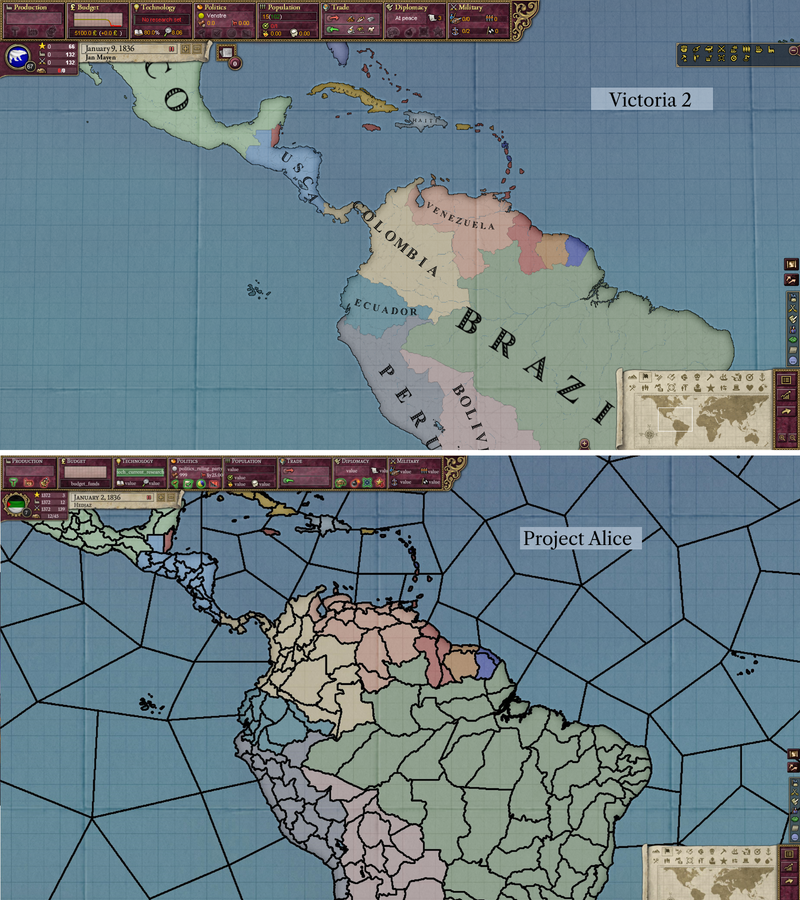
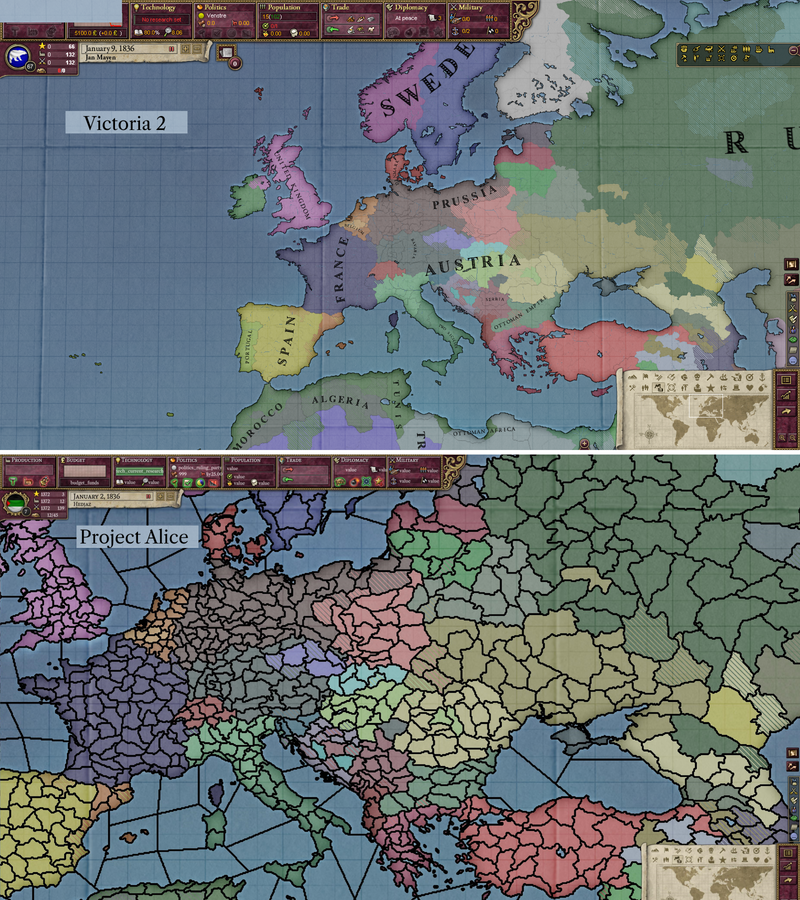
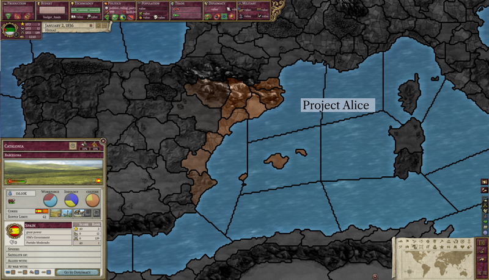
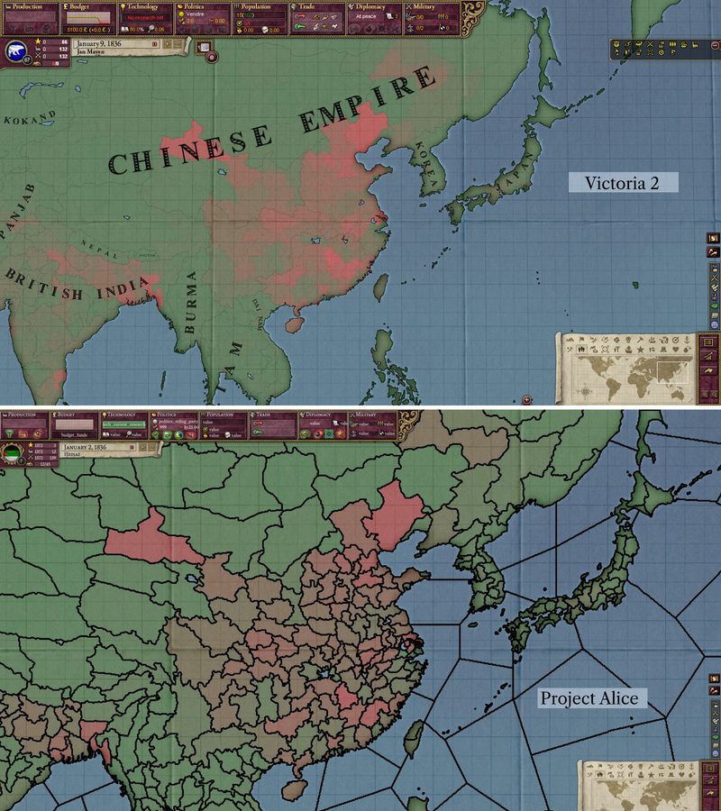
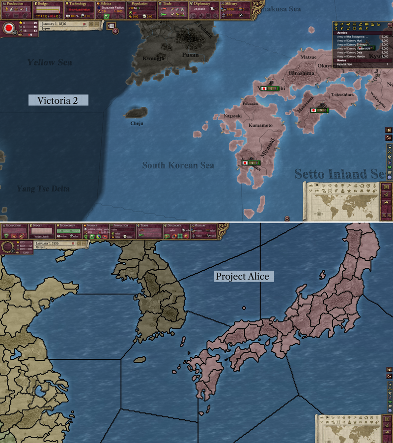
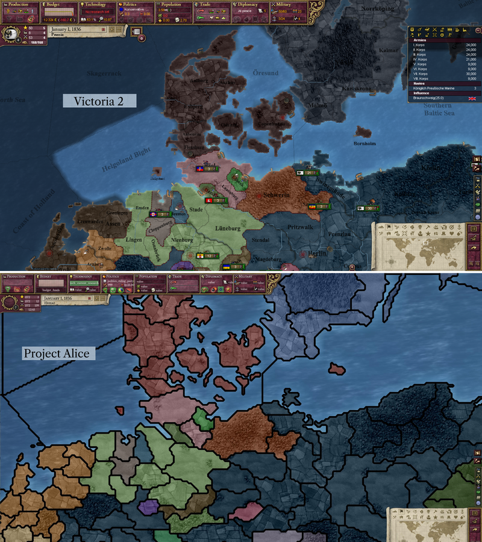

# Progreso hasta marzo de 2023

¡Hola! ¿Cómo están todos?

Para el primer blog de desarrollo sobre el Proyecto Alice, vamos a presentar el proyecto y echar un vistazo rápido a lo que el equipo ha estado trabajando en los últimos dos meses:

## ¿Por qué existe el Proyecto Alice?

Schombert comentó:

> Inicialmente comencé Open V2 porque encontré algunas cosas en Victoria 2 realmente molestas, a pesar de que en general me divertía con el juego. Específicamente, la constante aparición de rebeldes me estaba sacando de quicio, y también me estaba cansando de seleccionar las mismas respuestas a eventos una y otra vez. Dado que Victoria 2 no es tan complicado, pensé que podría recrearlo con algunas correcciones. A medida que las cosas avanzaban, empecé a encontrar más y más cosas que podía hacer de manera diferente, y quizás mejor. Fue divertido, pero al mismo tiempo ralentizó significativamente el desarrollo. Eventualmente, me cansé de trabajar en ello, y la comunidad no parecía muy interesada, así que lo dejé.
>
> Sin embargo, hace aproximadamente año y medio, terminé en el discord del SOE (Symphony of Empires), donde estuve discutiendo su proyecto y dando ocasionalmente algunos consejos basados en mi experiencia con Open V2. Estar allí ayudó a revivir un poco mi interés y eventualmente me llevó a escribir una herramienta (contenedor de datos) que es la columna vertebral del Proyecto Alice. Eventualmente, algunas personas allí, así como algunos nuevos amigos que hice en el camino, se ofrecieron a ayudarme a terminar lo que empecé, y aquí estamos.

## Mapa

Como podras saber por los [videos lacónicos](https://www.youtube.com/channel/UCVRXDHpfemCzPSHDfqOPr-Q) de Schombert, eventualmente tenemos la intención de agregar el mapa globo en 3D de Open V2 como una opción adicional al mapa en 2D que tenemos actualmente.

Las fronteras que puedes ver en las capturas de pantalla aún están en proceso de desarrollo. Actualmente, todas las fronteras son bastante gruesas, pero en el futuro, las fronteras de provincia a provincia serán delgadas, las fronteras de estado a estado serán más gruesas, y las fronteras nacionales tendrán una elegante línea de puntos. Además, las fronteras que ves se ajustarán de manera inteligente según el nivel de zoom, de manera similar a cómo funcionaban en Open V2.

Una ventaja de tener un mapa en 2D en este momento es que es fácil compararlo con el mapa en Victoria 2. Algunos de los desarrolladores incluso han estado agregando pequeñas mejoras de calidad de vida a medida que avanzan. Por ejemplo, puedes ver a continuación cómo seleccionar una provincia en el modo de mapa cultural te permitirá ver cómo se distribuye una cultura por todo el mapa.

 
 

Actualmente, el modo de mapa del terreno luce casi idéntico a cómo lo hacía en Victoria 2. Y, como bonificación adicional, incorporamos algunas correcciones de errores que mejoran el mapa original, haciendo que las islas de Fehmarn y Tsushima aparezcan por primera vez. Estas islas forman parte del mapa original (te animo a que lo verifiques por ti mismo), pero nunca se mostraron debido a un error.

 

## Combate

Vamos a replicar la guerra en el juego original de la manera más cercana posible, incluyendo la microgestión de tus unidades, pero es probable que haya variables ocultas que afecten al combate detrás de escena y que no podamos replicar exactamente. Como concesión para facilitar el desarrollo, no estamos planeando tener modelos de unidades en 3D en nuestro primer lanzamiento. En cambio, nos quedaremos con contadores de unidades en 2D, lo cual seguramente hará feliz a cierto tipo de personas. Por supuesto, si tienes experiencia renderizando modelos 3D en C++/OpenGL, estoy seguro de que al equipo le encantaría saber de ti.

## Interfaz de usuario

En general, la interfaz de usuario permanece muy cercana a lo que estaba presente en Victoria 2. Sin embargo, las fuentes son completamente nuevas (nos lo agradecerás más adelante si alguna vez tienes que ampliar la interfaz de usuario). Actualmente, estamos utilizando una versión de Caslon para el texto principal, que fue una tipografía popular para publicar libros durante el período cubierto por el juego. Aún así, los puristas reales han estado trabajando arduamente para descubrir cómo renderizar el texto exactamente como estaba en el juego original, y planeamos tener una opción para cambiar el texto a su apariencia original.

## Compatibilidad con modificaciones (mods)

Planeamos ofrecer eventualmente una compatibilidad casi perfecta con mods, pero no es nuestra prioridad en este momento. A medida que nos acerquemos al lanzamiento, trabajaremos para asegurarnos de que algunos de los mods más populares, como HPM/GFM/HFM, funcionen de inmediato, y luego abordaremos cualquier brecha en la compatibilidad a medida que lleguen los informes de errores.

## El futuro

Nuestro plan sigue siendo lanzar una versión 1.0 que difiera mínimamente del juego original. Después de la versión 1.0, planeamos experimentar con cambios más radicales. Estos van desde reformar el sistema de rebeldes hasta expandir la economía para hacerla más interesante, pero por ahora no queremos repetir los mismos errores que desviaron a Open V2.

¡Esperamos que nos acompañes en el camino hacia la versión 1.0!

*Añadadido por el traductor:* Unete a nosotros en [Discord](https://discord.gg/QUJExr4mRn) para estar al tanto de las actualizaciones más recientes.