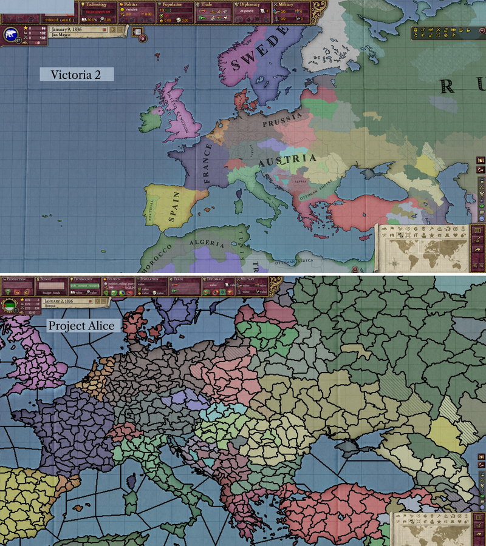
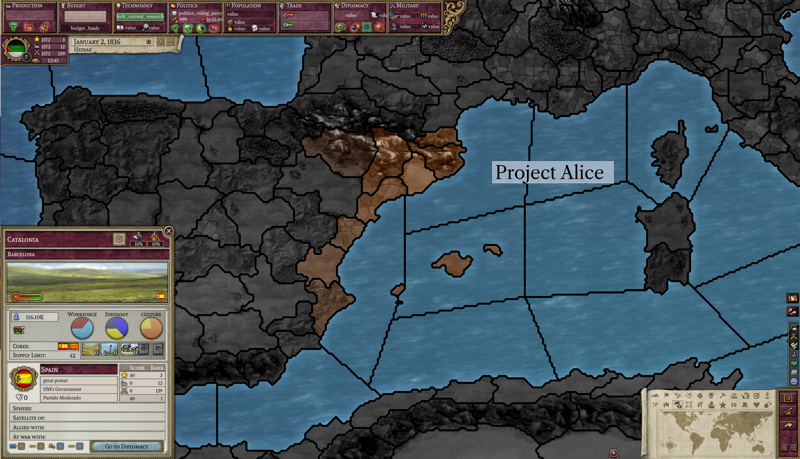
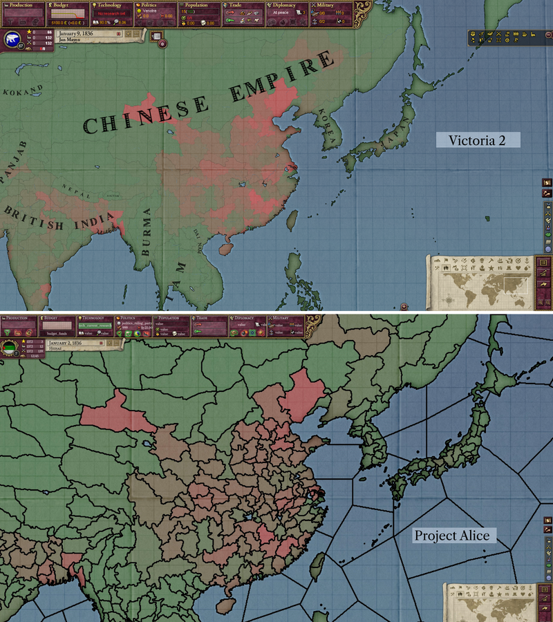

# Progresso até Março de 2023

Olá! Como estão todos?

Para o primeiro post de desenvolvimento sobre o Project Alice, vamos apresentar o projeto e dar uma rápida olhada no que a equipa tem trabalhado nos últimos dois meses:

## Por que o Project Alice existe?

Schombert comentou:

> Iniciei originalmente o Open V2 porque achei algumas coisas no Victoria 2 muito irritantes, apesar de geralmente diverti-me com o jogo. O spam infinito de rebeldes para mim era o pior, e também estava cansado de selecionar as mesmas respostas para eventos repetidamente. Como o Victoria 2 não é tão complicado, pensei que poderia recriá-lo com algumas correções. Conforme as coisas progrediam, comecei a encontrar cada vez mais coisas que poderia fazer de forma diferente e talvez melhor. Isso foi divertido, mas ao mesmo tempo diminuiu significativamente o ritmo de desenvolvimento. Eventualmente, fiquei cansado de trabalhar no projecto, e a comunidade não parecia estar muito interessada, então abandonei.
>
> A cerca de um ano e meio atrás, entrei no discord do SOE (Symphony of Empires), onde tenho estado a discutir o projeto e dando conselhos ocasionais com base em minha experiência com o Open V2. Estar lá ajudou a reviver um pouco o meu interesse e acabou por me levar a escrever uma ferramenta (data-container) que é a espinha dorsal do Project Alice. Eventualmente, algumas pessoas de lá, bem como alguns novos amigos que fiz ao longo do caminho, ofereceram ajuda para terminar o que comecei, e aqui estamos.

## Mapa

Como vocês podem saber pelos [vídeos lacônicos](https://www.youtube.com/channel/UCVRXDHpfemCzPSHDfqOPr-Q) de Schombert, eventualmente pretendemos adicionar o mapa 3D do globo do Open V2 como uma opção adicional ao mapa 2D que temos agora.

As fronteiras que você pode ver nas capturas de tela ainda estão em desenvolvimento. Actualmente, as fronteiras são todas bastante grossas, mas no futuro, as fronteiras de província para província serão finas, as fronteiras de estado para estado serão mais grossas e as fronteiras nacionais terão uma linha com mais grossura. As fronteiras serão ajustadas de forma inteligente com base no zoom, assim como funcionavam no Open V2.

Uma vantagem de ter um mapa 2D no momento é que é fácil compará-lo com o mapa no Victoria 2. Alguns dos desenvolvedores até têm adicionado pequenas melhorias de qualidade de vida à medida que avançam. Por exemplo, você pode ver abaixo como selecionar uma província no modo de mapa cultural permitirá que você veja como uma cultura está espalhada por todo o mapa.

 
 

Atualmente, o modo de mapa de terreno parece quase idêntico ao que era no Victoria 2. E, como bônus adicional, incorporamos algumas correções de bugs que melhoram o mapa original, fazendo com que as ilhas de Fehmarn e Tsushima apareçam pela primeira vez. Essas ilhas fazem parte do mapa original (eu encorajo você a procurar por si mesmo), mas nunca apareceram por causa de um bug.

 

## Combate

Vamos replicar o combate no jogo original o mais fielmente possível, incluindo a microgerência de suas unidades, mas provavelmente há variáveis ocultas afetando o combate nos bastidores que talvez não possamos replicar exatamente. Como concessão à facilidade de desenvolvimento, não estamos planejando ter modelos de unidade em 3D em nosso primeiro lançamento. Em vez disso, manteremos contadores de unidades em 2D, o que certamente deixará algumas pessoas muito felizes. Claro, se você tiver experiência em renderizar modelos 3D em C++/OpenGL, tenho certeza de que a equipe adoraria ouvir de você.

## Interface do usuário

Geralmente, a interface do usuário permanece muito próxima do que estava presente no Victoria 2. As fontes, no entanto, são todas novas (você nos agradecerá por isso mais tarde se precisar redimensionar a interface do usuário). Atualmente, estamos usando uma versão de Caslon para o texto do corpo, que era uma fonte popular para a publicação de livros durante o período abordado pelo jogo. Ainda assim, os verdadeiros puristas têm trabalhado arduamente para descobrir como renderizar o texto exatamente como era no jogo original, e planejamos ter uma opção para voltar o texto à sua aparência original.

## Compatibilidade com mods

Planejamos entregar eventualmente uma compatibilidade com mods quase perfeita, mas não é nosso foco no momento. Conforme nos aproximamos do lançamento, trabalharemos para garantir que alguns dos mods mais populares, como HPM/GFM/HFM, funcionem sem problemas, e depois abordaremos quaisquer lacunas na compatibilidade à medida que os relatórios de bugs forem chegando.

## O futuro

Nosso plano ainda é lançar um 1.0 que diferirá minimamente do jogo original. Após o 1.0, planejamos experimentar com mudanças mais radicais. Isso vai desde reformular o sistema de rebeldes até expandir a economia para torná-la mais interessante, mas por enquanto não queremos repetir os mesmos erros que desviaram o Open V2.

Esperamos que vocês continuem conosco na jornada até o 1.0!

## O Fim

Até o próximo mês! (ou, se você não consegue aguardar, junte-se a nós no [Discord](https://discord.gg/QUJExr4mRn))