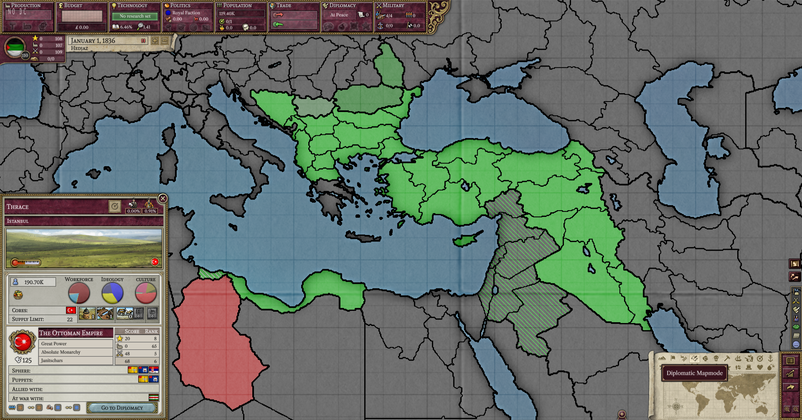
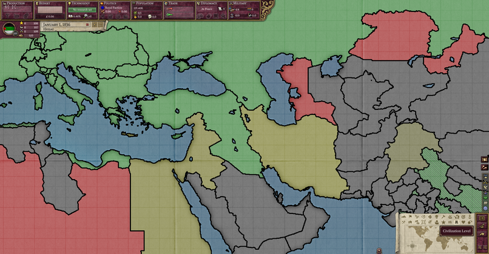
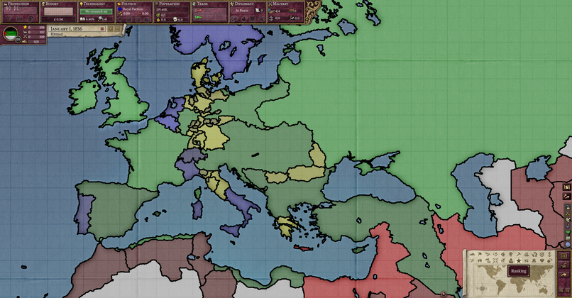
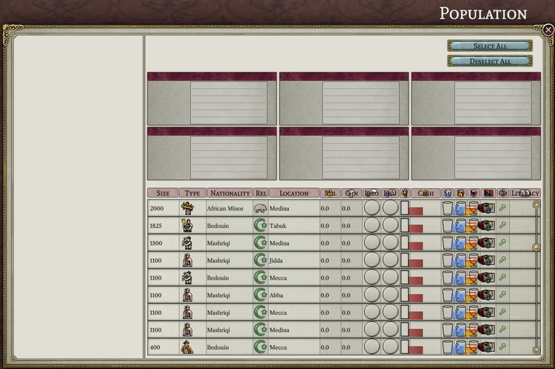
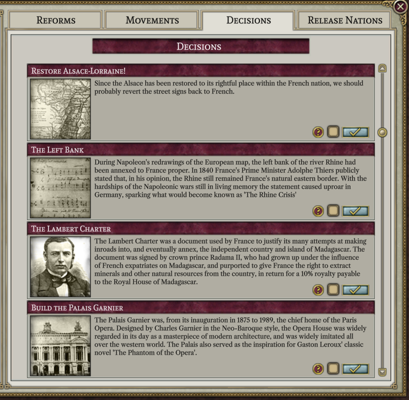
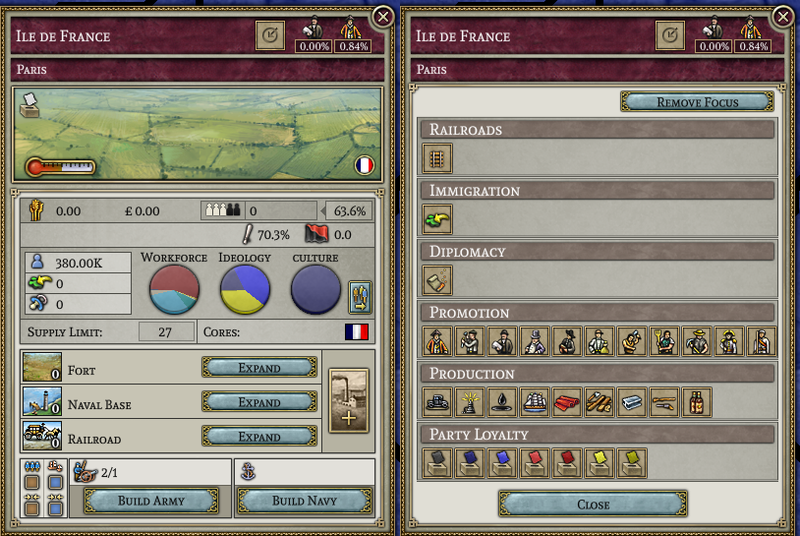
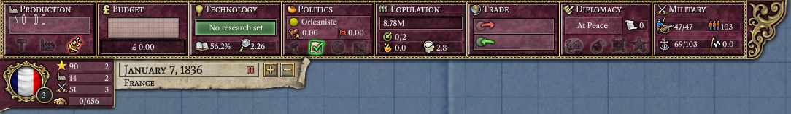
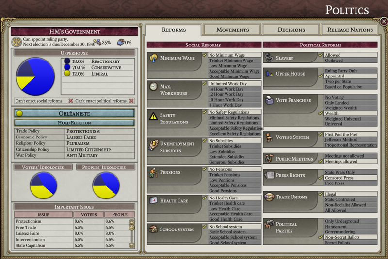
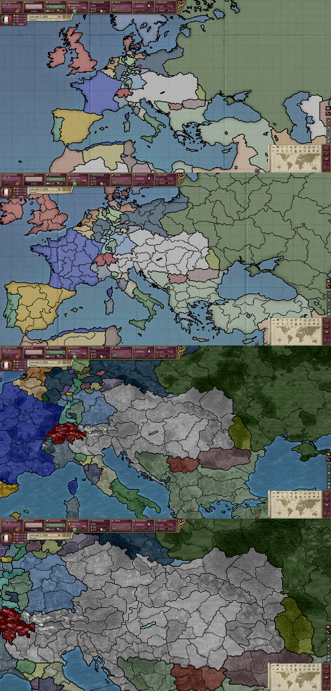
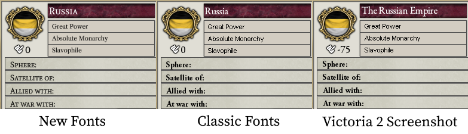

# Progreso hasta abril de 2023

¡Hola Alices! A medida que comienza abril, nosotros seguimos aquí, trabajando arduamente.

## Nuevos miembros en el equipo

En marzo, agregamos (más bien, que Schombert secuestró) cuatro nuevos programadores al equipo. En el orden en que se agregaron, ellos son Bruno, quien ha añadido el modo de mapa diplomático:

Cap, quien ha añadido los modos de mapa de infraestructura, nivel de civilización, reclutamiento, suministro, relaciones, rango y riesgo de revuelta (y quizás algunos otros que estoy olvidando en este momento).

Nick, quien ha realizado algunas mejoras en la consola y también ha comenzado con la ventana de población.

Y Landau, quien ha llenado de contenido la pestaña de decisiones.

Nuevos programadores, artistas o personas con otros talentos para contribuir son siempre bienvenidos a unirse al equipo.

## Preguntas y respuestas del equipo

Para este mes le preguntamos a Diana, la coordinadora del proyecto y segunda al mando en general, "¿en qué estás interesada en agregar al Proyecto Alice?"

> Para ser honesta, hasta ahora tengo habilidades de programación limitadas. Quería ayudar, pero las únicas cosas que podía hacer eran publicidad (cuyas posibilidades se redujeron un poco) y administrar personas (pero resulta que la gente aquí es bastante buena administrándose a sí misma). Tal vez intente trastear más con el código más adelante. Una vez que el proyecto esté más cerca de su lanzamiento, quiero molestar a los creadores de mods para tratar de convencerlos de hacer mods compatibles con él, y posiblemente ayudar con eso yo misma si la compatibilidad con mods se conserva tanto como espero, ya que realmente puedo hacer mods para los juegos de PDX, solo evito hacerlo debido a la falta de fuerza de voluntad. Además de eso, el proyecto es importante para mí; es algo que deseé que sucediera durante mucho, mucho tiempo, especialmente porque Victoria 2 es demasiado lento para mí.

## Progreso den la interfaz de usuario

El lento proceso de implementar la interfaz de usuario aún está en marcha. Este mes logramos un progreso significativo en la ventana de la provincia, que ahora muestra información como puntajes nacionales, empleo en RGO y alianzas, entre otras cosas. La ventana de política también ha experimentado mejoras significativas. La mayor parte de la información en la columna izquierda ahora está completa, junto con el contenido de las pestañas de problemas, reformas (para naciones incivilizadas) y decisiones. También se ha dado el primer paso para hacer funcionar la ventana de población (mencionada anteriormente).

## Progreso del mapa

En este momento se han añadido 15 de los 22 modos de mapa. Además, las fronteras entre provincias han recibido una mejora estética. Ahora, las fronteras entre naciones son más gruesas que las entre estados, que a su vez son más gruesas que las entre provincias. Y al hacer zoom, las fronteras menos importantes desaparecerán, dejándote solo con las fronteras nacionales cuando el mapa esté completamente alejado.

## Fuentes clásicas

El mes pasado mencionamos que MasterChef estaba trabajando en reintegrar las fuentes clásicas como una opción. Este mes nos complace anunciar que el trabajo ha sido completado, y para los ultra puristas hemos añadido la opción de renderizar el texto utilizando los mapas de bits originales.

Las personas con monitores de alta resolución probablemente querrán quedarse con las nuevas fuentes; las fuentes de mapa de bits no se ven muy bien cuando se escalan.

## Reglas del juego

En cuanto a hacer que el juego realmente *funcione*, se dio un paso importante este mes al recopilar una descripción, en su mayoría completa, de las reglas del juego. Esta descripción no solo es útil como objetivo para programar, sino que probablemente sea independientemente útil para los jugadores de Victoria 2 que simplemente quieran saber cómo funciona realmente el juego. No dudes en compartir correcciones o completar omisiones.

[Documento de reglas](https://github.com/schombert/Project-Alice/blob/main/docs/rules_es.md)

¡Nos vemos el próximo mes! (o, si no puedes esperar tanto, únete a nosotros en [Discord](https://discord.gg/QUJExr4mRn))