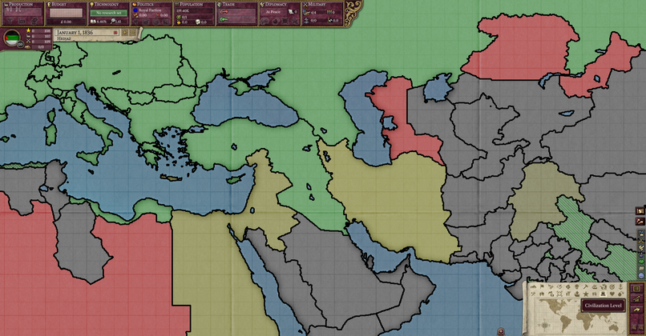
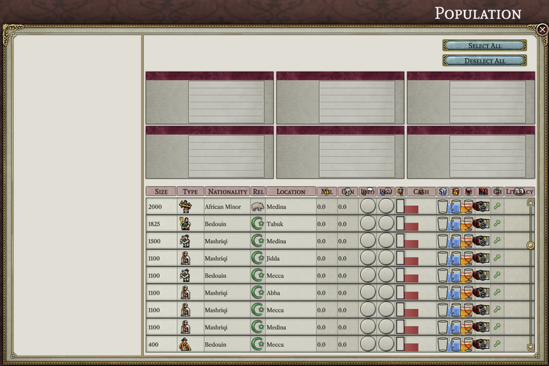
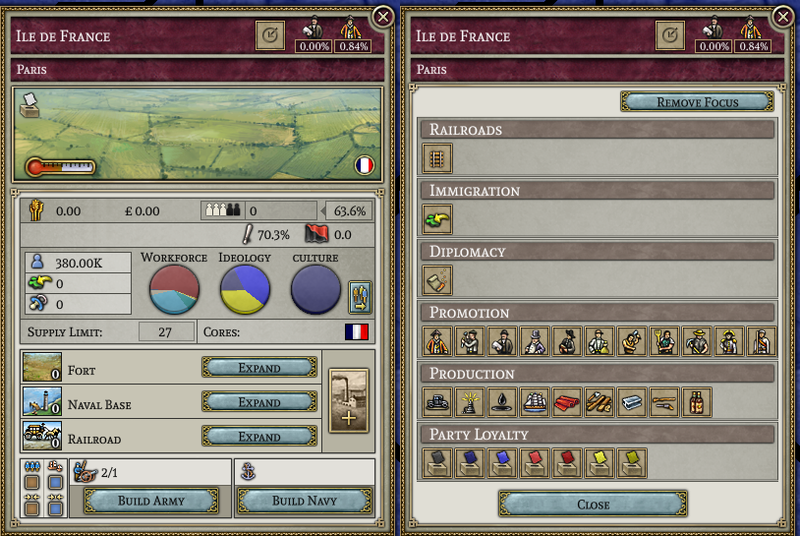
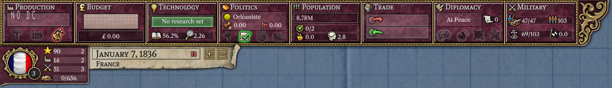
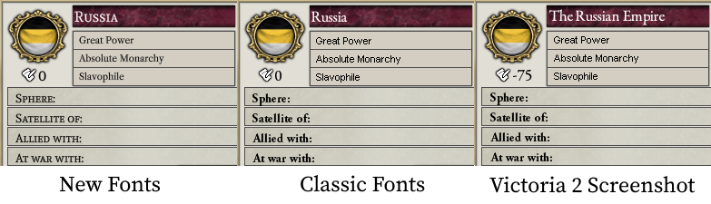

# Progresso até Abril de 2023

Olá, Alices! À medida que abril se inicia, ainda estamos aqui, trabalhando incansavelmente.

## Novos membros da equipe

Em março, adicionamos (Schombert raptou) quatro novos programadores à equipe. Na ordem de aparição, eles são Bruno, que adicionou o modo de mapa diplomático:

Cap, que adicionou os modos de mapa de infraestrutura, nível de civilização, recrutamento, suprimento, relações, classificação e risco de revolta (e talvez alguns outros que estou esquecendo neste momento)

Nick, que fez algumas melhorias na consola, bem como começou a trabalhar na janela de população

e Landau, que preencheu o conteúdo da guia de decisões

Novos programadores, artistas ou pessoas com outros talentos para contribuir são sempre bem-vindos à equipe.

## Perguntas e respostas da equipe

Para este mês, perguntamos a Diana, coordenadora do projeto e segunda no comando geral: "o que você está interessada em adicionar ao Projeto Alice?"

> Para ser honesta, até agora tenho poucas habilidades de programação. Eu queria ajudar, mas as únicas coisas que eu poderia fazer eram publicidade (cujas possibilidades meio que encolheram) e gerir pessoas (mas as pessoas aqui acabaram sendo bastante boas em se autogerir). No futuro talvez tentarei programar. Quando o projeto estiver mais próximo do lançamento, quero incomodar os criadores de mods para tentar convencê-los a tornar os mods compatíveis com o projecto, e possivelmente ajudar com isso, se a compatibilidade com mods for preservada como espero, já que eu posso criar mods para jogos PDX - apenas evito fazer isso por falta de vontade. Além disso, o projeto é importante para mim; é algo que desejei que acontecesse há muito tempo, especialmente porque o Victoria 2 é muito lento.

## Progresso da IU

O processo lento de implementação da UI (interface do usuário) ainda está em andamento. Neste mês, fizemos progressos significativos na janela da província, que agora exibe informações como pontuações nacionais, emprego em RGO e alianças, entre outras coisas. A janela de política também viu melhorias significativas. A maioria das informações na coluna da esquerda agora está preenchida, juntamente com o conteúdo das guias de problemas, reformas (para nações não civilizadas) e decisões. Um primeiro passo para fazer a janela de população funcionar (mencionado acima) também foi dado.

## Progresso do mapa

Neste momento, 15 dos 22 modos de mapa foram adicionados. Além disso, as fronteiras entre províncias passaram por uma renovação. Agora, as fronteiras entre nações são mais grossas do que as entre estados/districtos, que, por sua vez, são mais grossas do que as entre províncias. E à medida que você afasta o zoom, as fronteiras menos importantes vao desaparecendo, deixando apenas as fronteiras nacionais quando o mapa estiver mais afastado.

## Fontes clássicas

No mês passado, mencionamos que o MasterChef estava trabalhando para trazer de volta as fontes clássicas como uma opção. Este mês, estamos felizes em anunciar que o trabalho foi concluído e, para os ultra-puristas, adicionamos a opção de renderizar o texto usando os bitmaps originais.

Pessoas com monitores de alta resolução provavelmente vão querer ficar com as novas fontes; as fontes bitmap não ficam bem quando são ampliadas.

## Regras do jogo

Em termos de fazer o jogo realmente *correr*, um importante primeiro passo foi dado neste mês, construímos uma descrição - em grande parte completa - das regras do jogo. Não apenas essa descrição é útil como alvo a programar, mas provavelmente é útil de forma independente para os jogadores do Victoria 2 que simplesmente querem saber como o jogo realmente funciona. Sinta-se à vontade para compartilhar correções ou preencher quaisquer omissões.

[Documento de regras](https://github.com/schombert/Project-Alice/blob/main/docs/rules.md)

## O Fim

Até o próximo mês! (ou, se você não consegue aguardar, junte-se a nós no [Discord](https://discord.gg/QUJExr4mRn))