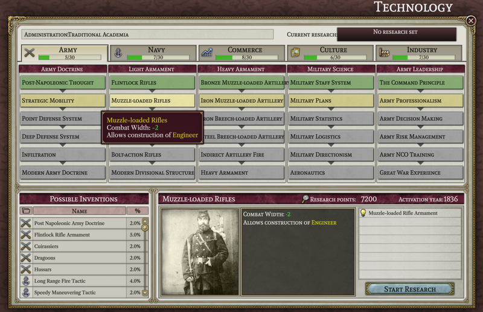
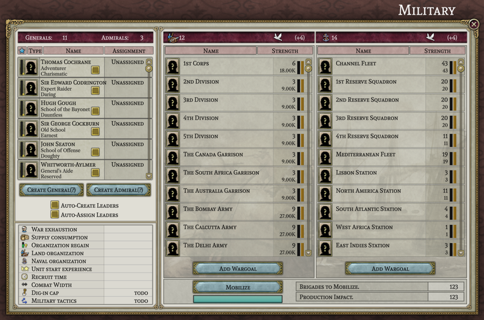
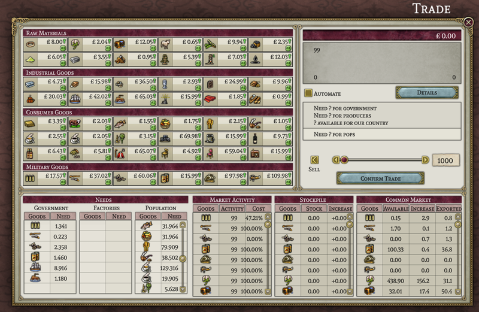
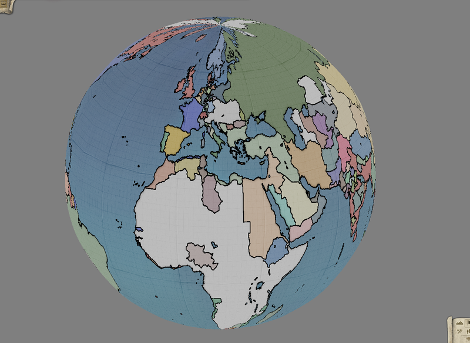

# Progreso hasta mayo de 2023

Una vez más es hora de revisar qué están haciendo los holgazanes en el Proyecto Alice.

## Nuevos miembros del equipo

En marzo, añadimos un nuevo programador al equipo, DeathByDarwin, quien ha estado trabajando con leaf para realizar mejoras en la ventana de tecnología.

## Preguntas y Respuestas del Equipo

Este mes le preguntamos a leaf, uno de los miembros fundadores del Proyecto Alice y líder del proyecto [SOE](https://github.com/symphony-of-empires/symphony-of-empires): "¿Cómo ha sido trabajar en el Proyecto Alice en comparación con trabajar en SOE?"

> Bueno, el Proyecto Alice es bastante similar en cuanto al "estilo de gestión" como SoE (pero mucho más organizado y documentado). Creo que el hecho de que estuviera debidamente documentado desde el principio hizo posible trabajar para un grupo de personas que de otra manera no podrían entender su funcionamiento interno. Trabajar en Alice es bastante directo, ya que simplemente codificas, presentas, esperas la revisión, corriges errores y luego se fusiona la mayor parte del tiempo. Creo que eso es una cualidad bastante agradable; en SoE era simplemente presentar y luego corregir los errores, lo que solía romper cosas, y luego alguien tenía que arreglar eso, así que sí, de hecho, trabajar en Alice es una experiencia más organizada y aún así directa. El hecho de que Alice también utilice Data-container lo convirtió en una elección interesante para trabajar, ya que con SoE todo se centraba en llevar los datos a algún lugar estructurado. Data-container utiliza métodos para acceder a los datos, lo cual es bastante agradable porque obtienes automáticamente las propiedades de tus objetos, y sus relaciones, debidamente documentadas e interactuadas, todo al mismo tiempo. En general, diría que ha sido más agradable trabajar con ello.

## Progreso en la Interfaz de Usuario

Este mes, el trabajo en la interfaz de usuario ha estado más disperso que el mes pasado. Por lo tanto, no hay una ventana única que podamos mostrar como casi completa. Sin embargo, puedes ver cómo las piezas se van colocando gradualmente en el presupuesto (por forn), militar (por MasterChef) y ventanas de comercio (por leaf y forn), a continuación.

Internos

Hubo más avances este mes en la implementación de partes de la actualización diaria del juego, lo cual, lamentablemente, no se presta realmente para capturas de pantalla interesantes. Una gran parte del trabajo se centró en hacer que las poblaciones "vivan", es decir, crezcan, disminuyan, cambien de trabajo, se asimilen, se muevan, compren cosas, se enfaden, aprendan a leer, se unan a movimientos y cambien sus opiniones políticas, entre otras cosas. Hemos implementado al menos una primera versión de la mayoría de las acciones que realiza una población en Victoria 2, con la excepción de la conversión religiosa. Por el momento, simplemente hemos hecho que las poblaciones cambien de religión cuando se asimilan en lugar de tener un proceso separado para eso. Tampoco hemos intentado emular ninguno de los errores extraños (o tal vez solo elecciones de diseño extrañas) de Victoria 2 que a veces hacían que una población que cambiaba de trabajo cambiara automáticamente su cultura también.

El otro desarrollo importante, en términos de la actualización diaria, fue lograr un borrador de la economía funcionando. Y dado que la economía es, para muchas personas, una parte clave de lo que hace interesante a Victoria 2 como juego, probablemente merece su propia sección.

La economía

En términos generales, la economía del Proyecto Alice funciona de la misma manera que la economía de Victoria 2. La actividad económica central es el consumo de bienes, ya sea para satisfacer las necesidades de la población, pagar el mantenimiento de unidades militares, pagar construcciones o producir bienes de consumo. Cuando se produce un bien, primero va a una especie de almacén nacional (con esto no me refiero a lo que se llama "almacenes" en el juego) o, si la nación está en la esfera de otra, una fracción va a este almacén y el resto va al almacén del líder de la esfera. Cuando se necesita un bien, primero se extrae del almacén nacional, y si este está vacío, del almacén del líder de la esfera, y si también está vacío, finalmente de un almacén mundial (el almacén mundial se llena con los "sobrantes" de lo que no se ha consumido el día anterior). Y, por supuesto, todo esto se hace en orden jerárquico, por lo que las naciones de mayor rango tienen la primera oportunidad de consumir cualquier bien disponible en el almacén del líder de la esfera o en el almacén mundial.

Ese marco general permanece sin cambios en el Proyecto Alice. Sin embargo, dentro de una nación hacemos algunas cosas de manera diferente. Una nación no es un único consumidor de bienes; está compuesta por muchas fábricas y poblaciones, todas las cuales tienen su propia demanda de bienes. En Victoria 2[^1], cada uno de estos consumidores toma su turno para comprar de los almacenes de bienes. El orden exacto no se muestra en la interfaz de usuario, pero parece mantenerse básicamente constante de un día a otro. Esto significa que, si no hay suficiente cantidad del bien para satisfacer toda la demanda, los consumidores que van antes en el orden podrán obtener lo que quieren, mientras que los que van después no podrán. Esto tiene el efecto de hacer que las escaseces de bienes sean extremadamente bimodales: los consumidores que van temprano en el orden obtienen todo lo que quieren, mientras que los que van después no obtienen nada. A veces se puede ver esto en la ventana de la fábrica, donde puedes notar que algunas fábricas informan que no tienen escasez mientras que otras informan que algunos de los mismos bienes no están disponibles.

Sin embargo, en el Proyecto Alice, todos los consumidores dentro de una nación tienen un acceso igual a los bienes disponibles. Esto significa que, si no hay suficientes bienes disponibles, cada consumidor recibirá una fracción de lo que querían. Esto a su vez significa que todas tus fábricas se verán afectadas igualmente por una escasez. Por ejemplo, en la imagen a continuación, puedes ver que todas las fábricas sufren igualmente por la escasez de hierro.

Otra cambio se refiere a la manera en que se gestionan las reservas nacionales (y ahora estoy hablando de lo que se llaman "reservas" en el juego). Hay dos formas en que las reservas nacionales se simplifican en comparación con cómo funcionan en Victoria 2. Primero, en Victoria 2, algunas formas de consumo por parte del gobierno (por ejemplo, el pago del mantenimiento de las unidades) pasa a través de las reservas, lo que significa que el gobierno primero traslada mercancías a sus reservas nacionales y luego las saca para consumirlas. Esto puede causar algunas cosas extrañas si desactivas la automatización de las reservas (ya que con la automatización desactivada puedes interferir con el proceso de poner las mercancías en las reservas en primer lugar). En el Proyecto Alice eso no sucede; cualquier mercancía requerida por los gastos gubernamentales se compra y luego se consume directamente, sin pasar por las reservas como un paso intermedio. Y eso a su vez significa que la automatización de las reservas ya no cumple un propósito útil y no se incluirá (porque la configuración de tus reservas ya no puede interferir con otros gastos).

Además, en Victoria 2, las reservas nacionales pueden funcionar básicamente en tres modos (cuando no están siendo automatizadas, claro). Se pueden configurar para llenarse de mercancías hasta alcanzar una cantidad objetivo, se pueden configurar para vender mercancías por dinero hasta que disminuyan a una cantidad objetivo, o se pueden vaciar para satisfacer la demanda interna de mercancías que actualmente escasean. En el Proyecto Alice hemos reducido estos tres modos a dos modos más simples: puedes configurar tus reservas para llenarse hasta cierto nivel o vaciarse para cubrir cualquier escasez. Básicamente, hemos eliminado la opción de convertir las mercancías almacenadas en dinero. Esta característica se ha eliminado por dos razones. Primero, aunque teóricamente podrías jugar en los mercados con ello, el hecho de que los precios solo puedan moverse en una cantidad limitada por día hace que hacer algo útil sea un proceso tedioso. En segundo lugar, la interfaz de usuario para manipular tus reservas siempre ha sido confusa como mínimo, hasta el punto en que creo que la mayoría de los jugadores simplemente nunca las quitan del modo automático. Espero que al simplificar las reservas podamos hacer que al menos la actividad básica de acumular bienes militares durante tiempos de paz y luego usar esas reservas en tiempos de guerra sea algo que las personas normales puedan utilizar de manera productiva.

## Avance Exclusivo

Erik, quien es en gran medida responsable de la maquinaria técnica que respalda el mapa, ha estado bastante ocupado fuera del Proyecto Alice últimamente. Sin embargo, puedo compartir un avance exclusivo de algunos de sus últimos trabajos:

## El fin

¡Nos vemos el próximo mes! (o, si no puedes esperar tanto, únete a nosotros en [Discord](https://discord.gg/QUJExr4mRn))

[^1]: Deberías tomar esta información con un "según lo que puedo percibir" implícito. No tenemos acceso al código fuente de Victoria 2, por lo que parte de esto es especulación basada en lo que hemos observado.