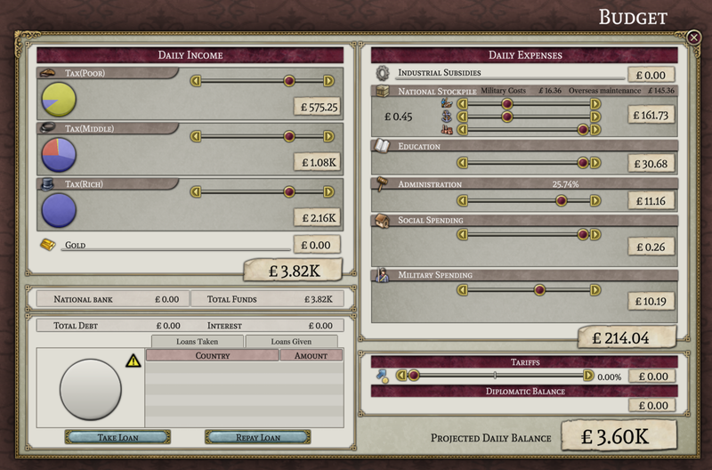

# Progresso até Maio de 2023

Mais uma vez é hora de rever o que os preguiçosos do Project Alice têm feito.

## Novos membros da equipe

Em março, adicionamos um novo programador à equipe, DeathByDarwin, que tem trabalhado com leaf para fazer melhorias na janela de tecnologia.

## Perguntas e respostas da equipe

Este mês, perguntamos a leaf, um dos membros fundadores do Project Alice e líder do projeto [SOE](https://github.com/symphony-of-empires/symphony-of-empires): "Como foi trabalhar no Project Alice em comparação com o trabalho no SOE?"

> Bem, o Project Alice tem praticamente o mesmo "estilo de gestão" que o SoE (mas muito mais organizado e documentado). Acredito que o facto de ter sido devidamente documentado desde o início tornou possível um monte de pessoas cooperarem que de outra forma não seriam capazes de entender o seu funcionamento interno. Trabalhar no Alice é bastante direto, já que você apenas codifica - envia - aguarda revisão (PR - Pull Request) - corrige erros e, na maioria das vezes, é merged. Acho que essa é uma qualidade muito boa; no SoE, era apenas enviar e depois corrigir os erros, o que tendia a causar problemas, e então alguém tinha que corrigir esses problemas, então sim, de facto, trabalhar no Alice é uma experiência mais organizada e ainda directa. O facto de o Alice também usar Data-container tornou-o uma escolha interessante para trabalhar, já que no SoE tudo estava centrado em colocar os dados em algum lugar estruturado. O Data-container usa métodos para acessar dados, o que por si só é muito bom, pois você obtém automaticamente as propriedades dos seus objetos e suas relações, devidamente documentadas e interagindo - tudo ao mesmo tempo. No geral, eu diria que tem sido mais agradável trabalhar com o Alice.

## Progresso da interface do usuário

Neste mês, o trabalho na interface do usuário foi mais espalhado do que no mês passado. Portanto, não há uma única janela que possamos mostrar como quase completa. No entanto, você pode ver as peças gradualmente sendo colocadas nas janelas de orçamento (por forn), militar (por MasterChef) e comércio (por leaf e forn), abaixo.

## Internos

Houve mais progresso neste mês na implementação da atualização diária do jogo (daily-ticks), o que infelizmente não da captura de telas interessantes. Grande parte do trabalho foi feito para fazer com que as populações "vivam", ou seja, cresçam, diminuam, mudem de emprego, assimilem, imigrem, comprem coisas, fiquem zangadas, aprendam a ler, se juntem a movimentos e mudem opiniões políticas, entre outras coisas. Implementamos pelo menos um primeiro rascunho da maioria das coisas que uma população faz no Victoria 2, com excepção da conversão religiosa. Por enquanto, fizemos com que as populações mudassem de religião quando assimilassem, em vez de ter um processo separado para isso. Também não fizemos nenhuma tentativa de emular nenhum dos bugs estranhos (ou talvez apenas escolhas estranhas de design) do Victoria 2 que às vezes faziam com que uma população que mudava de emprego automaticamente mudasse também de cultura.

A outra grande evolução, em termos da atualização diária, foi conseguir um rascunho da economia a funcionar. E dado que a economia é, para muitas pessoas, uma parte fundamental do que torna o Victoria 2 um jogo interessante, ela merece a sua própria secção.

## A economia

Em termos gerais, a economia do Projeto Alice funciona da mesma maneira que a economia do Victoria 2. A atividade econômica central é o consumo de mercadorias, seja para satisfazer as necessidades da população, pagar a manutenção de unidades militares, pagar por construções ou para produzir mercadorias de saída. Quando uma mercadoria é produzida, ela primeiro entra em no armazém nacional (com isso, *não* estou falando do que é referido como "stockpile(armazém)" no jogo) ou, se a nação estiver na esfera de outra nação, uma fração vai para este armazém nacional e o restante vai para o armazém do líder da esfera. Quando uma mercadoria é necessária, ela primeiro é retirada do armazém nacional e, se estiver vazio, do armazém do líder da esfera e, se também estiver vazio, finalmente de um armazém mundial (o armazém mundial é preenchido com as "sobras" do que não foi consumido no dia anterior). E, é claro, tudo isso é feito em ordem de classificação, para que as nações de classificação mais alta tenham a primeira chance de consumir quaisquer mercadorias disponíveis no armazém do líder da esfera ou no armazém mundial.

Esse quadro geral permanece inalterado no Projeto Alice. No entanto, dentro de uma nação, fazemos algumas coisas de maneira diferente. Uma nação não é um único consumidor de bens; ela é composta por muitas fábricas e populações, todas com sua própria demanda por mercadorias. No Victoria 2[^1], cada um desses consumidores tem por sua vez de comprar dos armazéns de mercadorias. A ordem exacta não é mostrada na interface do usuário, mas parece permanecer basicamente constante de um dia para o outro. Isso significa que, se não houver mercadorias suficientes para satisfazer toda a demanda por elas, os consumidores que vão primeiro na ordem serão capazes de obter o que desejam, enquanto aqueles que vão mais tarde não conseguirão. Isso faz com que as escassezes de mercadorias sejam extremamente bimodais: os consumidores no início da ordem obtêm tudo o que desejam, enquanto os que vão depois não obtêm nada. Às vezes, é possível ver isso na janela da fábrica, onde podesse notar que algumas fábricas relatam que não há escassez, enquanto outras relatam que algumas das mesmas mercadorias estão indisponíveis.

No Projeto Alice, no entanto, todos os consumidores dentro de uma nação têm acesso igual às mercadorias disponíveis. Isso significa que, se não houver mercadorias suficientes disponíveis, todos os consumidores receberão uma fração do que desejavam. Isso, por sua vez, significa que todas as suas fábricas serão igualmente afetadas por uma escassez. Por exemplo, na imagem abaixo, você pode ver que todas as fábricas estão sofrendo igualmente com a escassez de ferro.

Outra mudança é a forma como os armazéns nacionais são tratados (e agora *estou* falando do que são chamados de "stockpile/armazém" no jogo). Existem duas maneiras pelas quais os estoques nacionais são simplificados em relação à forma como funcionam no Victoria 2. Primeiro, no Victoria 2, algumas formas de consumo pelo governo (por exemplo, pagamento da manutenção de unidades) passam pelos armazéns nacionais, ou seja, o governo primeiro move as mercadorias para seus armazéns nacionais e depois as retira para consumi-las. Isso pode causar algumas coisas estranhas acontecerem se você desativar a automação dos armazéns (já que, com a automação desligada, você pode acabar interferindo no processo de colocar as mercadorias nos armazéns em primeiro lugar). No Projeto Alice, isso não acontece; quaisquer mercadorias necessárias para despesas do governo são compradas e depois consumidas diretamente, sem passar pelos armazéns como um passo intermediário. Por isso e que a automação dos armazéns não serve mais nenhum propósito útil e não será incluída (porque as configurações de armazéns não podem mais interferir em outros gastos).

Além disso, no Victoria 2, seus armazéns nacionais podem funcionar em basicamente três modos (quando não estão automatizados, é claro). Eles podem ser configurados para encher até um determinado nível de mercadorias, podem ser configurados para vender mercadorias por dinheiro até diminuir para um determinado nível, ou podem ser esvaziados para satisfazer a demanda doméstica de mercadorias que estão em falta. No Projeto Alice, reduzimos esses três modos a dois modos mais simples: você pode configurar seus armazéns para encher até um certo nível ou esvaziar para cobrir qualquer escassez. Essencialmente, removemos a opção de transformar mercadorias armazenadas em dinheiro. Essa funcionalidade foi removida por duas razões. Primeiro, embora você teoricamente pudesse jogar com os mercados com isso, o fato de que os preços podem se mover apenas por uma quantidade limitada por dia torna qualquer coisa útil um processo tedioso. Em segundo lugar, a interface do usuário para manipular seus estoques sempre foi confusa no melhor dos casos, a ponto de acreditar que a maioria dos jogadores simplesmente nunca os desativam. Espero que, ao simplificar os estoques, possamos tornar pelo menos a atividade básica de armazenar bens militares durante o tempo de paz e depois usar esses estoques na guerra algo que as pessoas normais possam usar produtivamente.

## Espreitadela

Erik, que é em grande parte responsável pela maquinaria técnica que sustenta o mapa, esteve bastante ocupado fora do Projeto Alice ultimamente. No entanto, posso compartilhar uma espreitadela de alguns de seus trabalhos mais recentes:

[^1]: Você deve levar estas informações com um "na medida do que posso perceber implicitamente." Não temos acesso ao código-fonte do Victoria 2, portanto, algumas dessas informações são especulações baseadas no que observamos.

## O Fim

Até o próximo mês! (ou, se você não consegue aguardar, junte-se a nós no [Discord](https://discord.gg/QUJExr4mRn))