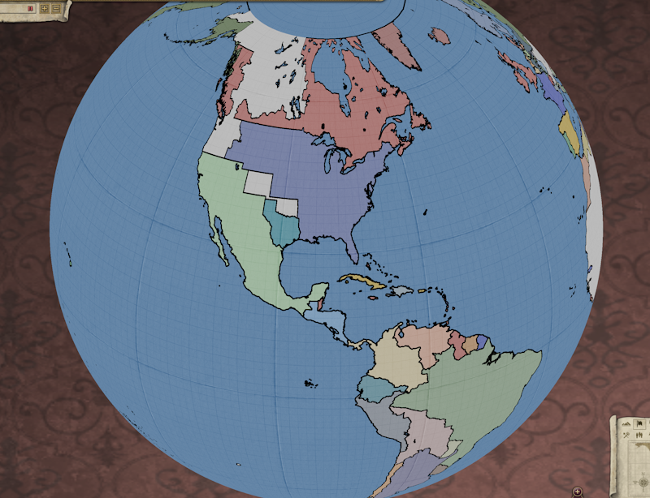
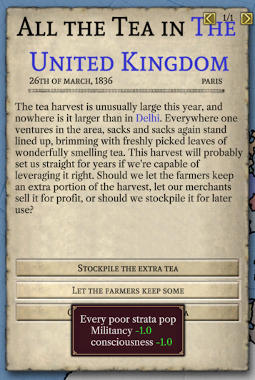
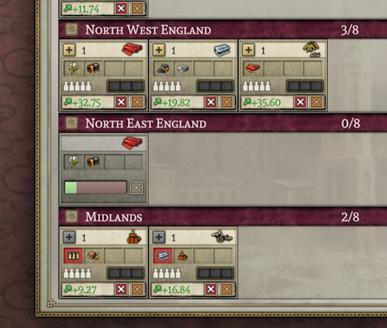
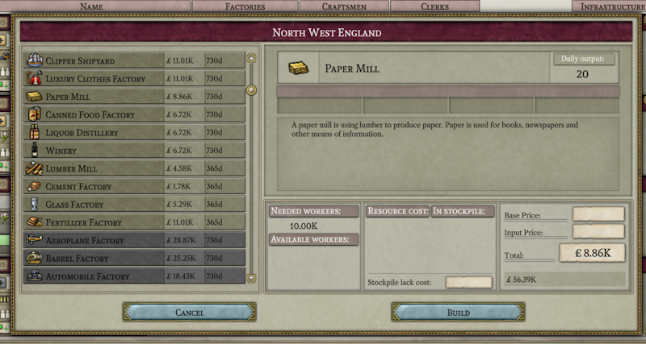
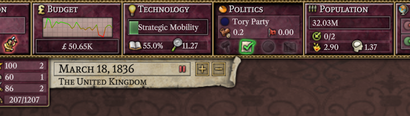
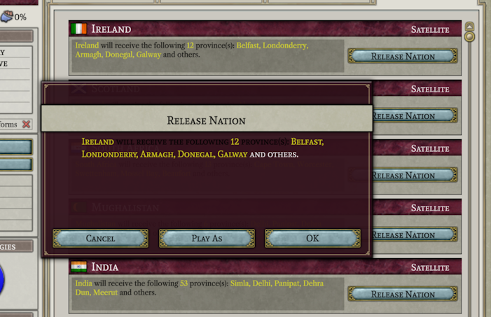
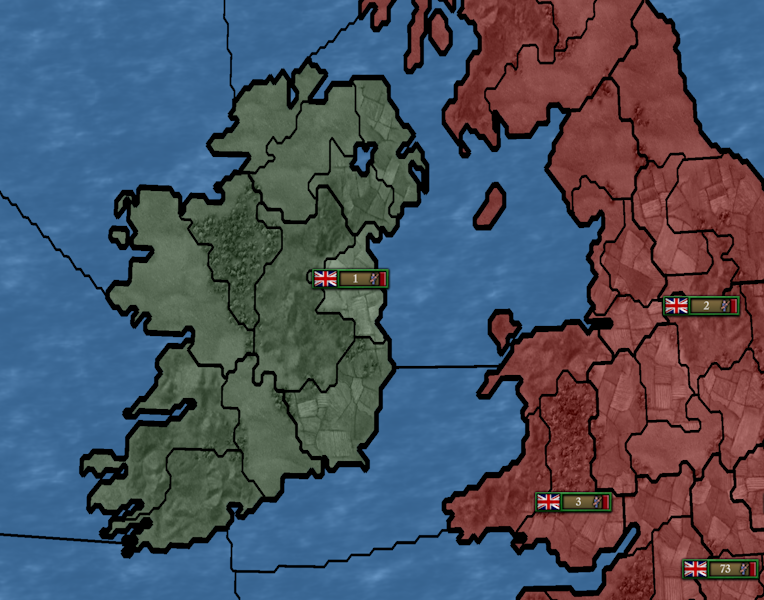
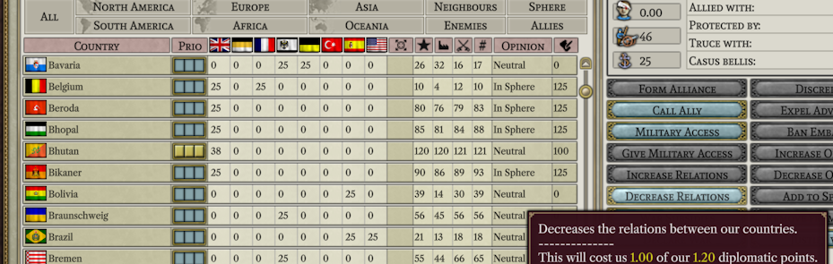

# Progresso até junho de 2023

Este mês tem sido excepcionalmente productivo, possivelmente porque alguns dos nossos membros da equipe começaram as férias de verão. Mas, antes de entrarmos nisso:

## Novos membros da equipe

- BrickPi: BrickPi é outro desenvolvedor que também faz parte do projeto OpenVic2. Para nós, BrickPi contribuiu com uma atualização que permite aos novos desenvolvedores do Windows depender do caminho de instalação de sua cópia do Victoria 2 para desenvolvimento, em vez de terem que soletrá-lo manualmente para começar.
- Breizh: Embora seja novo na equipe, Breizh faz parte do nosso Discord desde os primeiros dias. E, apesar de ser novo, contribuiu muito este mês para concluir a interface do usuário.
- Ivysaur: Ivysaur também é alguém que está conosco no Discord desde o início. Ivysaur entrou no final do mês e atualmente não teve tempo para contribuir com mais do que algumas dicas de ferramentas.

## Equipe P&R

Este mês perguntamos a Erik, um dos quatro membros fundadores do Projeto Alice e um grande colaborador do [SOE](https://github.com/symphony-of-empires/symphony-of-empires): "Como foi trabalhar no Projeto Alice em comparação com o trabalho no SOE?"

> Trabalhar no Alice foi significativamente mais tranquilo, graças a ter metas mais claras e à experiência adquirida ao trabalhar no SOE. Foi incrivelmente útil ter trabalhado em um jogo de mapas antes. O progresso no Projeto Alice também tem sido muito mais rápido, o que se deve em grande parte ao excelente trabalho feito por todos os colaboradores. Outro fator é que a expansão de recursos é praticamente inexistente aqui.
> 
> Houve um maior interesse neste projeto, o que é esperado devido à grande demanda por um Victoria 2 de código aberto (basta olhar para o número de forks do Open V2). Estou ansioso pelo enorme potencial de modding assim que o 1.0 estiver concluído. Modding no Vic2 é bastante limitado, e isso é algo que gostaria de ver melhorado.

## Progresso da interface do usuário

Como indicado no mês passado, o trabalho no globo terrestre avançou. Para fazer o mapa padrão do Victoria 2 funcionar no globo, adicionamos algum espaço em branco aos polos. Não é uma solução perfeita, mas faz um trabalho bastante bom. Também estamos trabalhando em um mapa completo do globo com uma projeção adequada baseada no mapa Open V2 e, esperamos, poderemos lançar a versão 1.0 com essa opção adicional para jogos não modificados. (O mapa plano tradicional também permanece disponível por meio de uma opção de menu, mas eu não senti nenhuma tentação de voltar a usá-lo.)

Mas o que temos focado principalmente neste mês é a implementação de acções do usuário e a interface do usuário necessária para suportá-las. Uma adição imediatamente perceptível são os eventos.

Neste evento, ilustra-se várias coisas interessantes. O texto azul eventualmente se transformará em hiperlinks que, quando clicados, o levarão à província, estado ou nação nomeada. Você também pode ver as setas - ainda um trabalho em andamento - que ajudarão a organizar as coisas quando vários eventos estiverem ocorrendo ao mesmo tempo. A dica da ferramenta também mostra que os efeitos especificados nos saves estão sendo processados corretamente, e suas escolhas de eventos funcionam conforme o esperado quando você as faz (exceto por eventuais bugs).

Construções de todos os tipos, incluindo fábricas, unidades militares e edifícios provinciais como fortalezas, também foram incluídas. Acima, você pode ver uma fábrica de tecidos em construção.

Acima está a janela - apenas parcialmente concluída - para construir fábricas. Incluí isso simplesmente porque mostra como a descrição desnecessária do que o papel é usado, originalmente apresentado no Victoria 1, ainda sobrevive. Isso sempre me faz rir.

Este pequeno trecho mostra uma nova tecnologia no meio de pesquisa, bem como os gráficos de linha recém-implementados (cortesia de forn).

A libertação de nações (e a opção opcional para jogar como elas) também foi adicionada. Acima, você pode ver a caixa de diálogo de libertação da nação (com obviamente ainda algum trabalho a ser feito com a cor do texto) e o resultado da libertação da Irlanda.

Aqui podemos ver que é possível ganhar influência e aumentar suas relações com alguém. A maioria das ações de influência e ações diplomáticas simples foram implementadas. No entanto, sem uma IA real, a IA padrão aceita todas as solicitações de acesso militar e rejeita todas as solicitações de aliança.

Não há espaço suficiente para capturar todos as ações que foram adicionadas, mas aqui está a lista: mudar o foco nacional, iniciar pesquisa, construir edifícios provinciais, aumentar relações, diminuir relações, construir fábricas, construir navios, construir regimentos, cancelar a construção de unidades, mudar a prioridade da fábrica, excluir fábricas, liberar nação, jogar como nação, dar/cancelar subsídios de guerra, mudar as configurações do orçamento, iniciar uma eleição, mudar a prioridade de influência, desacreditar conselheiros, expulsar conselheiros, banir embaixada, aumentar opinião, diminuir opinião, adicionar à esfera, remover da esfera, transformar uma colônia em estado, investir em uma corrida colonial, intervir em guerra, reprimir um movimento, ocidentalizar, nomear partido governante, adotar/reverter uma reforma, ingressar em uma crise, mudar configurações de reserva, tomar uma decisão, fazer uma escolha de evento, fabricar uma causa beli, pedir acesso militar, pedir uma aliança. Sim, é muita coisa.

## Internos

Um primeiro rascunho de quase tudo o que é necessário para a atualização diária do jogo, fora o militar, foi adicionado. Isso inclui coisas que vão desde migrações de população até eleições, movimentos rebeldes, eventos, construção de unidades e edifícios. Claro, nesta fase inicial de desenvolvimento, ainda devem existir muitos bugs escondidos, mas é satisfatório ver a maior parte do mundo se comportando aproximadamente como deveria.

## Relações internacionais

O Projeto Alice atraiu algum interesse entre a comunidade de falantes de chinês do Victoria 2. Devido à barreira do idioma e a outros problemas logísticos, a maioria desta comunidade não está presente em nosso Discord. Para ajudar a preencher essa lacuna, trabalharemos com alguns membros dessa comunidade para tentar fornecer traduções para o chinês de nossas atualizações mensais e outras peças-chave da documentação. Se você estiver em contato com outras comunidades que não falam inglês e que estejam interessadas no projeto, e dispostas a fazer o trabalho de tradução necessário, ficaríamos felizes em apoiar outros idiomas também.

## Próximo mês

O próximo mês se concentrará principalmente na implementação de coisas associadas ao militar e à guerra, tanto na interface do usuário quanto nos internos do jogo. Isso inclui coisas como mover unidades, resolver batalhas, declarar guerras e enviar ofertas de paz. A minha esperança é chegar a uma espécie de versão de saco de pancada até o final do próximo mês, que é um jogo onde tudo basicamente funciona, mas onde a IA é totalmente passiva.

## Pensando sobre a IA

Embora haja uma quantidade razoável de trabalho a ser feito no lado militar das coisas, nada disso é particularmente desafiador tecnicamente. O mesmo não pode ser dito sobre a implementação da IA. Atualmente, planeio tratar a tomada de decisões da IA como processos essencialmente independentes ligados por uma compreensão superficial de sua situação geral, no máximo. Uma IA de classe mundial levaria tudo em consideração ao tomar decisões, mas acredito que ainda podemos obter algo aceitável dividindo suas decisões. E, importante para concluir as coisas a tempo, dividir a IA dessa forma torna fácil dividir o trabalho entre diferentes membros da equipe, uma vez que a pessoa que trabalha na forma como a IA escolhe construir fábricas não precisa se preocupar com a forma como a IA escolhe fazer alianças.

Se você está interessado em trabalhar na IA e conhece um pouco de C++, este seria um bom momento para se juntar à equipe (por favor, junte-se à equipe), pois você pode usar o tempo em que estamos trabalhando no militar e na guerra para se familiarizar com o projeto antes de passarmos para a IA.

## O Fim

Até o próximo mês! (ou, se você não consegue aguardar, junte-se a nós no [Discord](https://discord.gg/QUJExr4mRn))