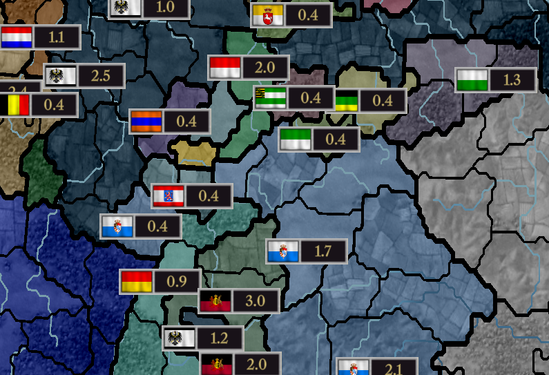
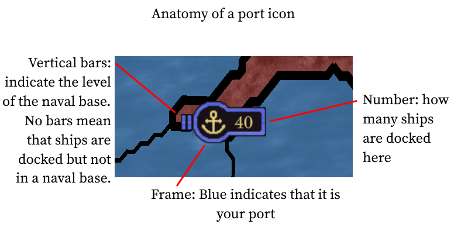
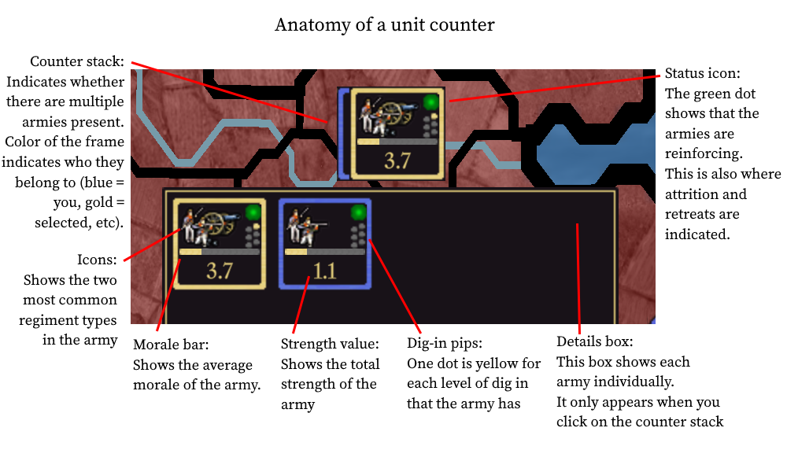
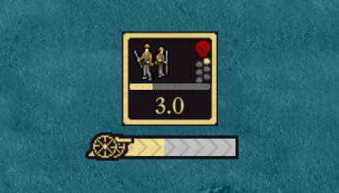
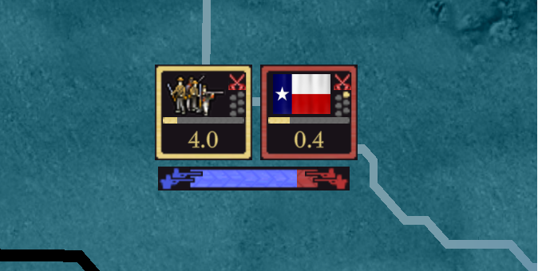
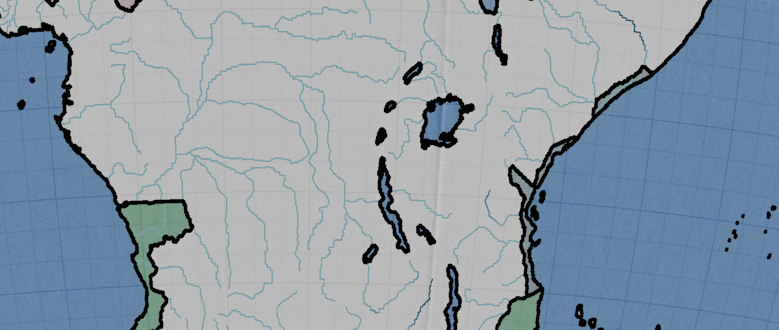

# Progreso hasta julio de 2023

Bienvenido a la actualización ligeramente retrasada. Me he centrado en preparar la [demo pública](https://github.com/schombert/Project-Alice/releases/download/v0.0.1-demo/2023-7-8-DEMO.zip), excluyendo todo lo demás. Pero más vale tarde que nunca.

## Las Grandes Noticias

La gran noticia de este mes es que el proyecto finalmente está listo para ser lanzado al público, aunque en un estado bastante rudimentario. La demostración no incluye ninguna inteligencia artificial en absoluto, así que es el momento perfecto para jugar como Texas u otro inicio difícil. O ir en busca de una conquista mundial, por si acaso. Actualmente, la "IA" estará de acuerdo con cualquier cosa que le pidas, independientemente de si tiene sentido o no.

## Progreso en la interfaz de usuario (UI)

Dado que no tenemos modelos 3D, hemos tenido que introducir algunos nuevos iconos 2D para mostrar la actividad militar en el mapa. En primer lugar, tenemos una vista compacta para cuando estás relativamente alejado.

Para los puertos, nuestra solución es la siguiente:

Cuando haces zoom, puedes ver más información sobre las unidades individuales:

También tenemos una interfaz de usuario básica para mostrar un asedio o batalla en curso.

La interfaz de usuario no está terminada en absoluto. Sin embargo, la mayor parte de su funcionalidad esencial está implementada, y por ahora mi enfoque se alejará de la interfaz de usuario para volver hacia los aspectos internos del juego. No esperes ver cambios importantes en la interfaz de usuario a partir de ahora hasta el próximo mes. Mayormente realizaré pequeñas mejoras a medida que avance.

El trabajo en el globo terráqueo también continúa. Este mes, Erik añadió los ríos (así como la lógica interna para detectar cruces de ríos). Esto completa la funcionalidad básica para el mapa en sí, en el sentido de que muestra toda la información que necesitas para jugar el juego. Ciertamente hay margen para mejoras estéticas, pero dado que no contamos con un equipo de arte, no te emociones demasiado.

## IA

Ahora que el lado del jugador del juego está en un estado funcional mínimo, ha llegado el momento de trabajar en la inteligencia artificial (IA). Mi plan actual para la IA es abordarla básicamente en dos pasos. Primero, intentaré poner la IA en un estado de funcionamiento aproximado, lo que significa que tendrá la capacidad de realizar todas las acciones que un jugador puede hacer, sin preocuparme demasiado por lo bien que juega el juego. Luego, haré un segundo paso para tratar de llevarla a un nivel mínimamente aceptable. *No* tengo la intención de intentar hacer que la IA "interprete un papel". La IA seguirá principalmente lo que considero una estrategia generalmente aplicable de intentar impulsar la industrialización mientras se enfoca en maximizar los puntos de investigación. La IA jugará de manera egoísta en general. Probablemente solo se unirá a tus guerras ofensivas si cree que puede obtener algo de ellas; generalmente no hará favores por el simple hecho de tener una alianza o relaciones altas.

Idealmente, me gustaría que la IA jugara tan competentemente como sea posible dentro de las reglas del juego. En particular, si hay algún micro tedioso que le daría a la IA una ventaja, como el ciclado de unidades, creo que la IA debería explotarlo si es posible para el jugador hacerlo también. Esto no es solo porque quiero que la IA sea un desafío. También quiero motivar mejoras a largo plazo en las reglas mismas al hacer que los jugadores estén sujetos a los mismos abusos que pueden ejercer sobre la IA.

## El Fin

¡Nos vemos el próximo mes! (o, si no puedes esperar tanto, únete a nosotros en [Discord](https://discord.gg/QUJExr4mRn))

