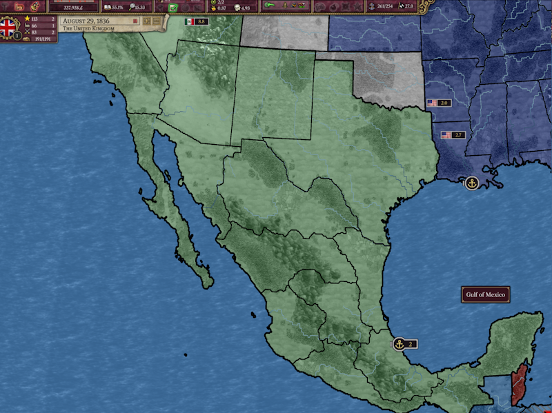
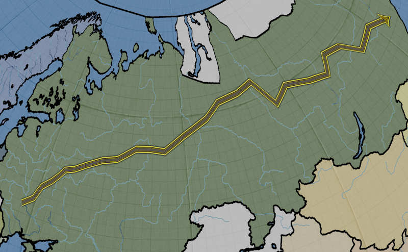
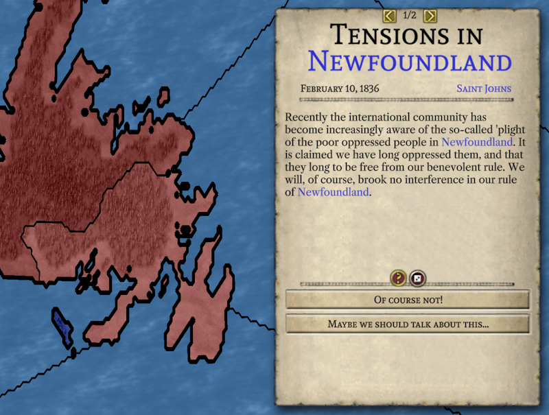
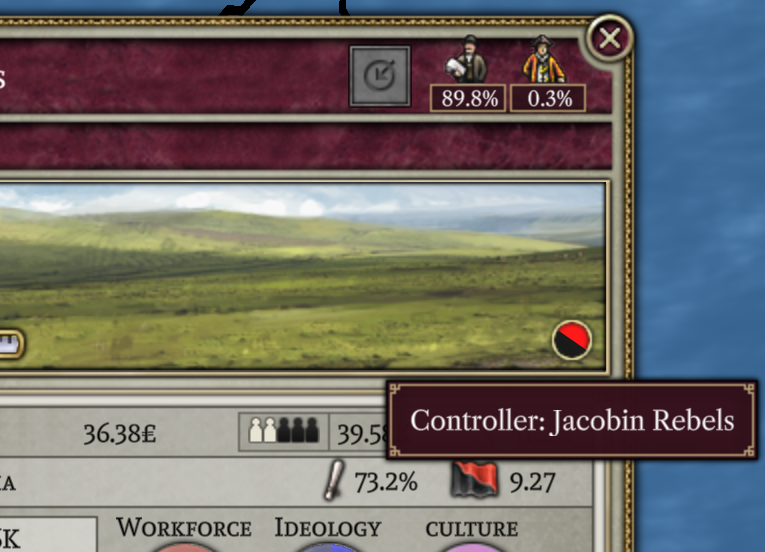
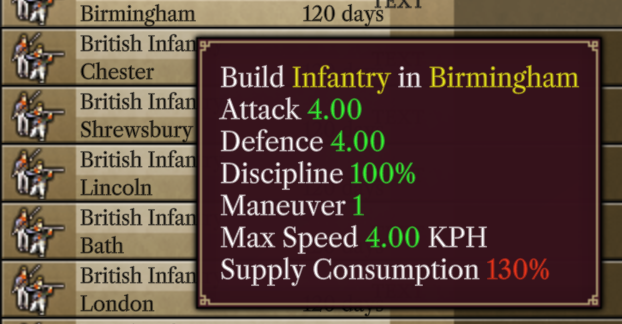

# Progreso hasta agosto de 2023

Bienvenido de vuelta a la actualización de agosto. Esta demasiado caluroso y necesito unas vacaciones.

## AI

La mayor parte de mi tiempo este mes se dedicó a obtener un borrador básico del funcionamiento de la inteligencia artificial (IA). Cuando digo "borrador básico", me refiero a que la IA existe y se mueve de alguna manera. Sin embargo, probablemente no sería un oponente muy desafiante en este punto, y hay muchas maneras de atraerlo para que realice ataques imprudentes y despliegues estratégicamente torpes de sus fuerzas. Pero funciona. La IA es capaz de gestionar su economía, investigar tecnologías e incluso ganar guerras contra otros jugadores controlados por la IA, lo que permite comenzar a probar realmente el juego.

No espero realizar revisiones fundamentales a la IA antes del lanzamiento de la versión 1.0. (Pero si alguien realmente entusiasta acerca del trabajo en IA quiere hacer revisiones, no los detendré). En cambio, planeo centrarme en complementar la toma de decisiones de la IA con rutinas diseñadas para compensar sus peores errores. No espero lanzar la versión 1.0 con oponentes de IA excelentes; mi objetivo es simplemente que no sean vergonzosamente malos. Obviamente, tener oponentes de IA buenos es importante y hace que el juego sea mucho más divertido. Pero crear un buen oponente de IA para la versión 2 implica adaptar la IA a las "singularidades" de la versión 2, en particular, cómo funciona el sistema de combate. Después de la versión 1.0, me gustaría hacer algunos cambios (en mi opinión, mejoras) en cómo funciona la guerra a un nivel fundamental, por lo que cualquier trabajo destinado a aumentar la competencia de la IA con el sistema de combate existente probablemente será un esfuerzo desperdiciado a largo plazo. Y así es como hemos llegado a lo que tenemos ahora, que es mi esfuerzo por obtener los mejores resultados con la cantidad mínima de esfuerzo.

Otra consideración importante en cuanto a la IA es qué tan bien manejará las modificaciones (mods). La investigación probablemente sea el punto fuerte de la IA en este aspecto. La IA decide qué investigar al observar los bonos que la tecnología le proporcionará (no tiene en cuenta las invenciones desbloqueadas aún). Esto significa que la IA no se verá afectada por revisiones completas del árbol tecnológico. La parte más débil de la IA en relación con los mods es cómo maneja la composición del ejército. La IA se construye bajo la suposición de que el equilibrio adecuado entre infantería y artillería puede llevarla a través del juego, ya que estos tipos de unidades se mantienen competitivos en el juego base mediante las mejoras que desbloquea la tecnología. Si un mod ha cambiado el equilibrio de las unidades lo suficiente como para que se requieran diferentes tipos de unidades para mantenerse competitivo, la IA no podrá entender esto.

Es obviamente difícil ilustrar el progreso en la IA con imágenes estáticas. Aun así, aquí hay una imagen de la IA ganando una guerra:

Un video reciente que muestra a la IA reorganizando sus unidades puedes verlo [aquí](https://www.youtube.com/watch?v=ua1n0MNf9mo).

## Flechas de movimiento

La contribución de Erik este mes consistió en agregar flechas que muestran la trayectoria que seguirán tus unidades.

Aún están en proceso de desarrollo porque no se ajustan correctamente al nivel de zoom ni muestran cuánto progreso ha realizado una unidad hacia la siguiente provincia. Sin embargo, son infinitamente mejores que simplemente recordar dónde hiciste clic y esperar a que tus unidades lleguen eventualmente, que es lo que teníamos que manejar antes.

## Mejoras menores en la interfaz de usuario

La mayor parte de mi tiempo este mes se ha dedicado a la inteligencia artificial, por lo que no hay muchos cambios en la interfaz de usuario. Pero eso no significa que no se haya hecho nada. Ahora funcionan los hipervínculos azules en el texto. Al hacer clic en uno, se desplazará el mapa a la provincia relevante y abrirá la ventana de la provincia correspondiente (o, para las naciones, la ventana de diplomacia).

Leaf también ha corregido el icono de ocupación para que finalmente puedas ver qué rebeldes han tomado el control de una provincia.

Y Masterchef ha estado trabajando continuamente en pulir la ventana militar.

## Demo actualizada

La actualización de este mes también incluye una [demo actualizada](https://github.com/schombert/Project-Alice/releases/download/v0.0.2-demo/2023-8-7-DEMO.zip) donde puedes ver por ti mismo los cambios descritos anteriormente. Una vez más, *por favor*, lee el archivo de texto incluido para obtener instrucciones sobre cómo "instalar" la demo. Al igual que la demo del mes pasado, aún no hemos alcanzado el punto en el que los informes de errores públicos sean particularmente útiles, pero es posible que pronto lleguemos a ese punto.

## El próximo mes

No estaba completamente bromeando acerca de que necesito unas vacaciones. Dado que la mayoría de los desarrolladores han estado ocupados durante el verano, he terminado realizando la mayor parte del trabajo de programación, lo que me ha dejado un poco agotado. Por otro lado, esto significa que si realmente me fuera de vacaciones este mes, casi nada se lograría. Así que, como compromiso, voy a centrarme este mes en mejoras más simples y menos consumidoras de tiempo en la interfaz de usuario. También podría comenzar a trabajar en el lanzador, que es la última pieza que falta antes de que podamos lanzar una beta pública. Leaf probablemente estará trabajando en el modo multijugador este mes. Ya ha creado una demo de concepto que permite a dos juegos conectarse y ver los movimientos del otro. Sin embargo, eso es solo la punta del iceberg en cuanto al modo multijugador, y no creo que el trabajo esté terminado para cuando llegue el próximo mes.

## El Fin

¡Nos vemos el próximo mes! (o, si no puedes esperar tanto, únete a nosotros en [Discord](https://discord.gg/QUJExr4mRn))

