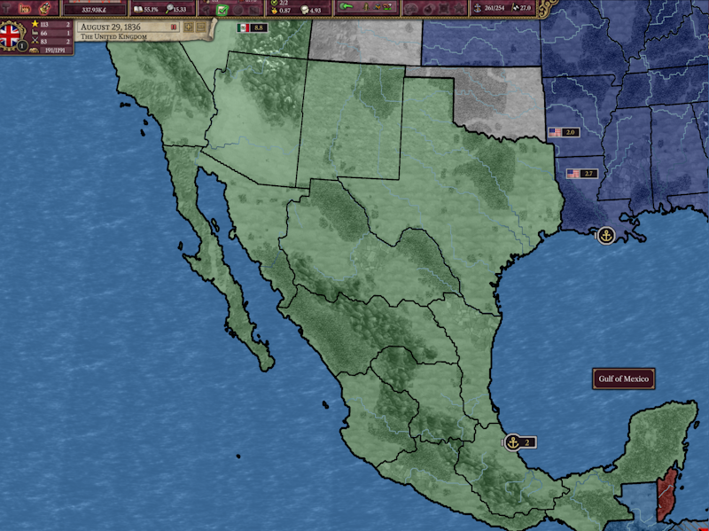
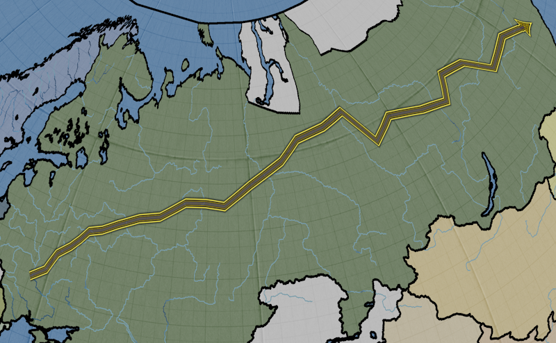
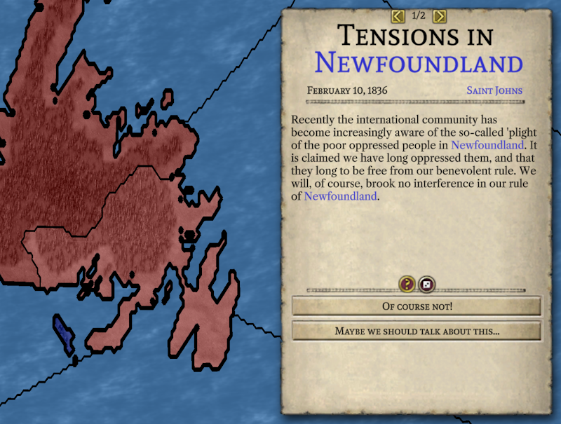

# Progresso até agosto de 2023

Bem-vindo de volta à actualização de agosto. Está muito calor e eu preciso de férias.

## IA

A maior parte do meu tempo neste mês foi gasta trabalhando em um rascunho inicial da IA. Quando digo "rascunho inicial", quero dizer que a IA existe e funciona um bocado mal. Provavelmente não seria um oponente muito desafiador neste momento, e existem muitas maneiras de atrai-la para fazer ataques mal aconselhados e implantações estrategicamente idiotas de exércitos. Mas ela funciona. A IA é capaz de administrar sua economia, pesquisar tecnologias e até vencer guerras contra outros jogadores de IA, o que torna possível começar a testar realmente o jogo.

Não espero fazer revisões fundamentais na IA antes do lançamento da versão 1.0. (Mas se alguém realmente entusiasmado com o trabalho em IA quiser revisar as coisas, eu não os impedirei.) Em vez disso, planeio em concentrar-me em complementar a tomada de decisões da IA com rotinas projetadas para compensar as piores falhas. Não espero lançar o 1.0 com oponentes de IA bons; estou a apontar para apenas algo que não seja vergonhosamente mau. Obviamente, bons oponentes de IA são importantes e tornam o jogo muito mais divertido. Mas criar um bom oponente de IA para Victoria 2 significa adaptar a IA às "idiossincrasias" de Victoria 2, em particular, como o sistema de combate funciona. Após o 1.0, gostaria realmente de fazer algumas mudanças (em minha mente, melhorias) na forma como a guerra funciona em um nível fundamental, e assim qualquer trabalho destinado a aumentar a competência da IA com o sistema de combate existente provavelmente será um esforço desperdiçado a longo prazo. E é assim que acabamos com o que temos agora. Eu estou a tentar obter os melhores resultados com o mínimo de esforço.

Outra consideração importante quando se trata da IA é como ela lidará com modificações. A pesquisa é provavelmente o ponto forte da IA neste aspecto. A IA decide o que pesquisar, olhando para os bônus que a tecnologia lhe dará (ela não leva em consideração as invenções desbloqueadas ainda). Isso significa que a IA não será incomodada por revisões completas da árvore tecnológica. A parte mais fraca da IA em relação às modificações é como ela lida com a composição do exército. A IA é construída sob a suposição de que o equilíbrio certo entre infantaria e artilharia pode levá-la ao longo do jogo, já que esses tipos de unidades são mantidos competitivos no jogo base pelas atualizações que a tecnologia desbloqueia. Se uma modificação mudou o equilíbrio das unidades o suficiente para que diferentes tipos de unidades sejam necessários para se manter competitivo, a IA não será capaz de entender isso.

Obviamente, é difícil ilustrar o progresso na IA com imagens estáticas. Ainda assim, aqui está uma imagem da IA vencendo uma guerra:

Um vídeo recente mostrando a IA movendo suas unidades pode ser encontrado [aqui](https://www.youtube.com/watch?v=ua1n0MNf9mo).

## Setas de Movimento

A contribuição de Erik neste mês foi adicionar setas mostrando o caminho que suas unidades seguirão.

Elas ainda estão um pouco em progresso, pois não se ajustam adequadamente ao nível de zoom nem mostram quanto progresso uma unidade fez em direção à próxima província. No entanto, são infinitamente melhores do que ter que lembrar onde você clicou e esperar que suas unidades cheguem lá eventualmente, que é o que tínhamos antes.

## Pequenas melhorias na UI

A maior parte do meu tempo neste mês foi dedicada à IA, portanto, não houve muitas mudanças na interface do usuário. Mas isso não quer dizer que nada foi feito. Os hiperlinks azuis no texto agora funcionam. Clicar em um deles moverá o mapa para a província relevante e abrirá a janela da província para ela (ou, para as nações, a janela de diplomacia).

Leaf também corrigiu o ícone de ocupação para nós, para que você finalmente possa ver quais rebeldes tomaram o controle de uma província.

E o Masterchef tem continuado a trabalhar para adicionar polimento à janela militar.

## Demonstração atualizada

A atualização deste mês também vem com uma [demonstração atualizada](https://github.com/schombert/Project-Alice/releases/download/v0.0.2-demo/2023-8-7-DEMO.zip) onde você pode ver por si mesmo as mudanças descritas acima. Mais uma vez, *por favor*, leia o arquivo de texto incluído para obter instruções sobre como "instalar" a demonstração. Como a demonstração do mês passado, ainda não estamos no ponto em que relatórios públicos de bugs não são particularmente úteis, mas espero chegar lá em breve.

## Próximo mês

Eu não estava a brincar quando disse que precisava de férias. Como a maioria dos desenvolvedores esteve ocupada durante o verão, acabei a desenvolver a maior parte do tempo, o que me deixou um pouco esgotado. Por outro lado, isso significa que se eu realmente for de férias este mês, quase nada será feito. Portanto, como um compromisso, vou me concentrar neste mês em melhorias na interface do usuário mais simples e menos demoradas. Talvez eu também comece a trabalhar no launcher, que é a última peça que falta antes de podermos lançar uma versão beta pública. A Leaf provavelmente estará trabalhando no modo multijogador neste mês. Ela já fez uma demonstração de prova de conceito que permite que dois jogos se conectem e vejam os movimentos um do outro. No entanto, isso é apenas a ponta do iceberg quando se trata de multijogador, e eu não acho que o trabalho estará concluído quando o próximo mês chegar.

## O Fim

Vejo você novamente no próximo mês! (ou, se você não pode esperar tanto, junte-se a nós no [Discord](https://discord.gg/QUJExr4mRn))