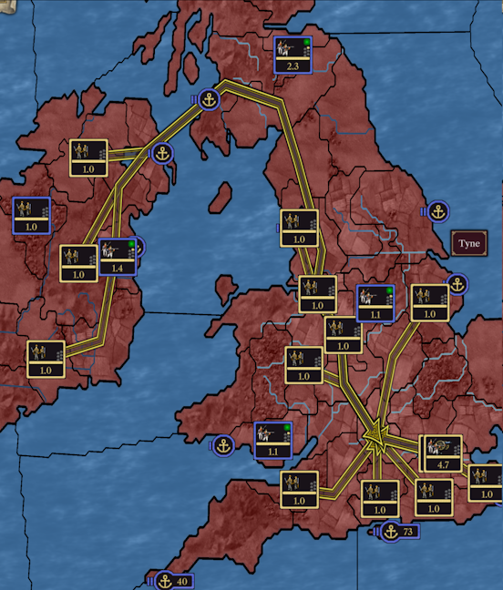
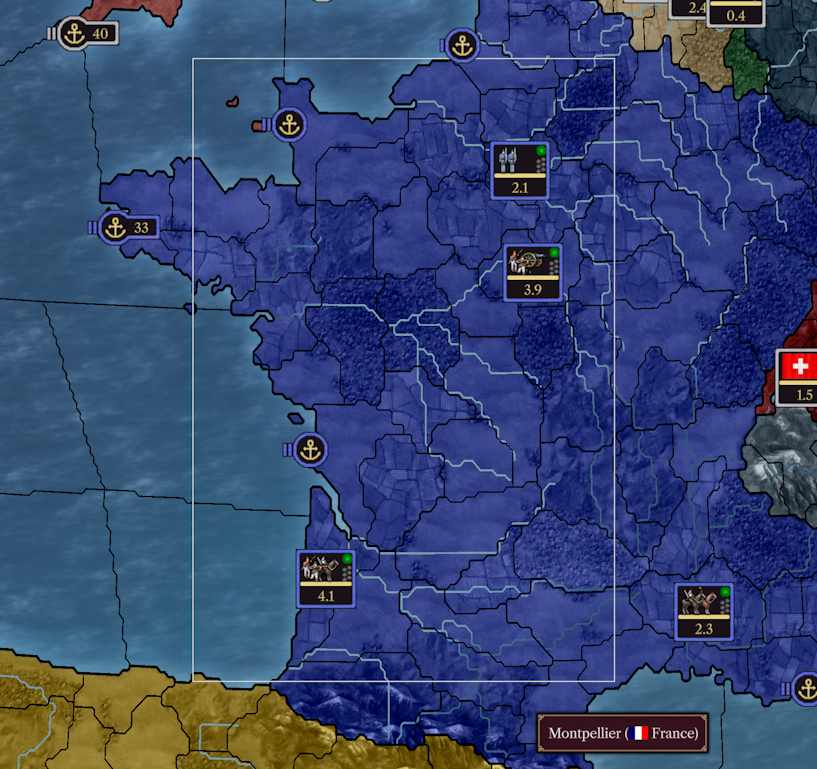
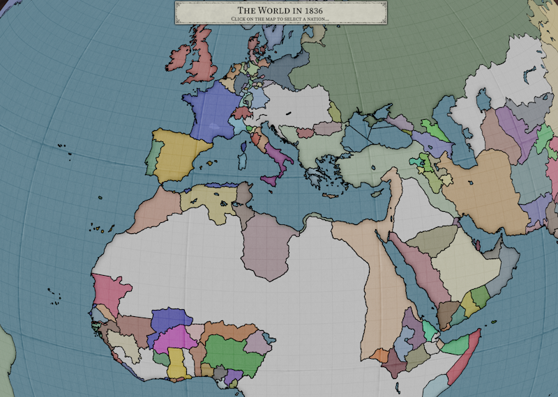
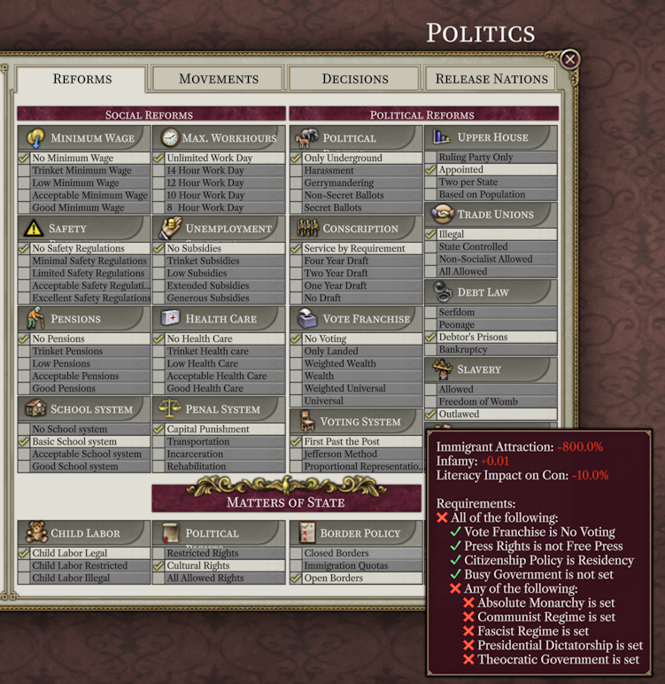

# Progreso hasta septiembre de 2023

Bienvenidos de nuevo a la actualización de [septiembre](https://www.youtube.com/watch?v=nfLEc09tTjI). Como de costumbre, esta actualización viene con una [demo actualizada](https://github.com/schombert/Project-Alice/releases/download/v0.0.6-demo/2023-9-7-DEMO.zip).

## Los pequeños detalles

Esta será una actualización bastante extensa, y sé que a todos les desagrada eso. Así que antes de empezar, aquí hay algunas imágenes bonitas:

Unidades reuniéndose en un punto de encuentro:

Selección de caja funcionando:

## Alpha pública

Estamos cerca de lanzar una alpha pública. Dado que ya contamos con una demo disponible, esto puede no marcar mucha diferencia para algunos de ustedes. Sin embargo, para mí, una alpha significa dos cosas. Primero, implica que, aunque aún habrá errores y áreas problemáticas, podrías disfrutar de un juego completo con algo de suerte. Segundo, significa que estaré abriendo la puerta a informes de errores por parte del público en general. Dependiendo de la cantidad y calidad de esos informes de errores, es posible que podamos pasar a una beta el próximo mes (la diferencia radica en que, en la beta, es probable que no veas errores importantes, mientras que en la alpha es probable que sí).

Las versiones alpha probablemente tendrán las mismas limitaciones que las demos. Esto significa que solo se ejecutarán en Windows 10 o versiones más recientes y requerirán una CPU que admita AVX2 (la mayoría de las CPU lanzadas en la última década). Algunas personas también informan tener problemas para ejecutar las demos en tarjetas gráficas con soporte OpenGL lo suficientemente antiguo, aunque Leaf ha estado proporcionando soluciones alternativas cuando es necesario.

### Haciendo un informe de error

Si no tienes la intención de realizar informes de errores, puedes omitir esta sección (un tanto extensa).

Como ya se indicó, el paso de la fase alfa a la beta dependerá en gran medida de informes de errores de calidad. Mecánicamente, hacer un informe de errores es fácil: simplemente ve al apartado de informes de errores en nuestro servidor de Discord y deja un mensaje allí. Sin embargo, un informe de errores simple como "X está mal" generalmente no es muy útil, e incluso puede ser inútil. Para corregir un error, un desarrollador necesita tres cosas: poder identificarlo, saber cuál debería ser el comportamiento correcto y poder reproducir el error por sí mismo. El informe de errores que probablemente estés inclinado a escribir probablemente no proporcionará todas esas cosas.

Supongamos, por el bien del argumento, que te encuentras con un error donde declarar una guerra con un determinado Casus Belli (CB) no te da la infamia esperada. Podrías estar tentado a hacer una publicación del tipo "Declarar guerra con CB X no dio la cantidad correcta de infamia". Esto puede parecer que dice todo lo que se necesita decir, pero en realidad es bastante deficiente en términos de lograr que se corrija el error. En primer lugar, no especifica bien el error. ¿Cada guerra declarada con ese CB da la cantidad incorrecta de infamia o solo algunas de ellas? ¿Y este problema afecta a otros CB también? Cuanta más información nos puedas proporcionar sobre las condiciones en las que has encontrado el problema, más probable es que un desarrollador identifique cuál es el error en realidad.

Lo siguiente que falta en este informe de errores es información sobre lo que debería estar sucediendo. No es suficiente decir que el CB te dio la cantidad incorrecta de infamia; debes explicar la cantidad de infamia que esperabas obtener y por qué lo esperabas. Sin esa información, es posible que no sepamos qué tipo de corrección hacer. En las demos actuales, por ejemplo, la velocidad de movimiento, el combate y los asedios son todos bastante rápidos. Con el tiempo, eventualmente los ralentizaremos, pero no creo que podamos hacerlo exactamente a la velocidad que tenían en V2. Esto se debe en parte a que no conozco el factor exacto para ralentizarlos y, por lo tanto, un informe de errores que me diga, por ejemplo, que las batallas son demasiado rápidas no ayudará a mejorar las cosas porque no me acerca realmente a descubrir qué tan rápido deberían ser.

Finalmente, para corregir un error, un desarrollador necesita saber cómo verlo por sí mismo, ya que esa suele ser la única manera de ver qué está saliendo mal exactamente y saber si un cambio en particular resolverá realmente el problema. Incluso en nuestro ejemplo simple, un buen informe de errores para este problema necesita un conjunto de pasos que guíen al desarrollador para reproducirlo. Si el CB está disponible desde el principio, podría ser tan simple como decir que declarar guerra a la nación A usando la nación B es suficiente para ver el error. Sin embargo, si se trata de un CB condicionalmente disponible, entonces necesitarías incluir básicamente un breve recorrido explicando cómo llegar al punto donde podemos ver el error. Puede parecer obvio para ti, pero encontrar un error mediante ensayo y error es una perdida de tiempo para el desarrollador. Si el error no se puede ver en los primeros años, también puede ser útil adjuntar una partida guardada (y su correspondiente archivo de escenario, y la lista ordenada de modificaciones, si las hay) donde el error se pueda encontrar fácilmente. 

## Launcher

La adición más reciente y significativa al Proyecto Alice es el nuevo launcher.

El launcher no es solo un lugar para seleccionar mods y comenzar el juego. El Proyecto Alice utiliza lo que llamamos "archivos de escenario" para acelerar la carga del juego. Un archivo de escenario es esencialmente una versión eficientemente empaquetada de los datos del juego (modificados por un conjunto dado de mods). Cuando ejecutas el juego por primera vez o seleccionas una nueva combinación de mods, primero debes crear un archivo de escenario utilizando el launcher (esto tomará más o menos tiempo dependiendo de la velocidad de tu computadora, tu disco duro y la complejidad de los mods). Si actualizas un mod, necesitarás recrear el archivo de escenario para que aparezcan los cambios en el mod (y tus antiguas partidas guardadas no estarán disponibles al usar el nuevo archivo de escenario, así que ten cuidado). Los archivos de escenario se colocan en `Your Documents\Project Alice\scenarios`, mientras que los archivos de guardado se encuentran en `Your Documents\Project Alice\saves`.

## Compatibilidad con HPM

Como primer paso hacia una mayor compatibilidad general de mods, nos enfocamos en hacer que HPM se cargara correctamente el mes pasado. Al hacerlo, descubrimos tres pequeños errores en los archivos de HPM. Por lo tanto, para evitar que el launcher te moleste al respecto, también hemos lanzado un pequeño parche de compatibilidad con HPM (disponible en el canal de parches de compatibilidad de mods en el servidor de Discord).

Todavía necesita algunos ajustes para que el texto se ajuste correctamente en algunos lugares con las nuevas fuentes, pero la mayoría de los cambios que HPM hizo se cargaron sin problemas.

## El Fin

¡Nos vemos el próximo mes! (o, si no puedes esperar tanto, únete a nosotros en [Discord](https://discord.gg/QUJExr4mRn))