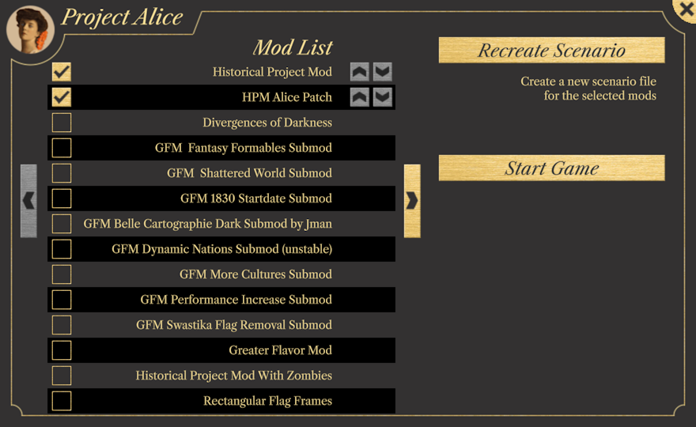

# Progresso até Setembro de 2023

Bem-vindo de volta à atualização de [setembro](https://www.youtube.com/watch?v=nfLEc09tTjI). Como de costume, esta atualização vem com uma [demo atualizada](https://github.com/schombert/Project-Alice/releases/download/v0.0.6-demo/2023-9-7-DEMO.zip).

## As pequenas coisas

Esta será uma atualização relativamente detalhada, e sei que todos detestam isso. Portanto, antes de começarmos, aqui estão algumas imagens bonitas:

Unidades a reunirem em um ponto de encontro:

Seleção de caixa funcionando:

## Alpha público

Estamos perto de lançar um alpha público. Uma vez que já temos um demo disponível, isso pode não fazer muita diferença para alguns de vocês. Para mim, no entanto, um alpha significa duas coisas. Primeiro, significa que, embora ainda haja bugs e problemas, você poderá desfrutar de um jogo completo com um pouco de sorte. Em segundo lugar, significa que estarei abrindo as portas para relatórios de bugs do público em geral. Dependendo do número e qualidade desses relatórios, talvez possamos passar para uma beta no próximo mês (a diferença sendo que na beta provavelmente não verá grandes bugs, enquanto na alpha provavelmente verá).

Os lançamentos da alpha provavelmente terão as mesmas limitações das demos. Isso significa que eles só rodarão no Windows 10 ou mais recente e exigirão uma CPU que suporte AVX2 (isso inclui a maioria das CPUs lançadas na última década). Algumas pessoas também relatam problemas ao rodar as demos em placas gráficas com suporte OpenGL suficientemente antigo, embora a Leaf tenha fornecido uma solução alternativa quando necessário.

### Fazer um relatório de bug/problema

Se você não pretende fazer relatórios de bug, pode saltar esta secção (um pouco longa).

Como já indicado, a transição da alpha para a beta será impulsionada principalmente pela qualidade dos relatórios de bug. Mecanicamente, fazer um relatório de bug é fácil: você apenas vai para a seção de relatórios de bug do nosso Discord e deixa uma mensagem lá. No entanto, um simples relatório de bug como "X está errado" geralmente não é muito útil, e talvez até inútil. Para corrigir um bug, um desenvolvedor precisa de três coisas: ser capaz de identificá-lo, saber qual deve ser o comportamento correto e ser capaz de reproduzir o bug por si mesmo. O relatório de bug que inicialmente esteja inclinado a escrever provavelmente não fornecerá todas essas informações.

Suponha, por uma questão de argumento, que você encontrou um bug onde declarar uma guerra com um determinado CB não lhe deu a infâmia esperada. Você pode ser tentado a fazer um post com a informação de "Declarar guerra com CB X não deu a quantidade certa de infâmia." Isso pode parecer que diz tudo o que precisa ser dito, mas na verdade é bastante ineficaz em termos de correção de bugs. Em primeiro lugar, não identifica bem o bug. *Toda* guerra declarada com esse CB dá a quantidade errada de infâmia ou apenas algumas delas? E esse problema afeta outros CBs também? Quanto mais informações você puder nos fornecer sobre as condições em que encontrou o problema, mais provável é que um desenvolvedor identifique o que realmente é o bug.

A próxima coisa ausente deste relatório de bug é informações sobre o que deveria estar acontecendo. Não basta dizer que o CB lhe deu a quantidade errada de infâmia: você deve explicar a quantidade de infâmia que esperava receber e por que esperava isso. Sem essa informação, talvez não saibamos que tipo de correção fazer. Nas demos atuais, por exemplo, a velocidade de movimento, combate e cercos é muito rápida. Com o tempo, eventualmente iremos desacelerá-los, mas não acredito que conseguiremos deixá-los na velocidade exata que estavam no V2. Isso se deve em parte ao fato de eu não saber o fator exato para desacelerá-los, e, portanto, um relatório de bug em que diz as batalhas são muito rápidas, por exemplo, não ajudará a melhorar as coisas, porque não me aproxima realmente de descobrir a rapidez que deveriam ter.

Por fim, para corrigir um bug, um desenvolvedor precisa saber como vê-lo por si mesmo, porque muitas vezes essa é a única maneira de ver o que está errado e saber se uma determinada mudança realmente resolverá o problema. Mesmo em nosso exemplo simples, um bom relatório de bug para esse problema precisa de um conjunto de etapas que guie o desenvolvedor para reproduzi-lo. Se o CB estiver disponível desde o início, isso pode ser tão simples quanto dizer que declarar guerra à nação A usando a nação B é suficiente para ver o bug. No entanto, se este for um CB condicionalmente disponível, você precisaria incluir basicamente um pequeno guia explicando como chegar ao ponto em que podemos ver o bug. Pode parecer óbvio para você, mas encontrar um bug por tentativa e erro é extremamente custoso, e vai retirar imenso tempo do desenvolvedor. Se o bug não puder ser visto nos primeiros anos, você também pode querer anexar um save (e seu arquivo de cenário correspondente, e a lista ordenada de mods, se houver) onde o bug possa ser facilmente encontrado.

## Launcher

A adição mais recente ao Project Alice é o novo launcher.

O launcher não é apenas um local para selecionar mods e iniciar o jogo. O Project Alice usa o que chamamos de "arquivos de cenário" para acelerar o carregamento do jogo. Um arquivo de cenário é essencialmente uma versão eficientemente empacotada dos dados do jogo (conforme modificado por um conjunto específico de mods). Ao executar o jogo pela primeira vez ou selecionar uma nova combinação de mods, você primeiro terá que criar um arquivo de cenário usando o launcher (isso levará mais ou menos tempo dependendo da velocidade do seu computador, do seu disco rígido e da complexidade dos mods). Se você atualizar um mod, precisará recriar o arquivo de cenário para que as alterações no mod apareçam (e seus salvamentos antigos não estarão disponíveis ao usar o novo arquivo de cenário, então esteja avisado). Os arquivos de cenário são colocados em `Documentos\Project Alice\cenários`, enquanto os arquivos de salvamento estão localizados em `Documentos\Project Alice\salvamentos`.

## Compatibilidade com HPM

Como primeiro passo em direção a uma compatibilidade de mods mais geral, focamos em fazer o HPM carregar corretamente no mês passado. Ao fazer isso, descobrimos três bugs menores nos arquivos do HPM. Portanto, para evitar que o launcher tenha problemas, lançamos um pequeno patch de compatibilidade do HPM para eles (disponível no canal de patches de compatibilidade de mods do Discord).

Ainda precisa de alguns ajustes para fazer o texto se encaixar corretamente em alguns lugares com as novas fontes, mas a maioria das mudanças que o HPM fez carregou sem problemas.

