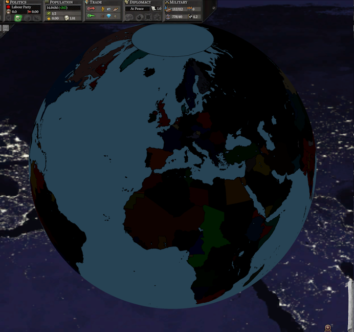
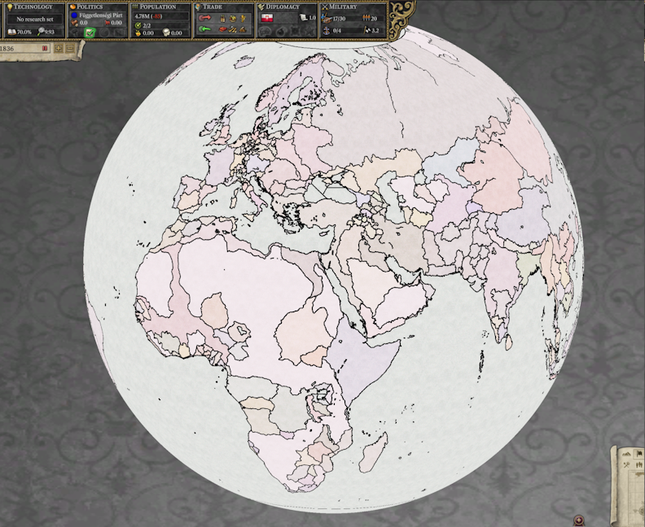

# Progreso hasta octubre de 2023

Bienvenido de nuevo a la actualización de octubre. Solo faltan unos meses más hasta que pueda dejar de escribir esto. Eso probablemente también hará feliz a mi traductor.

## Alpha pública

La versión [0.8.1 alpha](https://github.com/schombert/Project-Alice/releases/download/v0.8.1%CE%B1/0.8.1-ALPHA.zip) de Project Alice ya está disponible. Es un juego jugable en el estado actual, siempre y cuando estés dispuesto a pasar por alto algunos errores aquí y allá. Ya he jugado una campaña completa como Austria (en HPM) sin problemas importantes.

Los informes de errores de la comunidad todavía son muy apreciados y nos ayudarán a llegar más rápido a la versión 1.0. Incluso informar sobre pequeñas cosas como consejos faltantes y otros errores en la interfaz de usuario es útil.

## Estado de compatibilidad con mods

Aquí está la lista de lo que funciona y en qué medida. Si deseas que investiguemos o trabajemos en la compatibilidad con algún mod que no esté en esta lista, avísanos. Consulta la siguiente sección para obtener detalles.

- HPM (Historical Project Mod): requiere un parche de compatibilidad (pero hay muchas versiones de HPM; si estás utilizando una versión diferente de HPM, es posible que necesites que hagamos un parche para tu versión).
- HFM (Historical Flavour Mod): requiere un parche de compatibilidad y eventualmente necesitará un sombreador personalizado.
- MHM (Modern History Mod): Trabajando con el creador para encontrar y corregir errores (básicamente hecho en este momento). Necesitará un parche de compatibilidad para un sombreador personalizado y es posible que necesite algunos parches para acceder a las diversas fechas de inicio por el momento.
- ToL (Throne of Loraine): Informes de errores presentados (necesita un sombreador).
- AoE (Age of Enlightenment): Informes de errores presentados (necesita un sombreador).
- DoDR (Divergences of Darkness Rework): Informes de errores presentados. Sin embargo, debido al rápido ritmo de desarrollo de este mod, parece poco probable que pueda mantenerse al día con un parche de compatibilidad o los informes de errores (también necesita un sombreador).
- DoD:HPM (Divergences of Darkness: HPM): Informes de errores presentados.
- HtA (Heirs to Aquitania): Hice un parche de compatibilidad antes de darme cuenta de que el desarrollador aún estaba activo. Los errores deberían estar arreglados en el mod ahora.
- ToK (Trail of Khans): Informes de errores presentados.
- GFM (Greater Flavor Mod): en espera. Uno de sus desarrolladores nos pidió que esperáramos con los informes de errores hasta que se completara su próximo lanzamiento importante.
- TGC (The Grand Combination): actualmente incompatible (aunque enviamos algunos informes de errores de todos modos). TGC realiza algunos cambios fundamentales en los tipos de población y edificios de provincia que Alice no está diseñado para acomodar actualmente. Es posible que eventualmente tengamos un parche que elimine las cosas adicionales, o Leaf podría agregar soporte, pero ninguno de los dos se ha hecho aún.

## Qué significa la compatibilidad de mods

Recientemente, he estado cargando diferentes mods para ver qué funciona y qué no. Esto ha resultado ser una experiencia algo frustrante porque Victoria 2 es extremadamente permisiva en lo que acepta. Esto no significa que sea extremadamente permisiva con lo que funciona, sino que en muchos casos, los mods pueden funcionar con todo tipo de errores. Esto genera dos problemas para nosotros. En primer lugar, Alice fue diseñada en parte para facilitar la escritura de mods sin errores. Por lo tanto, se quejará de cada problema que encuentre cuando intentes lanzar un mod, dando lugar a menudo a una lista algo intimidante de errores. En mi opinión, un mod que genera un informe de errores no es compatible con Alice (todavía).

El segundo problema es cómo manejamos esos problemas. El enfoque en Alice generalmente es eliminarlos para que lo que queda pueda funcionar sin errores. Esto significa que si un desencadenante de evento se refiere a una etiqueta no definida, por ejemplo, esa parte de la condición se omitiría, lo que a su vez puede llevar a que un evento se desencadene mucho más a menudo de lo esperado. Victoria 2... hace otras cosas, desde bloquearse hasta no desencadenarse en absoluto. Así que, aunque aún puedas jugar un mod que genere un informe de errores, puede que no se ejecute de la misma manera que lo hacía en Victoria 2.

Para los mods que aún están en desarrollo, he estado enviando (a menudo cientos de) informes de errores. Mi esperanza es que al solucionar estos errores, podamos obtener mods que funcionen mejor para Victoria 2 y que puedan cargarse sin problemas en Alice. También he comenzado a escribir parches de compatibilidad (pequeños mods para los mods que reemplazan los archivos con errores) para algunos mods que ya no están siendo desarrollados.

Otro obstáculo para la compatibilidad perfecta de mods son los cambios gráficos que algunos mods hacen en el mapa. Alice utiliza OpenGL para renderizar sus gráficos (para facilitar la ejecución en Linux), mientras que Victoria 2 usaba DirectX, por lo que no podemos cargar los shaders modificados en los que algunos mods confían. El resultado más común es que el mapa se vea extremadamente oscuro o extremadamente claro al alejarse. Esto también es un problema que se puede solucionar. Nuestros shaders también se pueden modificar, por lo que podemos agregar un shader de OpenGL a estos mods para que se representen correctamente en Alice, o (si los desarrolladores del mod no están interesados en admitir Alice) podemos agregar el shader modificado a un parche de compatibilidad.

## Multijugador

No sé si tendremos multijugador como parte del lanzamiento 1.0, pero Leaf ha estado trabajando en ello este mes. Su informe es el siguiente:

El modo multijugador se ha desarrollado durante octubre, principalmente solucionando inconvenientes. Por ejemplo, ahora puedes expulsar y prohibir a personas en un vestíbulo, incluso si ya están en juego (algo que generalmente no es posible en el juego base, excepto con la ayuda de modificaciones). También se ha mejorado el chat, mostrando mensajes en tiempo real sobre quién fue expulsado, quién se unió y quién se fue, en una sola ventana, que se puede abrir con la tecla TAB. También mejoramos las colas de red para ello, es decir, nos aseguramos de que los comandos enviados a un cliente realmente se reciban por completo, no se corten al azar como sucedía anteriormente (lo cual era un error que se corrigió).

También hemos estado probando el multijugador en busca de errores y asegurándonos principalmente de que la jugabilidad sea igual o más disfrutable que en la versión estándar. También puedes unirte a nuestro equipo "Multijugador" en nuestro servidor de Discord. En cuanto al multijugador en sí, no se considera lo suficientemente "estable" como para ser incorporado directamente, por lo que se lanza por separado. Suele ser más vanguardista que las versiones normales, incorporando nuevos cambios tan pronto como se implementan, lo que significa que se solucionan más errores y hay menos desincronizaciones.

## El Fin

¡Nos vemos el próximo mes! (o, si no puedes esperar tanto, únete a nosotros en [Discord](https://discord.gg/QUJExr4mRn))