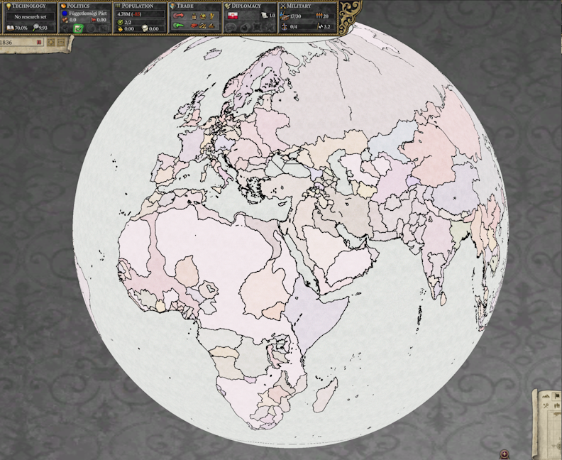

# Progresso até Outubro de 2023

Bem-vindo de volta à atualização de outubro. Só mais alguns meses até eu poder parar de escrever estas actualizações. Isso provavelmente vai deixar o meu tradutor feliz também.

## Alpha pública

A versão [0.8.1 alpha](https://github.com/schombert/Project-Alice/releases/download/v0.8.1%CE%B1/0.8.1-ALPHA.zip) do Project Alice já está disponível. É um jogo jogável tal como as coisas estão, se você estiver disposto a ignorar alguns bugs aqui e ali. Já joguei uma campanha completa como Áustria (em HPM) sem grandes problemas.

Relatórios de bugs da comunidade ainda são muito apreciados e nos ajudarão a chegar mais rápido à versão 1.0. Mesmo relatar pequenas coisas como dicas ausentes e outros problemas com a interface do usuário é útil.

## Status de compatibilidade com mods

Aqui está a lista do que funciona e em que medida. Se você deseja que investiguemos/trabalhemos na compatibilidade com qualquer mod que não esteja nesta lista, por favor, avise-nos. Veja a próxima seção para os detalhes.

- HPM: requer um patch de compatibilidade (mas existem muitas versões de HPM por aí; se você estiver usando uma versão diferente de HPM, talvez precise que façamos um patch para a sua versão).
- HFM: requer um patch de compatibilidade e eventualmente precisará de um shader personalizado
- MHM (Modern History Mod): Funcionando com o criador para encontrar e corrigir bugs (basicamente feito neste ponto). Precisará de um patch de compatibilidade para um shader personalizado e pode precisar de alguns patches para acessar as várias datas de início por enquanto
- ToL (Throne of Loraine): Relatórios de bugs enviados (precisa de um shader)
- AoE (Age of Enlightenment): Relatórios de bugs enviados (precisa de um shader)
- DoDR (Divergences of Darkness Rework): Relatórios de bugs enviados. No entanto, devido ao ritmo rápido de desenvolvimento deste mod, parece improvável que eu seja capaz de acompanhar um patch de compatibilidade ou os relatórios de bugs (também precisa de um shader)
- DoD:HPM (Divergences of Darkness: HPM): Relatórios de bugs enviados
- HtA (Heirs to Aquitania): fiz um patch de compatibilidade antes de perceber que o desenvolvedor ainda estava ativo. Os bugs devem estar corrigidos no mod agora.
- ToK (Trail of Khans): Relatórios de bugs enviados
- GFM (Greater Flavor Mod): em espera. Um dos desenvolvedores pediu que esperássemos com os relatórios de bugs até que a próxima grande versão deles estivesse pronta.
- TGC (The Grand Combination): atualmente incompatível (embora tenha enviado alguns relatórios de bugs de qualquer maneira). TGC faz algumas mudanças fundamentais nos poptypes e nos edifícios da província que Alice não está atualmente projetada para acomodar. Podemos eventualmente acabar com um patch que remova as coisas extras, ou a Leaf pode acabar adicionando suporte, mas nenhum dos dois foi feito ainda.

## O que significa compatibilidade com mods

Recentemente, tenho carregado diferentes mods para ver o que funciona e o que não funciona. Isso provou ser uma experiência um bocado frustrante porque o Victoria 2 é extremamente permissivo no que aceita. Isso não significa que ele seja extremamente permissivo no que funciona, mas em muitos casos, mods podem funcionar com todos os tipos de bugs. Isso causa dois problemas para nós. Primeiro, o Alice foi em parte projectado para tornar mais fácil escrever mods sem bugs. Portanto, ele reclamará de todos os problemas que encontrar quando você tentar lançar um mod, muitas vezes resultando em uma lista de erros intimidante. Na minha opinião, um mod que gera um relatório de erro não é compatível com o Alice (ainda).

A segunda questão é como lidamos com esses problemas. A abordagem no Alice geralmente é cortá-los para que o que resta possa funcionar sem bugs. Isso significa que se um evento "trigger" se refere a uma tag indefinida, por exemplo, parte da condição seria omitida, o que, por sua vez, pode levar a um evento seja invocado com muito mais frequência do que o esperado. O Victoria 2... faz outras coisas, desde travar até falhar em invocar. Portanto, embora você ainda possa jogar um mod que gera um relatório de erro, ele pode não funcionar da mesma forma que no Victoria 2.

Para mods que ainda estão em desenvolvimento, tenho enviado (muitas vezes centenas de) relatórios de bugs. Minha esperança é que, ao corrigir esses bugs, possamos obter mods que funcionem melhor para o Victoria 2 e que possam ser carregados sem problemas pelo Alice. Comecei a escrever patches de compatibilidade (pequenos mods para os mods que substituem os arquivos com bugs) para alguns mods que não estão mais sendo desenvolvidos.

Outra barreira para a compatibilidade perfeita com mods são as mudanças gráficas que alguns mods fazem no mapa. O Alice usa o OpenGL para renderizar seus gráficos (para facilitar a execução no Linux), enquanto o Victoria 2 usava o DirecX, e portanto não podemos carregar os shaders modificados nos quais alguns mods dependem. O resultado mais comum é que o mapa parece extremamente escuro ou extremamente claro quando visto de longe. Isso é um problema corrigível. Os nossos shaders podem ser modificados, e assim podemos adicionar um shader OpenGL a esses mods para que eles sejam renderizados corretamente no Alice, ou (se os desenvolvedores do mod não estiverem interessados em dar suporte ao Alice) podemos adicionar o shader modificado a um patch de compatibilidade.

## Multijogador

Eu não sei se teremos multijogador como parte do lançamento 1.0, mas a Leaf tem trabalhado nisso neste mês. O relatório dela é o seguinte:

O multijogador foi desenvolvido ao longo de outubro, principalmente resolvendo inconveniências, por exemplo, agora você pode expulsar e banir pessoas em um lobby, mesmo que já esteja em jogo (algo que normalmente não é possível no jogo padrão, a menos com a ajuda de mods). A função de chat também foi aprimorada, mostrando mensagens em tempo real sobre quem foi banido, quem entrou e quem saiu, em uma única janela, que pode ser aberta com a tecla TAB. Também melhoramos as filas de rede para ele, ou seja, garantimos que os comandos enviados a um cliente sejam realmente recebidos pelo cliente em sua forma completa, e não apenas cortados aleatoriamente, como acontecia (o que era um bug que foi corrigido).

Também temos testado o multijogador em busca de bugs e principalmente verificando se a jogabilidade é igual ou mais divertida do que no jogo padrão, você também pode se juntar à nossa equipe de "Multijogador" em nosso servidor do Discord. Quanto ao próprio multijogador, ele não é considerado "estável" o suficiente para ser lançado oficialmente, por isso é lançado separadamente, geralmente sendo mais "avançado" do que os lançamentos normais, incorporando novas mudanças assim que são adicionadas, devido a mais bugs estarem sendo corrigidos = menos fora de sincronia.

## O Fim

Até o mês que vem! (ou, se você não puder esperar tanto, junte-se a nós no [Discord](https://discord.gg/QUJExr4mRn))