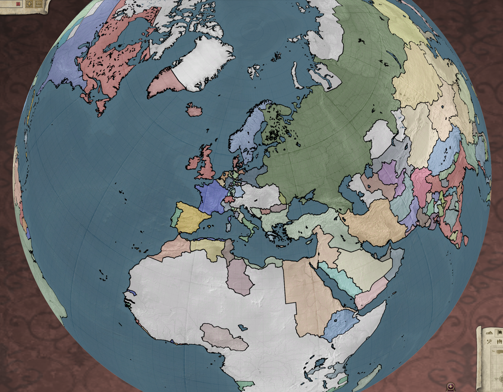
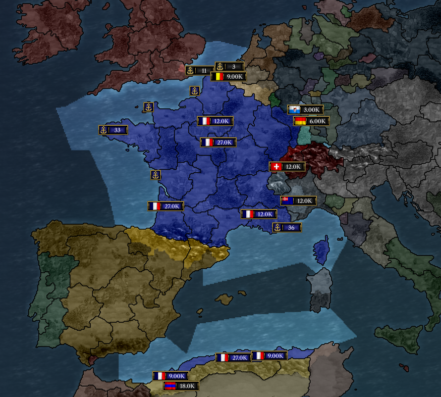
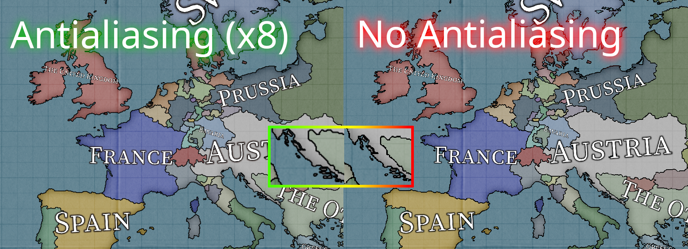
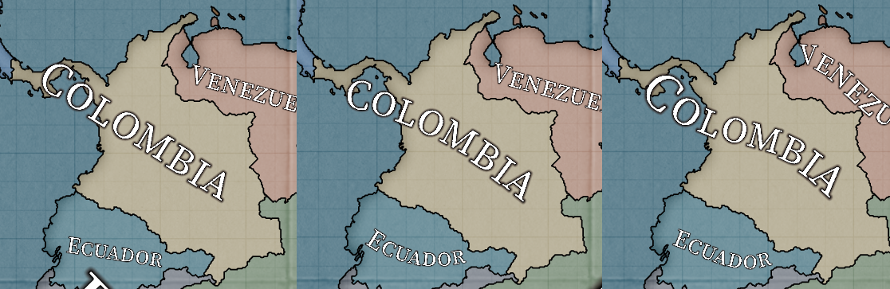
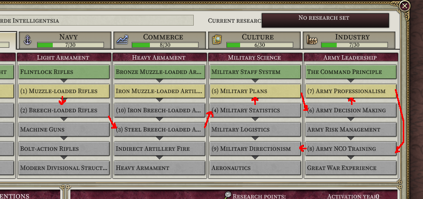
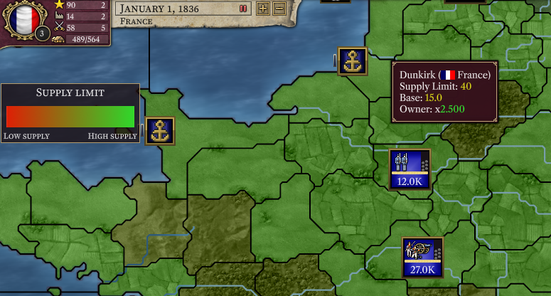
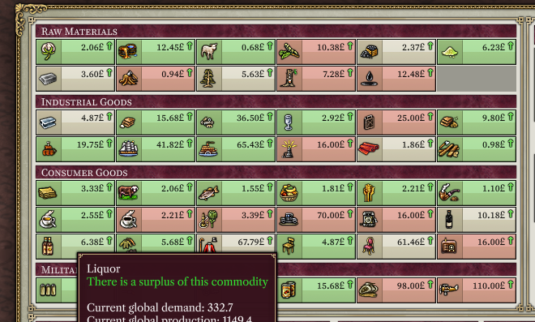

# Progresso até Novembro de 2023

É novembro.

## Alpha pública

A versão [0.8.7 alpha](https://github.com/schombert/Project-Alice/releases/download/v0.8.7%CE%B1/0.8.7-ALPHA.zip) do Project Alice já está disponível. Relatórios de bugs da comunidade continuam sendo muito apreciados e nos ajudarão a chegar à versão 1.0 mais rapidamente. Estou optimista de que avançaremos para versões beta em algum momento deste mês.

## Novo Mapa

Este mês fizemos algumas alterações para permitir mapas de globo completo. Não podemos adicionar automaticamente novos terrenos a um mapa existente, mas isso permite-nos criar mods de mapa que cubram todo o globo. O [primeiro deles](https://github.com/schombert/Project-Alice/blob/main/openv2%20map%20mod/OpenV2Map.zip), para o jogo padrão, já pode ser testado. Como na maioria dos novos mods de mapa, ainda há pixels soltos e outros pequenos problemas para resolver. Muitas das províncias na África também precisarão ser renomeadas / receber novas histórias / ser rearranjadas em estados diferentes. Isso ocorre porque parte do mapa foi desenhada a partir de uma reformulação mais antiga que fez esses ajustes para criar fronteiras pré e pós-coloniais melhores na África. Se você estiver interessado em me ajudar a fazer essas correções, por favor, entre no discord.

Planeio lançar um guia breve para atualizar um mapa existente ainda este mês.

## Outras Melhorias Gráficas

Leaf ainda está trabalhando na perfeição do multijogador (ainda temos um bug OOS a ser investigado e corrigido antes que possa ser incorporado a um lançamento oficial). No entanto, ela também fez pequenas melhorias aqui e ali.

#### Névoa de Guerra (Fog of War)

Agora há uma opção nas configurações gráficas para ligar o efeito clássico de névoa de guerra, que ocultará o conteúdo das províncias que você não tem visão.

#### Anti-Aliasing

As opções gráficas agora também permitem que você ajuste o nível de anti-aliasing de 0 (o que tínhamos antes) até 16 (o que não recomendo, porque pode tornar a interface do usuário extremamente lenta - eu optei por 4). Esta opção ajuda as fronteiras e rios a parecerem melhores, especialmente quando você está afastado.

(pedimos desculpas aos nossos tradutores)

#### Rótulos de Mapa

A maior dessas melhorias (que acabou sendo maior do que pensávamos, já que acabou sendo uma semana inteira de trabalho para três desenvolvedores) são os novos rótulos de mapa. Esses rótulos aparecem quando você está suficientemente afastado e podem ser definidos como "muito ondulados" (curvas cúbicas), "curvos" (curvas quadráticas) e "planos" (lineares).

## Melhorias na Qualidade de Vida

#### Fila de Tecnologia

Uma das melhorias na qualidade de vida que mais mudaram o jogo que adicionamos, após a capacidade de automatizar escolhas de eventos, é a capacidade de enfileirar pesquisas com antecedência (clique com a tecla Shift para adicionar pesquisa à fila e clique com o botão direito para removê-la). Quando a pesquisa atual termina, a próxima começará automaticamente. Isso significa que você pode adicionar tecnologias futuras à sua fila de pesquisa e elas simplesmente permanecerão nela até que se pesquisem (em outras palavras, eu faço "setup" da pesquisa das tecnologias assim que começo o jogo e nunca mais olho para elas).

#### Legendas de Mapa

Isso ainda é um recurso incompleto, mas começamos a adicionar uma legenda de mapa que explicará o significado das cores em vários modos de mapa. Os modos de mapa existentes realmente não precisam disso para serem compreensíveis, em sua maioria, mas eventualmente nos permitirá adicionar mais informações aos modos de mapa existentes sem exigir que os jogadores retornem para ler um novo manual explicando-os.

#### Janela de Comércio

A janela de comércio agora está codificada por cores para mostrar onde você tem escassez e excedentes (além de algumas informações adicionais adicionadas nàs tooltips).

## Extensões de Modding

À medida que nos aproximamos do lançamento da versão 1.0, comecei a implementar extensões no jogo a pedido dos modders. Não estou fazendo grandes reescritas de sistemas ou algo assim (ainda), mas adicionar novos efeitos, por exemplo, é facilmente possível. Minha regra geral aqui é que só adiciono algo se um modder planeja usá-lo quando estiver disponível. Não quero adicionar coisas que *poderiam* ser usadas, porque isso tiraria muita energia, e atrasaria a versão 1.0. A maior coisa que adicionamos até agora é uma versão do que são conhecidos como "triggers scriptados" em alguns outros jogos da Paradox.

Uma lista do que já foi adicionado pode ser encontrada [aqui](https://github.com/schombert/Project-Alice/blob/main/docs/extensions.md), que será atualizada à medida que avançarmos.

## O Fim

Até o mês que vem! (ou, se você não puder esperar tanto, junte-se a nós no [discord](https://discord.gg/QUJExr4mRn))