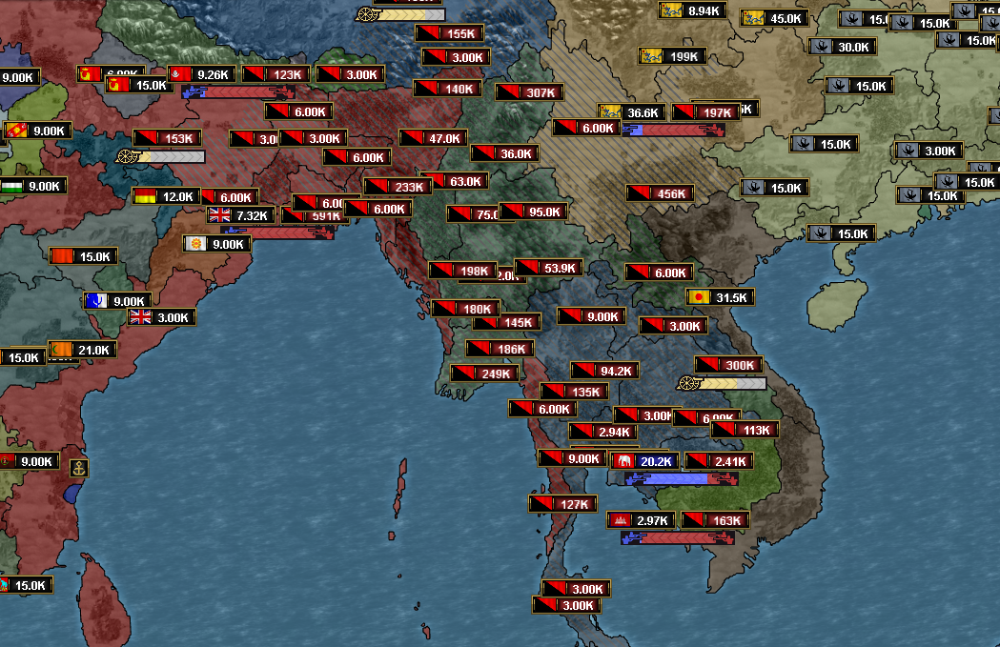
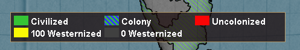
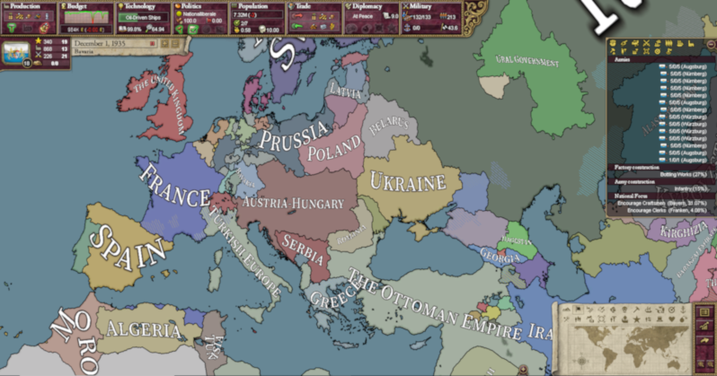

# Progress as of December 2023

Will Santa bring us 1.0 for Christmas?

## Public beta

The [0.9.3 beta](https://github.com/schombert/Project-Alice/releases/download/v0.9.3%CE%B2/0.9.3-BETA.zip) version of Project Alice is now available.

## Little Details

Since this is going to be a text-heavy update, let me start you out with some images of things that have been added since the last update.

Leaf added rebel armies back in, allowing zombie mods to work as intended (illustrated below).

Map legends for more map modes (most of these will appear in 0.9.4).

Late game GFM using leaf's new compatibility patch that has taken a strange turn.

## The Road to 1.0

We are getting close to a 1.0 release, possibly even before the end of the month. When we release version 1.0 depends mostly on the bug reports we receive. I judge how buggy the game is by how many open threads we have in the bug reports section of the discord. Once we get to the point where new threads are a rare occurrence and all of the known bugs have been fixed, I will assume that we are ready for 1.0. This means that the quality and timing of the 1.0 release is largely dependent on the community as a whole: the more bug reports we get, the fewer bugs 1.0 will ship with and the longer it will take us to ship it.

### "Missing" Features

1.0 will not release as a perfect copy of Victoria 2. Setting aside cosmetic differences, there are two major elements that may be missing in 1.0. The first is international debt. Making debt work has never been a high priority for me because, as we all know, copying how debt works in Victoria 2 means copying a mostly broken feature. Currently, the way things work in Project Alice is that if your spending would exceed your income, your spending is reduced to fit within your actual budget (including doing things like turning off subsidies) *as if* you had set your sliders to an affordable level. Even if I were to add debt, this behavior would be retained for the benefit of the AI, so you would still never see an AI go bankrupt. I know that some people want debt in the game, bugs and all, and so I made a deal with leaf (one of the other developers) that if she finishes adding polish to a couple of other features I will add debt back into the game. So whether you will see debt in 1.0 depends largely on that.

The second major feature that may end up missing from 1.0 is partial retreats, which is what makes "stack cycling" possible. The Victoria 2 AI has never been able to use and abuse this feature like a player can, and I have currently left it out because I don't want to spend the significant effort required to make the AI be able to get up to the same shenanigans, and I don't want to give a player more advantages over the AI than they already have. However, I know that this feature also has its die-hard fans. So I propose, as a compromise, that players be allowed to perform partial retreats but *only against other human players*. If you think that this compromise is something that you really, really want to see added to the game, please let me know in the discord and it could be added before 1.0 is released.

## Immediate Plans after 1.0

After 1.0 releases I plan on ~~going on vacation~~ reducing the pace of development for a month or so to focus on fixing any issues that are discovered post 1.0 and to decide on the future direction of the project. There are a number of different directions development could take after 1.0. One of those would be to turn 1.0 into the perfect Victoria 2 clone that I know some people want. However, that doesn't particularly interest me. I would encourage anyone who wants that to fork the project after 1.0 is released, and I will be happy to direct people to your daughter project/give you channels in our discord/answer questions and offer advice. Project Alice is already pretty close to being such a perfect clone, and I am sure that a few motivated developers could get it the rest of the way there in a few months if they really wanted to.

For the future of Project Alice, I foresee the following possibilities:

### Possible Future 1: Community Driven Development

It is possible that, after the release of 1.0, we will see an increase in the number of players and modders. If we start to develop our own modding community, then I am willing to let the future of Project Alice be largely determined by that community. Modders seem to be a pretty conservative bunch, generally, so I expect this will mean mostly gradual tweaks to mechanics combined with various improvements to how the UI can be extended and what scripts can do. In this future, I would continue to make the technical decisions for the project, but would give up the ability to decide on the overall direction of the game to some body that represents the community--which I will call "the council of modders."

### Possible Future 2: More Radical Changes

It is also possible that we don't attract many modders and/or that the modding community won't want to abandon having Victoria-2-compatible mods (which would make extensions and improvements pointless, since they would not be used). In that case, I will assume that 1.0 will be good enough for the people who just want a more performant and stable Victoria 2 and will continue developing Project Alice into a game I think will be (more) fun to play without really worrying about trying to imitate Victoria 2 or be compatible with it. I have a number of ideas already about how to change the game's fundamental systems, and I am itching to experiment with them.

## The End

See you again next month! (or, if you can't wait that long, join us on [discord](https://discord.gg/QUJExr4mRn))