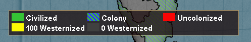

# Progresso até Dezembro de 2023

Será que o Pai Natal nos trará a versão 1.0 para o Natal?

## Beta pública

A versão [0.9.3 beta](https://github.com/schombert/Project-Alice/releases/download/v0.9.3%CE%B2/0.9.3-BETA.zip) do Project Alice já está disponível.

## Pequenos Detalhes

Já que esta será uma atualização com muito texto, deixe-me começar mostrando algumas imagens das coisas que foram adicionadas desde a última atualização.

Leaf trouxe de volta exércitos rebeldes, permitindo que mods de zumbis funcionem como pretendido (ilustrado abaixo).

Legendas de mapa para mais modos de mapa (a maioria delas aparecerá na versão 0.9.4).

Late game GFM usando o novo patch de compatibilidade de leaf que tomou um rumo estranho.

## O Caminho para 1.0

Estamos nos aproximando de um lançamento 1.0, possivelmente até o final do mês. Quando lançaremos a versão 1.0 depende principalmente dos relatórios de bugs que recebemos. Eu julgo o quão problemático o jogo está pelo número de tópicos abertos na secção de relatórios de bugs do discord. Uma vez que chegarmos ao ponto em que novos tópicos são uma ocorrência rara e todos os bugs conhecidos tenham sido corrigidos, vou assumir que estamos prontos para a versão 1.0. Isso significa que a qualidade e o timing do lançamento da 1.0 dependem em grande parte da comunidade como um todo: quanto mais relatórios de bugs recebermos, menos bugs a 1.0 terá e mais tempo levará para lançá-lo.

### Recursos "Ausentes"

A 1.0 não será lançada como uma cópia perfeita do Victoria 2. Deixando de lado as diferenças cosméticas, existem dois elementos principais que podem estar ausentes na 1.0. O primeiro é a dívida internacional. Fazer a dívida funcionar nunca foi uma prioridade alta para mim porque, como todos sabemos, copiar a dívida como funcionava no Victoria 2 significa copiar um recurso em grande parte partido e não funcional. Actualmente, da maneira como as coisas funcionam no Project Alice, se os gastos excederem as receitas, os gastos são reduzidos para se adequarem ao orçamento real (incluindo coisas como desligar subsídios) *como se* você tivesse ajustado seus controles deslizantes para um nível acessível. Mesmo se eu adicionasse a dívida, esse comportamento seria mantido em benefício da IA, porque nunca veria uma IA falir. Eu sei que algumas pessoas querem a dívida no jogo, bugs e tudo, e eu fiz um acordo com leaf (um dos outros desenvolvedores) de que se ela terminar de adicionar algumas funções e outras funcionalidades, vou adicionar a dívida de volta ao jogo. Portanto, se você irá ver a dívida na versão 1.0 dependerá em grande parte disso.

O segundo recurso importante que pode acabar faltando na 1.0 são retiradas parciais, que é o que torna possível o "ciclar unidades". A IA do Victoria 2 nunca foi capaz de usar e abusar desse recurso como um jogador pode, e actualmente deixei de fora porque não quero gastar o esforço significativo necessário para fazer com que a IA seja capaz de se envolver nas mesmas artimanhas, e não quero dar aos jogadores mais vantagens sobre a IA do que já têm. No entanto, sei que esse recurso também tem seus fãs fiéis. Portanto, proponho, como um compromisso, que os jogadores sejam autorizados a realizar retiradas parciais, mas *apenas contra outros jogadores humanos*. Se você acha que esse compromisso é algo que realmente deseja ver adicionado ao jogo, avise-me no discord e ele poderá ser adicionado antes do lançamento da 1.0.

## Planos Imediatos Após a 1.0

Após o lançamento da 1.0, planeio ~~tirar férias~~ reduzir o ritmo de desenvolvimento por um mês ou mais para me concentrar em corrigir quaisquer problemas que sejam descobertos após a 1.0 e decidir a direção futura do projeto. Existem várias direções diferentes que o desenvolvimento pode tomar após a 1.0. Uma delas seria transformar a 1.0 na cópia perfeita do Victoria 2 que sei que algumas pessoas querem. No entanto, isso não me interessa particularmente. Encorajaria qualquer pessoa que queira isso a bifurcar o projeto após o lançamento da 1.0, e ficarei feliz em direcionar as pessoas para seu projeto filho/dar-lhe canais em nosso discord/responder a perguntas e oferecer conselhos. O Project Alice já está bem perto de ser uma cópia perfeita desse tipo, e tenho certeza de que alguns desenvolvedores motivados podem levá-lo até o fim em alguns meses, se realmente quiserem.

Para o futuro do Project Alice, prevejo as seguintes possibilidades:

### Possível Futuro 1: Desenvolvimento Impulsionado pela Comunidade

É possível que, após o lançamento da 1.0, vejamos um aumento no número de jogadores e modders. Se começarmos a desenvolver nossa própria comunidade de modding, estou disposto a deixar que o futuro do Project Alice seja em grande parte determinado por essa comunidade. Os modders parecem ser um grupo bastante conservador, em geral, então espero que isso signifique principalmente pequenos ajustes nas mecânicas combinados com várias melhorias na forma como a interface do usuário pode ser estendida e no que os scripts podem fazer. Neste futuro, continuaria a tomar as decisões técnicas para o projeto, mas abriria mão da capacidade de decidir sobre a direção geral do jogo para um órgão que representasse a comunidade - que chamarei de "conselho de modders".

### Possível Futuro 2: Mudanças Mais Radicais

Também é possível que não atraiamos muitos modders e/ou que a comunidade de modding não queira abandonar os mods compatíveis com o Victoria 2 (o que tornaria as extensões e melhorias sem sentido, uma vez que não seriam usados). Nesse caso, vou assumir que a 1.0 será boa o suficiente para as pessoas que apenas querem um Victoria 2 mais eficiente e estável, e continuarei a desenvolver o Project Alice em um jogo que acho que será (mais) divertido de jogar sem realmente me preocupar em imitar o Victoria 2 ou ser compatível com ele. Já tenho várias ideias sobre como mudar os sistemas fundamentais do jogo, e estou ansioso para experimentá-las.

## O Fim

Vejo você novamente no próximo mês! (ou, se você não puder esperar tanto, junte-se a nós no [discord](https://discord.gg/QUJExr4mRn))