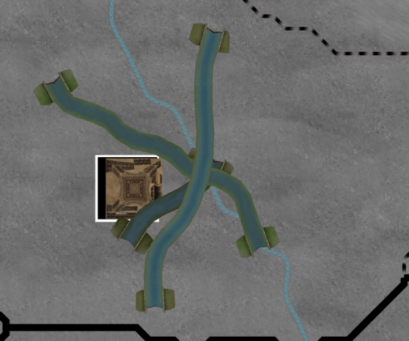

# Progresso até Janeiro 2024

Em direção a coisas maiores e melhores

## Chegou a versão 1.0

A versão [1.0.1](https://github.com/schombert/Project-Alice/releases/download/v1.0.1/1.0.1.zip) do Project Alice já está disponível.

## Um Clone de Victoria 2?

A versão 1.0.1 é o que eu consideraria uma cópia bastante próxima de Victoria 2, mas está longe de ser uma cópia perfeita. Claro, continuaremos a corrigir bugs, e a leaf está trabalhando em várias funcionalidades (possivelmente incluindo modelos 3D) que aparecerão em futuras versões 1.0.x.

Eu sei que, para alguns de vocês, isso não será o suficiente, e o que realmente querem é uma réplica perfeita de Victoria 2, até mesmo com alguns dos bugs. Vocês também provavelmente sabem que este não é *meu* objetivo com o projeto. A série de lançamentos 1.0.x é provavelmente o mais próximo que o Project Alice chegará de copiar Victoria 2.

Mas só porque esse não é *meu* objetivo não significa que vocês não podem apostar nisso, se é isso que desejam. Eu encorajo as pessoas que são "puristas" de Victoria 2 a organizar-se no nosso servidor (vocês podem até criar o vosso canal lá, se quiserem) e começar a trabalhar em uma versão do projeto que será baseada na série de lançamentos 1.0.x, mas que se aperfeiçoará em direção à cópia perfeita de Victoria 2 que vocês sonham.

Começar a partir dos lançamentos 1.0.x deixará esse projeto irmão muito, muito mais próximo de seus objetivos gerais do que começar do zero. As lições que aprendi com o Open V2, um dos meus projetos anteriores, facilitaram muito o trabalho no Project Alice, e começar a partir de algo que é meio que Victoria 2 vai economizar incontáveis horas. Ver outro projeto começar do zero me causaria dor. Além disso, embora eu não tenha planos de contribuir diretamente para uma recriação purista de Victoria 2, ainda ficaria feliz em responder perguntas e dar conselhos para que a equipa que decidir assumir; vocês não teriam que navegar por um código base estrangeiro sem ajuda.

## O Futuro Imediato

Como em qualquer software, sempre há mais bugs a serem encontrados e corrigidos. Sabemos que os rebeldes ainda precisam ser ajustados e que o TUR em GFM exibe um comportamento estranho. (Se vocês quiserem ajudar a resolver esses problemas, ter mais pessoas a jogar e a tentar identificar as causas é muito útil). Como já mencionado, a leaf está trabalhando em vários projetos que serão continuamente adicionados. O Ma44 está trabalhando na IA, então provavelmente veremos algumas melhorias lá também. E também podemos começar a implementar alguns dos itens menores e mais interessantes no fórum de sugestões. Também existem várias pequenas funcionalidades (por exemplo, habilitar o scroll quando se move em direção à borda da janela) que seriam excelentes projetos para novos colaboradores.

Primeiros trabalhos da leaf para carregar e renderizar alguns dos modelos.

Para os próximos meses, pessoalmente, planeio limitar as minhas contribuições à correção de bugs de natureza mais técnica. Em parte, isso se deve a estar aguardando para ver onde a comunidade se vai posicionar em relação ao Project Alice antes de iniciar grandes mudanças no jogo. Como mencionei na atualização do mês passado, se começarmos a ver mods específicos para o Project Alice, então provavelmente vou focar o projeto em atender às necessidades desses modders e fazer alterações no jogo que desfrutem de amplo apoio da comunidade. Claro, se não conseguirmos muitos modders, então não haverá ninguém realmente afetado por mudanças drásticas no jogo, e vou seguir com experimentos mais radicais.

Se você está trabalhando em um mod, mesmo que seja apenas um pequeno, ficaremos felizes em hospedar o seu trabalho no nosso discord. Também damos as boas-vindas a mais patches de compatibilidade para mods existentes do Victoria 2. E alguns mods, como o GFM, são tão complexos que realmente poderíamos usar mais pessoas com experiência em GFM para ajudar a melhorar o patch de compatibilidade (GFM em particular parece buggado, mas como não temos experiência suficiente com GFM para entender o que deveria estar a acontecer e a diagnosticar o que está realmente a acontecer com ele). Fazer um patch de compatibilidade geralmente é bastante direto. Primeiro, corrige-se os erros relatados pelo launcher quando se tenta criar um cenário com o mod. Em seguida, quando todos esses erros estiverem corrigidos, você joga o mod e verifica se algo "estranho" está acontecendo em comparação com o comportamento normal do mod. Se você puder identificar eventos, decisões ou outros fatores que não estão se comportando como no Victoria 2, você pode relatá-los para nós, levando a correções de bugs no Project Alice ou talvez a novas soluções alternativas para o patch de compatibilidade.

Mas, independentemente do que o futuro distante do projeto parece, há algum trabalho que precisa ser feito primeiro: uma reformulação da interface do usuário, que é no que me *vou* focar.

## Mudanças na Interface do Usuário

Acomodar os arquivos de interface do usuário do Victoria 2 é uma barreira substancial para o desenvolvimento adicional. Quando eu a implementar uma versão simples da dívida internacional, a principal dificuldade não foi escrever a lógica interna para fazê-la funcionar; a principal dificuldade foi, na verdade, descobrir como inseri-la na interface do usuário existente, e no final forneci apenas uma interface muito minimalista para isso. Está longe de ser ideal, porque a interface do usuário *é* o jogo, e se escrever a interface do usuário para novos sistemas de jogo não for indolor, isso faz com que todos os futuros desenvolvimentos sejam muito mais complicados. Não apenas o formato dos arquivos de interface do usuário e gráficos é bastante inconveniente, mas também prende-nos ao suporte à página de código win1250 para texto. A longo prazo, precisamos fazer a transição para Unicode, tanto para o benefício de nossos usuários internacionais quanto para minha sanidade. Fazer isso, no entanto, significa descartar a compatibilidade com as antigas fontes de bitmap do Victoria 2 e arquivos de localização e significa reescrever partes da interface do usuário para renderizar texto Unicode.

Portanto, decidi deitar fora o sistema de interface do usuário (e o sistema de localização, como subproduto disso) e começar do zero. Para mim, isso significa uma série de trabalhos técnicos, ao final dos quais vou sair com algumas ferramentas para facilitar minha vida. Para vocês, isso significará algumas coisas. Primeiro, vocês devem esperar que a aparência geral do jogo mude. Eu não vou copiar os antigos arquivos de interface do usuário para o novo sistema que criarei. Em vez disso, planeio refazer grande parte da interface do usuário para começar o processo de afastamento dos arquivos de jogo do Victoria 2 e em direção a um jogo que pode se manter por conta própria (embora isso provavelmente seja limitado aos elementos mais simples, como botões e fundos, para começar; eu não tenho talento artístico suficiente para realmente refazer os ícones adequadamente). Em segundo lugar, vocês perderão a opção de alternar para as fontes clássicas, pois não há como exibir texto Unicode com elas. Em terceiro lugar, eu esperaria que os nomes grandes de países no mapa desaparecessem por um tempo, e se eles voltarem, provavelmente não serão "curvos" (muitos scripts não funcionam muito bem, ou não funciona de todo). No fim, quaisquer mudanças na interface do usuário que os mods façam serão perdidas. Eu espero que a maioria dos mods para o Victoria 2 continue funcionando neste ponto (ainda exibiremos todos os mesmos dados internos), mas qualquer estilo individual que eles adicionaram teria que ser recriado no novo sistema de interface do usuário.

Acho que também devo avisar que algumas de minhas ideias de interface do usuário provavelmente os surpreenderão, pelo menos inicialmente. Não haverá barras de scroll, por exemplo. A interface do usuário se baseará em parte em algumas ideias de um projeto anterior meu, chamado PrintUI, que vocês podem encontrar um vídeo de demonstração [aqui](https://www.youtube.com/watch?v=SbE6sTv4e-c). Esse projeto foi principalmente uma experiência em criar uma interface do usuário minimalista que pudesse ser usada com igual facilidade com o mouse, teclado, controle ou alguma combinação dos três. Não pretendo que nossa nova interface do usuário seja tão espartana, mas ainda estou interessado em torná-la menos dependente do mouse como única opção.

## O Fim

Vejo você novamente no próximo mês! (ou, se você não puder esperar tanto, junte-se a nós no [discord](https://discord.gg/QUJExr4mRn))