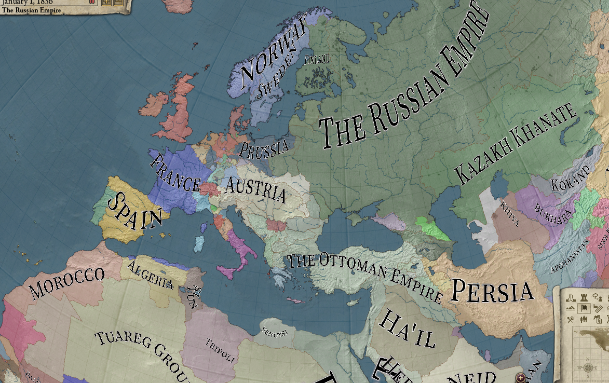
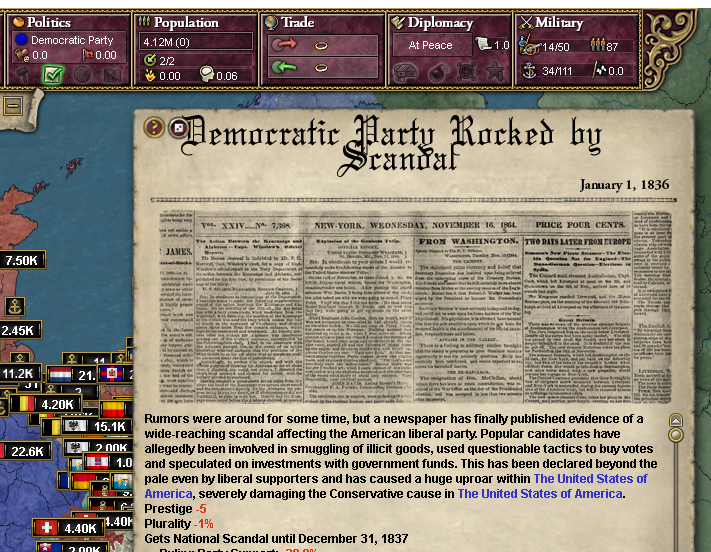
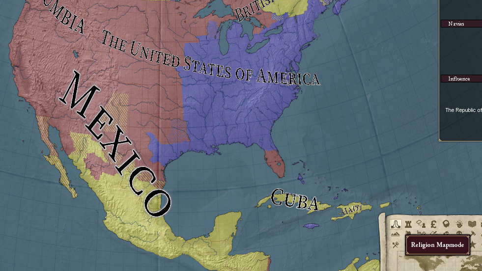
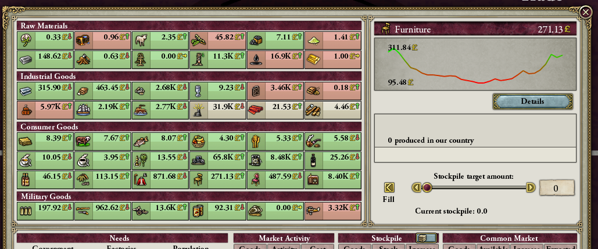
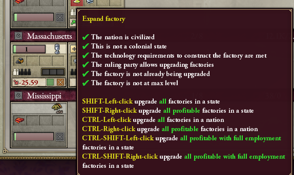
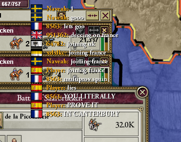

# Progress as of February 2024

It's San Valentine's Day, and we'll bring love and compassion to the otherwise not-so-hopeful and compassionate Victorian era.

## 1.0.9

Version [1.0.9](https://github.com/schombert/Project-Alice/releases/download/v1.0.9/1.0.9.7z) is available to download now!

## Modding extensions & the economy

This month was mainly dedicated to reworking the economy. Thanks to one of our developers, Peter, we had at least two iterations from the original economic model, while I'm not certain how it works in detail, it supposedly has more dynamic behaviour to it, removes price caps, and is overall more "realistic".

Another particular change throughout the month was supporting non-AVX2 CPUs. While this may seem like a rather small change, a tiny portion of our user base wasn't able to play Alice properly on older computers. However, our vectorization engine, Data Container, did, in fact, support SSE4.2, SSE3 and AVX2, but it required some tweaks to make it properly work on real computers.

Since images are worth a thousand words, and I don't feel like writing an essay, here is a summary of the new additions:

**Black map fonts**: After many complaints, we listened to you, and we added them. Access them via ESC → Graphics Options → Black Map Font.

**New event substitutions**: Give more flavour to your events and decisions. New substitutions such as `$party$`, `$government$`, `$culture_last_name$` and others will spice up your text - giving it more life to the events present at hand.

**New map modes**: Religion, fort, issues, income, militancy, and many more.

**New economy**: Dynamic prices, stabilization of demand/supply, elasticity and other neat economic properties.

**General UI improvements**: Some bothering things people complained about have now been fixed, here for example, we expanded the controls for expanding factories.

**Multiplayer improvements**: Fixed various OOS bugs (reminder that most OOS bugs occur NOT due to floating points, but rather due to multithreading). And also made the chat always visible!

## AHMP

One of our developers, Naveah, forked HPM and started doing some changes to it, to retrofit it for the new Alice engine. Some gameplay changes came with it too, such as being able to research any technology at start date (provided you research the ones from the columns first). New substate mechanics and a general orientation towards catering to the multiplayer crowd. While realizing that Alice differs from the original game.

You can obtain AHMP here: [GitHub Repository](https://github.com/nivaturimika/ahmp)
