# 2024 04 月报

我们想你们了，抱歉没写3月报，有时想堆到足够的才会说。

## v1.0.13

在撰写本文时，当前版本为1.0.13，它有很多新功能、模组修复、有效管理和游戏功能。

## 色盲模式

自我首次加入以来，一直想做无障碍模式，使残疾人能玩游戏。

两张图模拟色盲如何看待它们，第一个没有调整，第二个是`deutan`和`protan`调整。

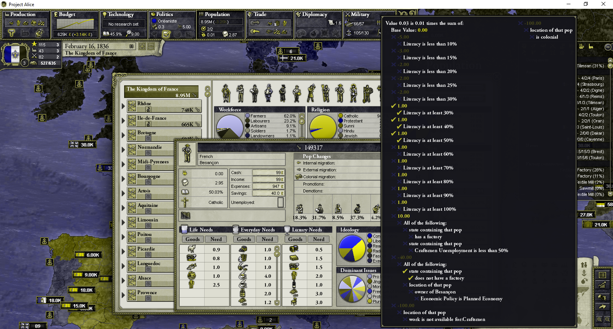

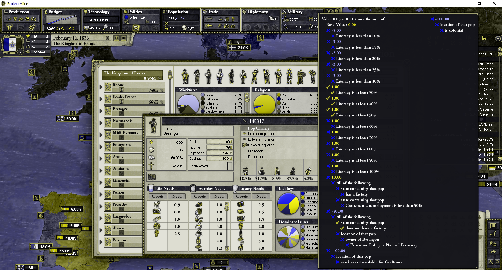

目前，它仍在基本状态，与使游戏模糊不清相形见绌（以灰度或消色差模式玩，您可能会遇到这问题）。但它提供更多玩家的可玩性。

## DDS 修复

DDS文件时常出现错误情况使模组有问题，著名的是`crimeamod`和`GFM`，例如文件颜色错误、DDS文件未正确解析等，出现蓝色马赛克、滑块消失等问题。

`现在，GFM的滑块修好了。`

## 地区名

之前，`英属大洋洲`适用澳洲。但现在不再如此，你可以睡觉，因为地图上自豪地写着`英属澳大利亚`。

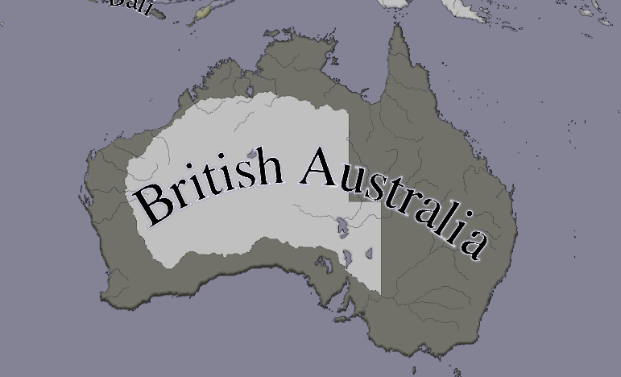

`美妙又不详的澳大利亚`

## TNO 修复

TNO (The New Order) mod 问题：
* 亚特兰特罗帕新土地没有各属其国（意大利、伊比利亚等）。
* OOB文件被忽略，因为名称是`TAG.txt`，并非`IBE_oob.txt`。

幸好，现在能玩了。

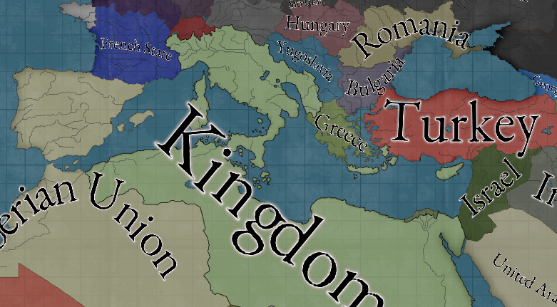

`啊，我想知道意大利在TNO中能活到五年后吗？`

## 无限递归？

玩家在mod中经常遇到崩溃问题，很多错误没得到修复。有个问题是事件触发自身，形成死锁，导致堆栈溢出！

想一下，每当你调用事件触发事件时，堆栈最多8mb，所以超过这限制，游戏会崩溃。

但不用怕，若你想做个疯狂的事，可以，只需设`alice_max_event_iterations`（一个事件在同一天递归几次），默认为8，就很多mod而言足够了。

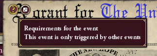

`什么？你想让事件自我调用，够了！`

## 国家 Picker 改进

工具提示，简述悬停国家/地区。此外，为方便查看，将概述凸显于选定国家。

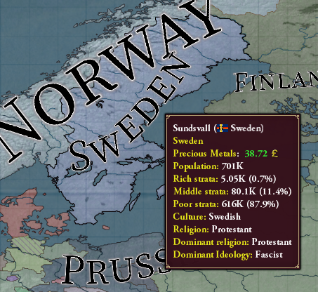

## 优美错误

错误在游戏中显示，不再崩溃。此外，有这错误的玩家自动让它国家的AI为无。然后主机可通过踢出幽灵玩家以`unset`它。

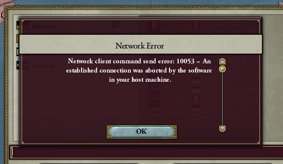

## 音乐播放器及其设置

不喜欢这曲？或想它洗脑？好，现在你可以用音乐播放器。

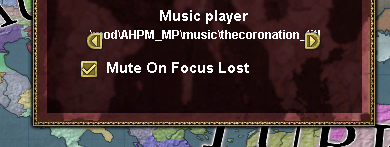

## 宏建造器

改进了，修复了些错误，做一些UI功能。

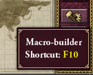

`宏建造器新图标`

`还有新的用户体验改进`

## 控制组

单选或多选单位时，按ctrl+数字，将它们分组，在侧边栏的括号中，`单位可追加到组`，更好微操。

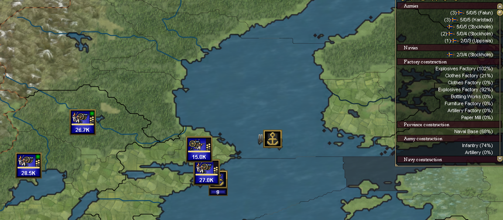

## AI自动控制前线

若不想管麻烦的军务、平叛时做决策、入侵小国不想管破事时，现在可以让军队交给AI来控制。

AI会做的：
* 增援前线
* 安全地围攻
* 平叛
* 预防御假想敌

## 有效价格

虽然原版经济没有本地价格，但我们添加了它，这样可通过国家对不同价格进行建模，从而允许出现不同的国内外贸易价格。

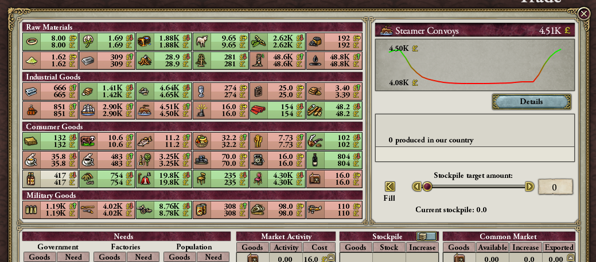

## 控制台改进

添加了新命令，还有修复有些命令不能用。控制台有音效了！

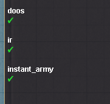

`复选或未选时代表作弊状态`

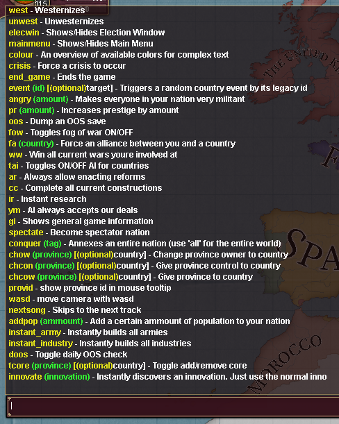

`新命令、添加人群、立即建造、tcore、发明`

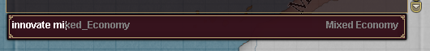

`发明建议`

## 就这些了！

我们开心地看到它已经v1.0.12，希望在5月也见到你！

`Katerina`继续改进mod兼容和多人游戏，`Schombert`继续改进UI，使其好访问、修改和国际化文本。

`Peter`大幅度改造了经济，为原本沉闷经济注入生机！