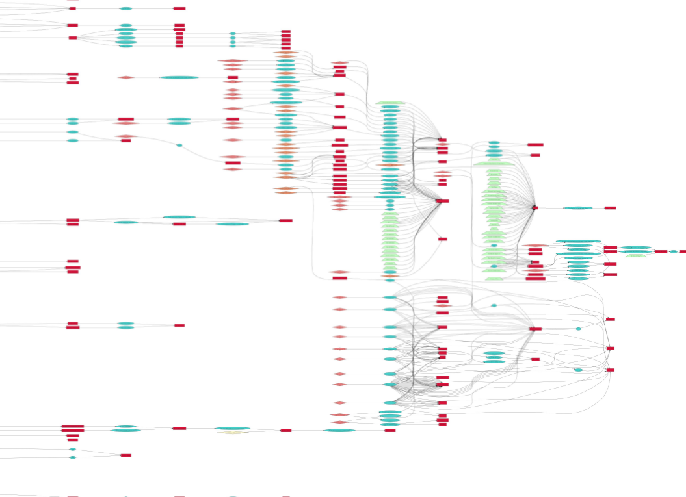
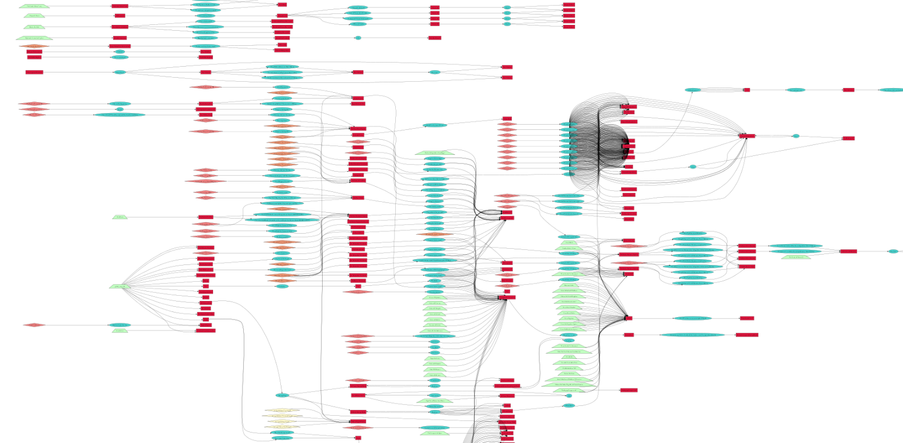
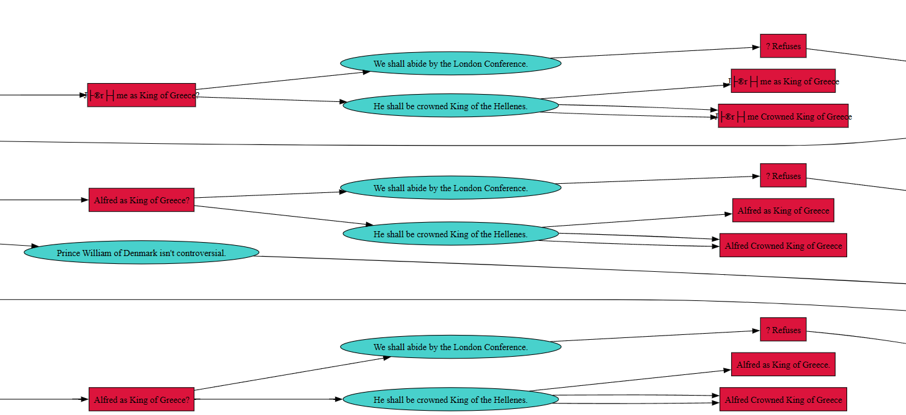
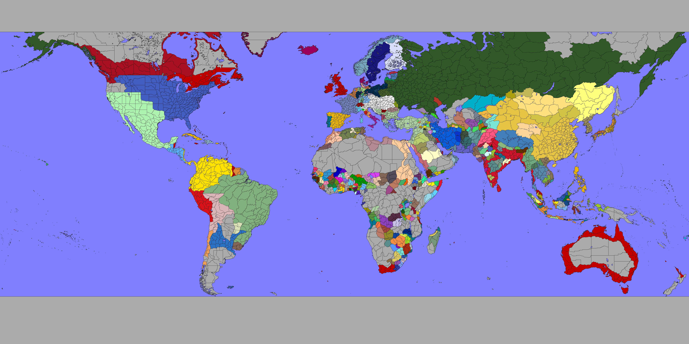
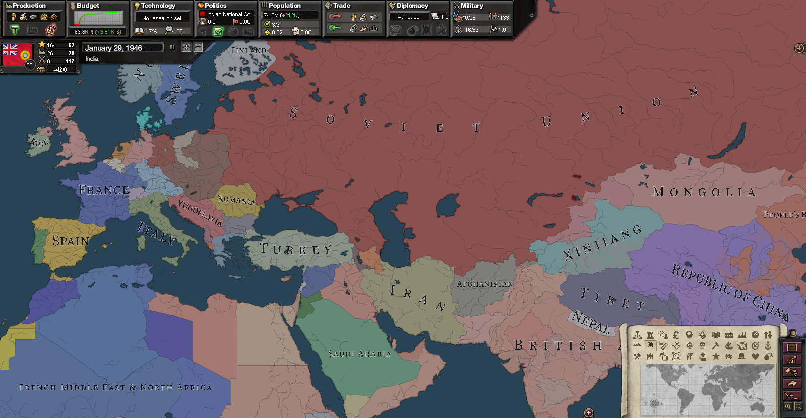
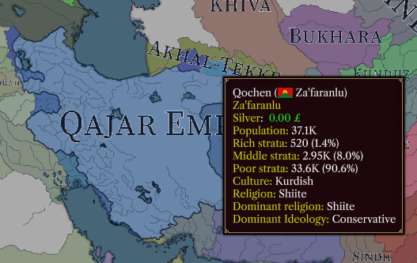
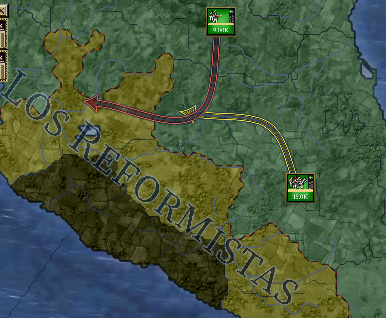
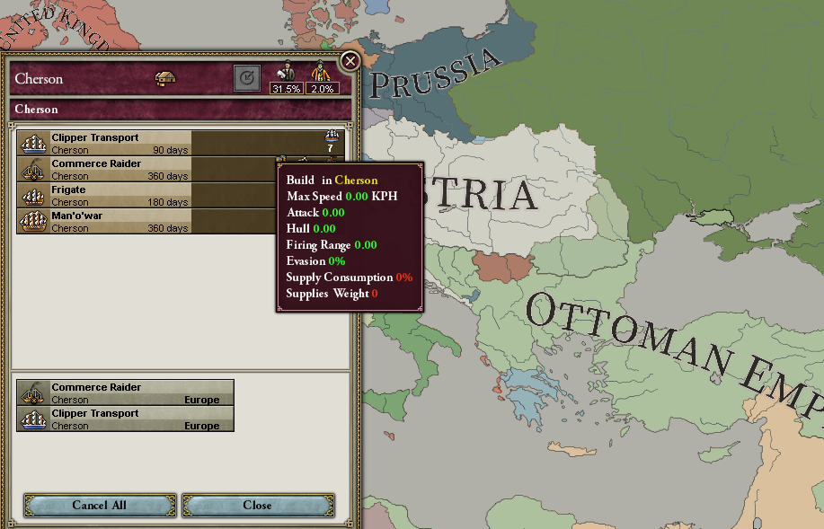
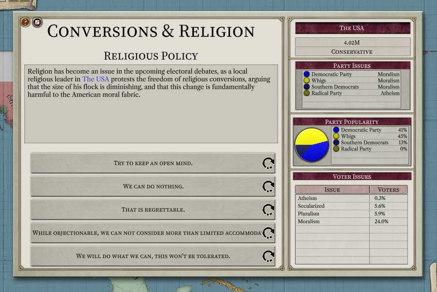
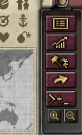

# Progress as of May 2024

Hello once again, as you may have known we have always prioritized QoL and extensibility of the game engine to do things that would otherwise be tedious or resource inefficient to do normally.

Hence, this month a handful of new modding extensions were added, some mod compatibility issues were ironed out too.

## 1.0.14

Last dev log was about a version that was upcoming, as opposed to talking about the release of a new version, here it will be the same. 1.0.14 is not released yet, but will be available shortly after this dev log.

### Automatic event chain graphs

Generate graphs of your event chains with ease, using the `graph` console command. It will make a text file inside `My Documents\Project Alice\oos\graph.txt`. It's in graphviz format, use a viewer like [this one](https://dreampuf.github.io/GraphvizOnline) to view it. But I'd recommend installing the actual graphviz program, so you don't crash the page (only if your graph is very large).

Output into SVG (using -o will cause encoding issues):
`dot -x -Grankdir=LR -Tsvg graph.txt > out.svg`

Output to PNG (will be scaled, unreadable, but cool for screenshots):
`dot -x -Grankdir=LR -Tpng graph.txt -o out.png`

### Generate world map PNG

A nice new feature! It's in the form of a console command:

`dmap blendnosealine`

Use `help dmap`, or type `dmap` to see more map generation options!

The saved map will be put in `My Documents\Project Alice\oos`

### Mod compatibility

Work has been done towards mod compatibility, not ensuring a 1:1 replica, but rather that the scripted effects and triggers evaluate and execute as expected.

For example nations are no longer "properly" cleaned, not until the end of the tick, where they are marked for garbage collection, but only actually perform it if they need it. This fixes issues with dismantlement on mods like GFM.

Non-triggered-only province events now also properly have `THIS` defined for the province itself rather than the owner.

### New label placement

Thanks to peter for reworking the label placement algorithm, now labels are way smaller but follow an uniform set of sizes as opposed to being scaled proportionally. As always, you can configure them to be linear, cuadratic or cubic.

### Hold CTRL to select navies only

A small QoL feature, micromanagers will be highly pleased with this addition.

### Press HOME to go to capital

Seems pretty natural to have it, afterall, it didn't cost anything to add! (Or did it?).

### Province hovering

A small QoL feature so you can see what you clicked, and what you're hovering. It's subtle, but it is enough to indicate "hover".

### New button SFX

Enjoy a more pleseant, and variant repertoire of sounds, as opposed to the monotonous "click" you'd hear every, single, time.

### Coloured arrows

Red when attacking, and gray when retreating!

### Build units on province view

Very requested, and we heard your requests, and we delivered.

### Elections window

Hooray! More flavour! More LARP! And also, we took the time to show nation-wide charts and information, as opposed to state-wide (because state wide is not useful in comparison).

### Console button

Some users reported being unable to access the console via (~ or \), so we just made a button to make their life easier.

### Validator

New features added to Alice's internal validator, now it also validates `news` and `tutorial` folders!

### Miscellaneous

- Hold shift to move faster on the map!
- Better validation for defines
- Cheat codes to always be able to take decisions and to always see decisions even if their triggers are not met (`dida` and `didp`)
- Less scary error messages
- Domain names supported! Now you don't have to manually resolve the IP of domain names in MP!

### That's all for now!

Yes - but wait, no - this is not all!

There are a lot of bugfixes we have done in 1.0.14, we have approached for more mod compatibility and tried to be more "QoL" centered to make up for our flaws (like the lack of newspapers, for example).
