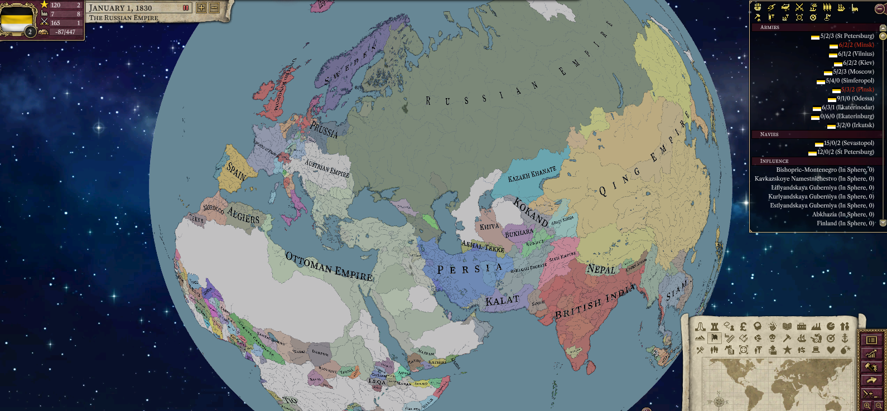

# Progress as of June 2024

Oh dear it's been so long since we haven't met each other (it's been 1 month).

It's now pride month, and it's interesting how far we've come in regards to our first release, v1.0 looked radically different than Alice does now.

So we want to thank all of you who have continued to support us through our 1.5 years of existence.

## Mod compatibility

Special care has been took this month to increase the compatibility of mods.

Most notably, various outstanding issues with GFM have been fixed, issues such as `war_countries`, `any_country` differing between decisions and events, and other quirks.

While not perfect, it is undeniably better than it was before.

Most notably dismantlement got fixed, allowing you to use the complex web of events involving dismantlement, depending on Victoria 2 behaviour such as tags not properly cleaning up.

Other issues such as declaring to become independent as Wallachia instantly got fixed too, fixing also other issues with mods such as TOL with a similar casus belli.

Mods such as IGoR_PuIR would report tier_1_focus was not a valid focus category, but that's no longer the case, now Alice made accomodations for the new categories of national foci.

Renaming issues also got fixed, so now renaming doesn't give provinces the name of "Farmlands".

And it's a good time to say that Alice allows you to tweak AI behaviour or parser behaviour via defines, consult the docs/extensions.md file for more information, but you can tweak the GP limit for AI, the behaviour of `any_country`, and other quirks.

### FROM bouncing and THIS bouncing

A very useful feature, trivial to add is FROM bouncing - but without having to use 3 country events to do it. Now you can inline your FROM scoping and THIS scoping without recurring to many events. Consult the extensions documentation.

### Lambda events

Another useful feature is defining events within events, inline. Consult the extensions documentation.

## Economy Reworks

Multiple RGOs per province are now possible!

And the economy has been made stabler, now it properly "presimulates" itself to find an equilibrium. In other words, less volatility due to predicting how to actively avoid it.

This results in a generally stabler gameplay experience with the economy, while mantaining the added realism and complexity. Below, a chart of the increase in treasury of the Ottoman Empire, we can observe it's steadily increasing and mantains itself after "startup".

## Bookmarks

You wanted them? Of course, they are a core feature - so say hi to bookmarks!

## Multilanguage support

Wonderful! We finally support languages aside from the ones hardcoded on vanilla! Long gone are the days of having to replace font sets or using weird ASCII tricks.

### Simplified Chinese

### Russian

### Arabic

### Adjectives and nouns fixes

Some languages like Spanish on the original game would display "Britanica India" rather than "British India", which led to funny situations with the map labels. Fortunely we fixed that:

Now it correctly says "India Britanica"!

### Line breaks

For breaking lines, we had to account for languages which did not use spaces often, such as Chinese or Thai.

Previously they would just overflow, which was less than ideal.

### Right-to-left!

RTL text is now supported too! (Bidirectionality is still a work in progress through). However now you can enjoy your RTL text on events and such!

## Thanks you for reading!

As always, minor bugfixes were done, balancing issues fixed and other quirks ironed out.

Expect increased mod compatibility in this release.

And as always, thank you <3
