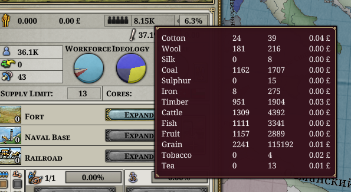
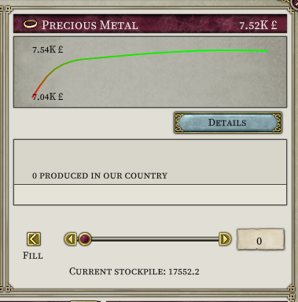
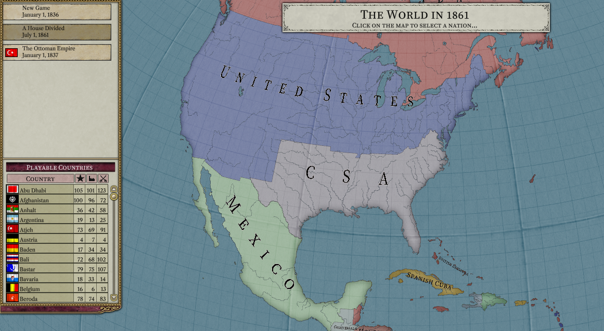
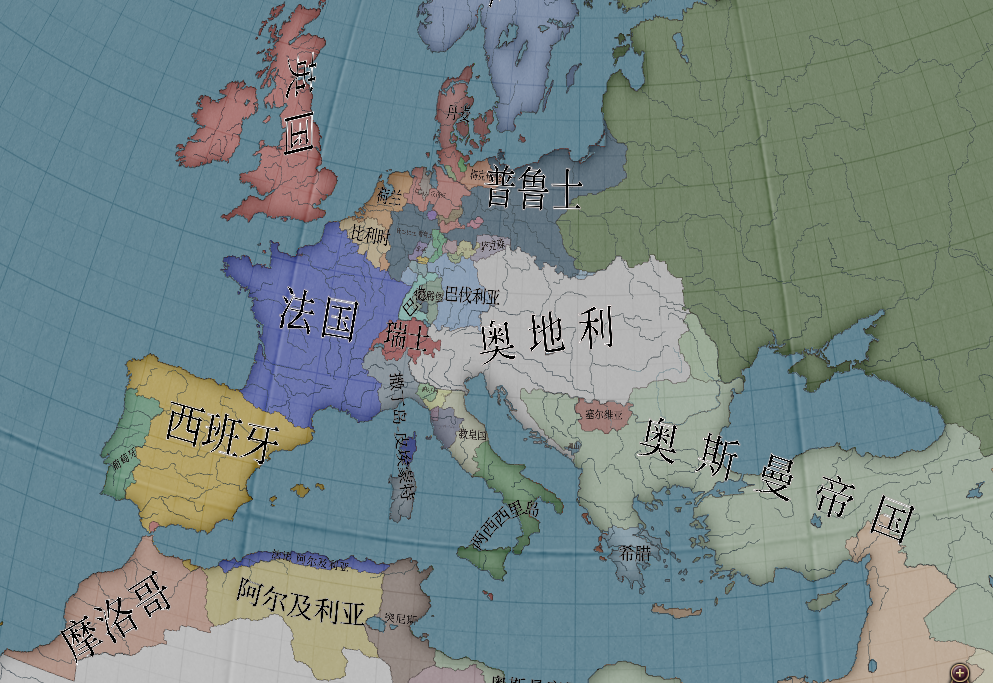
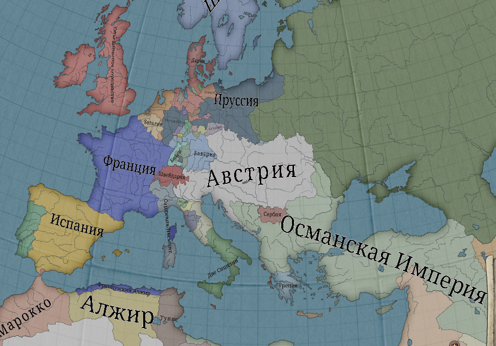
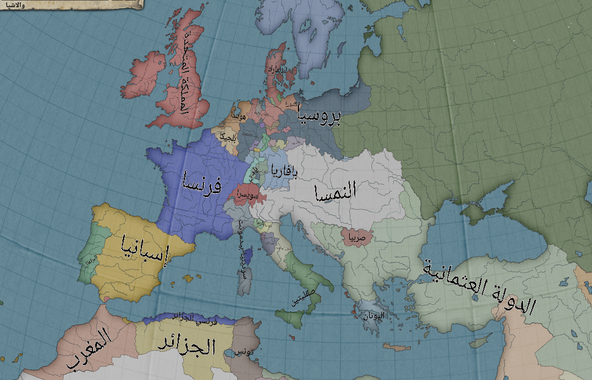
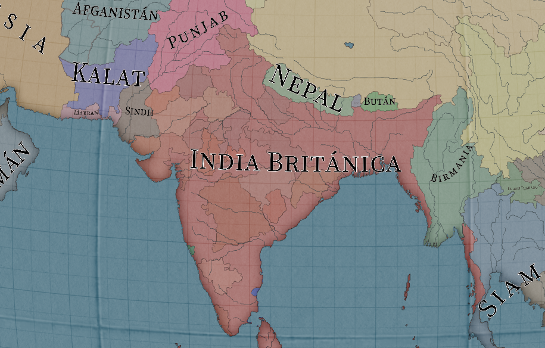
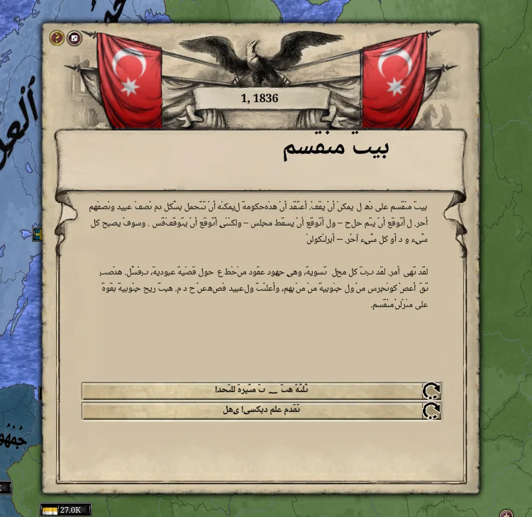

# Progress as of June 2024

Oh dear it's been so long since we haven't met each other (it's been 1 month).

## Economy Reworks

Multiple RGOs per province are now possible!

And the economy has been made stabler, now it properly "presimulates" itself to find an equilibrium. In other words, less volatility due to predicting how to actively avoid it.

This results in a generally stabler gameplay experience with the economy, while mantaining the added realism and complexity. Below, a chart of the increase in treasury of the Ottoman Empire, we can observe it's steadily increasing and mantains itself after "startup".

## Bookmarks

You wanted them? Of course, they are a core feature - so say hi to bookmarks!

## Multilanguage support

Wonderful! We finally support languages aside from the ones hardcoded on vanilla! Long gone are the days of having to replace font sets or using weird ASCII tricks.

### Simplified Chinese

### Russian

### Arabic

### Adjectives and nouns fixes

Some languages like Spanish on the original game would display "Britanica India" rather than "British India", which led to funny situations with the map labels. Fortunely we fixed that:

Now it correctly says "India Britanica"!

### Line breaks

For breaking lines, we had to account for languages which did not use spaces often, such as Chinese or Thai.

Previously they would just overflow, which was less than ideal.

### Right-to-left!

RTL text is now supported too! (Bidirectionality is still a work in progress through). However now you can enjoy your RTL text on events and such!

