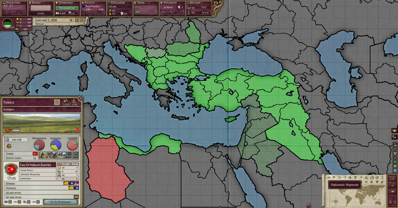
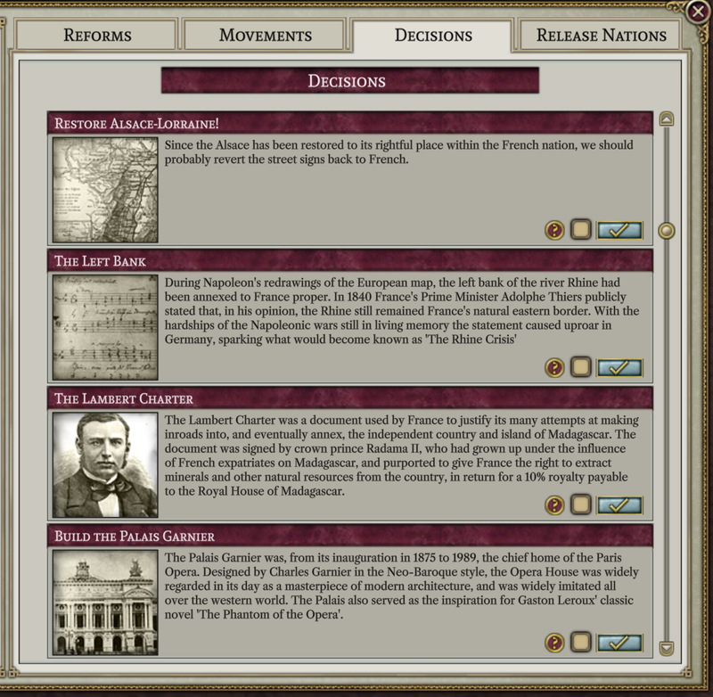
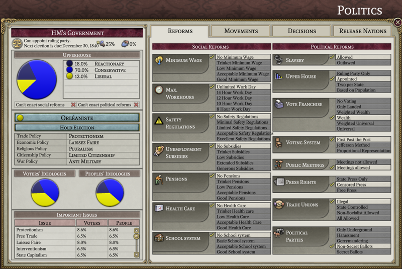
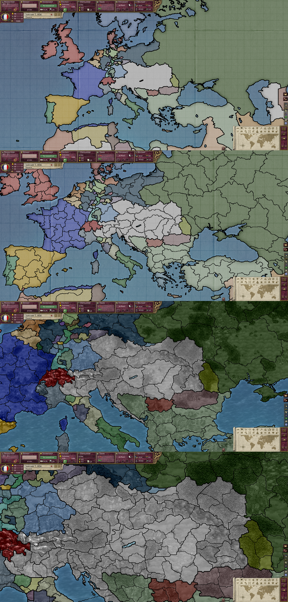

# Progress as of April 2023

Hello Alices! As April begins, we are still here, plugging away.

## New team members

In March we added (Schombert kidnapped) four new programmers to the team. In order of appearance, they are Bruno who has added the diplomatic map mode:

Cap, who has added the infrastructure, civilization level, recruitment, supply, relations, rank, and revolt risk map modes (and maybe some others I am forgetting at this point)

Nick, who has added some improvements to the console as well as making a start on the population window

and Landau who has populated the contents of the decisions tab

New programmers, artists, or people with other talents to contribute are always welcome to join the team.

## Team Q&A

For this month we asked Diana, the project coordinator and overall second in command "what are you interested in adding to Project Alice?"

> tbh, as of now I have little programming abilities. I wanted to help, but the only things I could do were advertising (the possibilities for which kinda shrunk) and managing people (but people here turned out to be quite good at managing themselves). I might try to fiddle more with the code later though. Once the project is closer to release, I want to bug mod creators to try to convince them to make mods compatible with it, and possibly help with that myself if modding compatibility is as preserved as I hope, as I can actually make mods for PDX games--I just avoid doing that due to lack of willpower. Apart from that, the project is kinda important to me; it's something I wished would happen for a long long time, especially because Victoria 2 is too slow for me.

## UI progress

The slow process of implementing the user interface is still underway. This month we made significant progress on the province window, which now displays information such as national scores, RGO employment, and alliances, among other things. The politics windows has also seen significant improvements. Most of the information in the left-hand column is now filled in, along with the contents of the issues, reforms (for uncivilized nations), and decisions tabs. A first step towards making the population window work (mentioned above) has also been made.

## Map progress

At this point 15 of the 22 map modes have been added. Additionally, the borders between provinces have gotten a facelift. Now borders between nations are thicker than those between states, which are in turn thicker than those between provinces. And as you zoom out, the less important borders will disappear, leaving you with only the national borders when the map is most zoomed out.

## Classic fonts

Last month we mentioned that MasterChef was working on bringing the classic fonts back as an option. This month we are happy to announce that the work has been completed, and for the ultra purists we have added the option to render the text using the original bitmaps.

People with high-resolution monitors will probably want to stick with the new fonts; bitmap fonts don't look great when they are scaled up.

## Game rules

In terms of making the game actually *run*, an important first step was made this month by collecting a--mostly complete--description of the rules of the game. Not only is this description useful as a target to program towards, it is probably independently useful for players of Victoria 2 who simply want to know how the game actually works. Please feel free to share any corrections or fill in any omissions.

[Rules document](https://github.com/schombert/Project-Alice/blob/main/docs/rules.md)

See you again next month! (or, if you can't wait that long, join us on [discord](https://discord.gg/QUJExr4mRn))