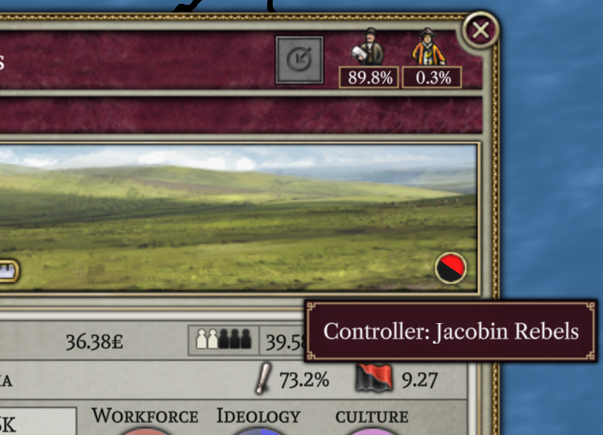
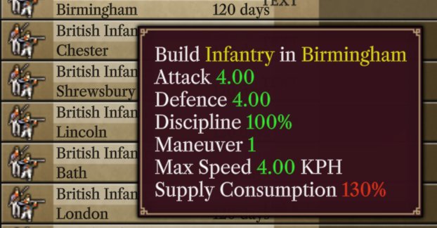

# 2023 8月 进展报告

欢迎阅读本月报告，但天太热了，我想放假。

## AI

这月，我大半时间都花在AI上，PA有了AI，但它初级且很简陋。这阶段它可能不是有价值的对手，且你可使它作出错误选择和战术上愚蠢部署。但它起码能工作了。AI管好自己经济和研究，甚至与其他AI战争中取得胜利，真正测试游戏成为可能。

在1.0版本发布之前，我对AI不会有根本修改。（若有人对AI感兴趣并希望修改，我不会阻止。）相反，我计划通过一些程序辅助AI决策，弥补其重大失误。没指望它是出色的对手，只是希望它不丢脸。即使出色的AI很重要，确实让游戏更有趣。但为V2做一个出色的AI，意味着针对v2本身缺陷进行调整，尤其是战斗系统。在1.0版本之后，我希望改进PA战争机制，因此旨在增强AI在现有战斗系统中的工作可能是吃力不讨好。这是现在所面临的情况，我尽力以最小努力达成最佳结果。

AI在mods时有一个主要因素是它在研究上的表现。AI可能擅长研究，通过查看科技赋予的奖励来决定应该研究什么（不考虑解锁的发明），意味着它不被科技树完全修改所困扰。AI在部队编制上较弱，尤其是mods。AI在此基于合适的步兵与炮兵比例让它取胜，这些单位通过其科技升级而保持优势。如果mod改变了单位平衡，甚至需要多种单位配合，那它无法理解这点。

显然，通过静态图片展示AI进展是很难的。但这是AI取胜的图片：

最近有个展示AI移动其单位的[视频](https://www.youtube.com/watch?v=ua1n0MNf9mo)。

## 移动箭头

Erik'的贡献在本月是添加了箭头，显示了你的部队要走的路径。

这些箭头目前很初级，不能根据缩放级别而自动调整其大小，也不能显示单位前往下个地块中取得了多少进展。但好比之前只凭记忆点击目标地点并希望它到达。

## UI界面小的改进

上面提过大半时间花在AI上，所以UI没多大变化，但有改了。文本中的蓝色链接现已经正常工作。点击任一链接把视窗转到相关地方并打开其窗口（国家-打开外交窗口）。

Leaf为我们修复省份占领状态bug，终于能看到那些叛军占领了哪些省份。

还有Masterchef一直在完善军事窗口。

## 最新演示

本月更新还附带了[最新演示](https://github.com/schombert/Project-Alice/releases/download/v0.0.2-demo/2023-8-7-DEMO.zip)。您可在军事窗口上看到上述修改。务必阅读附带的文件，其中包含了安装说明。与上月演示版一致，我们还没到达公开报告错误的阶段，但可能很快到了。

## 下月

我想放假，我是认真的，因为他们夏季很忙，所以我完成大部分的编程工作，很累。另外，如果我放假，本月几乎没进展。所以为了平衡，本月打算改进UI；可能做启动器，这是推出公测版最后阶段。Leaf可能在本月做多人模式，她做了相关原型，可让两位玩家连接并看到对方动作。但对多人模式而言，这只是冰山一角，我认为本月不会完成这工作。

## The End

下月再见！(或者，如果你迫不及待，就加入[discord](https://discord.gg/QUJExr4mRn)吧！)
