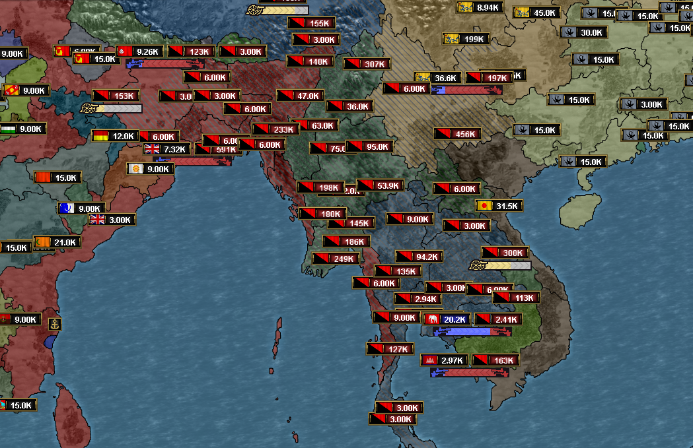

# Progreso hasta diciembre de 2023

¿Nos traerá Santa la versión 1.0 para Navidad?

## Beta pública

La versión [0.9.3 beta](https://github.com/schombert/Project-Alice/releases/download/v0.9.3%CE%B2/0.9.3-BETA.zip) del Proyecto Alice ya está disponible.

## Pequeños Detalles

Dado que esta actualización va a tener mucho texto, permíteme comenzar mostrándote algunas imágenes de cosas que se han añadido desde la última actualización.

Leaf reintegró los ejércitos rebeldes, permitiendo que los mods de zombis funcionen según lo previsto (ilustrado a continuación).

Leyendas de mapas para más modos de mapas (la mayoría de estas aparecerán en la versión 0.9.4).

Juego tardío de GFM utilizando el nuevo parche de compatibilidad de Leaf que ha tomado un giro extraño.

# El Camino hacia la Versión 1.0

Nos estamos acercando a un lanzamiento 1.0, posiblemente incluso antes de que termine el mes. La fecha de lanzamiento de la versión 1.0 dependerá principalmente de los informes de errores que recibamos. Evalúo qué tan defectuoso está el juego según la cantidad de hilos abiertos que tenemos en la sección de informes de errores en el Discord. Cuando lleguemos al punto en el que los nuevos hilos sean raros y todos los errores conocidos hayan sido corregidos, asumiré que estamos listos para la versión 1.0. Esto significa que la calidad y el momento del lanzamiento de la versión 1.0 dependen en gran medida de la comunidad en su conjunto: cuantos más informes de errores recibamos, menos errores tendrá la versión 1.0 y más tiempo nos llevará lanzarla.

### Características "Perdidas"

La versión 1.0 no se lanzará como una copia perfecta de Victoria 2. Dejando de lado las diferencias cosméticas, hay dos elementos principales que podrían estar ausentes en la versión 1.0. El primero es la deuda internacional. Hasta ahora, hacer que la deuda funcione nunca ha sido una alta prioridad para mí porque, como todos sabemos, copiar cómo funciona la deuda en Victoria 2 significa copiar una característica en su mayoría defectuosa. Actualmente, en Project Alice, si tus gastos exceden tus ingresos, tus gastos se reducen para ajustarse a tu presupuesto real (incluyendo cosas como desactivar subsidios), *como si* hubieras ajustado tus deslizadores a un nivel asequible. Incluso si agregara la deuda, este comportamiento se mantendría para beneficio de la IA, por lo que nunca verías a una IA quebrar. Sé que algunas personas quieren la deuda en el juego, errores incluidos, y por eso hice un trato con leaf (otra de las desarrolladoras) de que si ella termina de pulir algunas otras características, agregaré la deuda de nuevo al juego. Así que la presencia de la deuda en la versión 1.0 dependerá en gran medida de eso.

El segundo elemento importante que podría faltar en la versión 1.0 son las retiradas parciales, lo que hace posible el "ciclaje de pilas". La IA de Victoria 2 nunca ha podido usar y abusar de esta característica como lo haría un jugador, y actualmente la he dejado fuera porque no quiero gastar el esfuerzo significativo necesario para hacer que la IA pueda hacer las mismas travesuras, y no quiero darle a un jugador más ventajas sobre la IA de las que ya tiene. Sin embargo, sé que esta característica también tiene sus seguidores acérrimos. Por lo tanto, propongo, como compromiso, que los jugadores puedan realizar retiradas parciales, pero *solo contra otros jugadores humanos*. Si crees que este compromiso es algo que realmente deseas ver agregado al juego, házmelo saber en el Discord y podría agregarse antes de que se lance la versión 1.0.

## Planes Inmediatos Después de la Versión 1.0

Después del lanzamiento de la versión 1.0, planeo ~~tomarme unas vacaciones~~ reducir el ritmo de desarrollo durante aproximadamente un mes para centrarme en corregir cualquier problema que se descubra después de la versión 1.0 y decidir la dirección futura del proyecto. Hay varias direcciones diferentes que el desarrollo podría tomar después de la versión 1.0. Una de ellas sería convertir la versión 1.0 en el clon perfecto de Victoria 2 que sé que algunas personas quieren. Sin embargo, eso no me interesa particularmente. Animaría a cualquiera que desee eso a bifurcar el proyecto después del lanzamiento de la versión 1.0, y estaré encantado de dirigir a las personas a tu proyecto secundario/darte canales en nuestro Discord/responder preguntas y ofrecer asesoramiento. Project Alice ya está bastante cerca de ser un clon perfecto, y estoy seguro de que unos pocos desarrolladores motivados podrían llevarlo al resto del camino en unos pocos meses si realmente lo desean.

Para el futuro de Project Alice, vislumbro las siguientes posibilidades:

### Posible Futuro 1: Desarrollo Impulsado por la Comunidad

Es posible que, después del lanzamiento de la versión 1.0, veamos un aumento en el número de jugadores y modders. Si comenzamos a desarrollar nuestra propia comunidad de modders, estoy dispuesto a dejar que el futuro de Project Alice sea determinado en gran medida por esa comunidad. Los modders suelen ser bastante conservadores, en general, así que espero que esto signifique principalmente ajustes graduales a la mecánica combinados con diversas mejoras en cómo se puede ampliar la interfaz de usuario y lo que pueden hacer los scripts. En este futuro, continuaría tomando decisiones técnicas para el proyecto, pero renunciaría a la capacidad de decidir sobre la dirección general del juego a algún organismo que represente a la comunidad, al que llamaré "el consejo de modders".

### Posible Futuro 2: Cambios Más Radicales

También es posible que no atraigamos a muchos modders y/o que la comunidad de modders no quiera abandonar los mods compatibles con Victoria 2 (lo que haría que las extensiones y mejoras fueran inútiles, ya que no se usarían). En ese caso, asumiré que la versión 1.0 será lo suficientemente buena para las personas que simplemente quieren una Victoria 2 más eficiente y estable, y continuaré desarrollando Project Alice en un juego que creo que será más divertido de jugar sin preocuparme demasiado por tratar de imitar a Victoria 2 o ser compatible con ella. Ya tengo varias ideas sobre cómo cambiar los sistemas fundamentales del juego y estoy ansioso por experimentar con ellas.

## El Fin

¡Nos vemos el próximo mes! (o, si no puedes esperar tanto, únete a nosotros en [Discord](https://discord.gg/QUJExr4mRn))