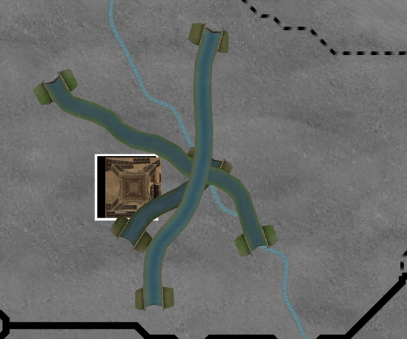

# 2024 1月 报告

爱丽丝计划[1.0.1](https://github.com/schombert/Project-Alice/releases/download/v1.0.1/1.0.1.zip)版已可用。

## V2复刻？

1.0版可以说接近了V2，但它不完美。当然，我们会继续修复错误，而Leaf在开发一些功能（还包括3D模型），将在未来版本中出现。

完美复刻V2，但不是我的目标。若你想要的话，我鼓励原教旨主义者在Discord本服务器上组织来，还可有专属频道，开始fork此项目并朝向完美复刻V2的方向。

## 近未来

跟所有软件一样总有更多错误要修复，我们知道叛军要改，而GFM中的TUR有些奇怪行为。（你想改的话，让更多人玩它并确定原因更有用。）回到正题，Leaf在做一些项目将会添加。Ma44一直在弄AI工作，因此我们会在那方面看到些改进，还可能会转向弄些有趣的小项目，还有些功能（鼠标移到窗口边缘以滚动）。

Leaf初期使些模型得到渲染。

在几个月内，我个人想只贡献修复技术性错误。部分原因是我等社区对爱丽丝计划作决定，再大改变游戏。上月我提到，回顾[2023年12月报](https://github.com/schombert/Project-Alice/blob/main/docs/Devlogs/december/december_cn.md)社区改革。

若你在做mod，即使很小，但我们很乐意帮你托管，我们也欢迎更多V2 MODs兼容补丁，而一些MOD，比如GFM如此复杂，甚至还需要懂GFM的人帮忙做兼容补丁（我们认为GFM有点奇怪而不懂，所以不知道咋诊断它咋发生。），一般，做兼容补丁很简单。首先，你试图修复用mod创建场景的启动器错误报告。然后，当修好时，玩一下，看它好了？若你能确定它的原因与V2行为的不同，可将这些报告给我们，可能修好了，或给兼容补丁提供些新的变通方法。

但无论爱丽丝计划未来是咋样，首先做些工作，比如UI，这才是`我将专注的地方`。

## UI

适配V2的GUI文件太麻烦。当我做了简单的国际债务时，不是做其中逻辑使其工作，难的是将其插到现有UI中。最后，我只提供了一个基本接口。这并非理想，因为UI是游戏一部分，若为游戏写UI不简单，那么没人愿意开发。GUI和GFX文件格式太差，还硬指定win1250代码页。从发展中看，需过渡到Unicode，对国际用户和我的工作很重要。但这样意味着放弃V2位图字体和本地化文件兼容，还要再写部分UI以支持Unicode。

因此，我放弃了UI系统（还有本地化系统），并再设计。就我而言，要做些技术工作，最终得到些工具使工作轻松。就你而言，会有些变化。

* 应该期待游戏的整体外观和感觉有变化。我不想旧的GUI文件复制到新系统中。
	* 相反，我计划再设计大部分界面，以逐步不再使用V2文件，并朝向独立游戏方向（即使可能只有简单元素，如按钮和背景；我没有艺术天赋来做新图标）。
* 你将失去经典字体选项，因为无法用它来显示Unicode文本。
* 我希望地图国名暂时消失，若有的话，它可能不会弯曲（因为太难做）。
* MOD的UI改变都不生效。我估计，目前大多V2MOD仍能工作（我们将显示所有内部数据），但任何自定内容须在新UI系统中再做。

我提醒下，我的一些UI想法可能使你感到奇怪。比如没有滚动条。部分UI基于我之前的[PrintUI的项目](https://www.youtube.com/watch?v=SbE6sTv4e-c)的一些想法，它是实验，旨在做个可用鼠标、键盘和控制器（或三合一）同样方便的最简UI。我不想使UI很简陋，但我感兴趣它不咋依赖鼠标。

## 结束语

下月再见！(或者，迫不及待就加入[discord](https://discord.gg/QUJExr4mRn)！)