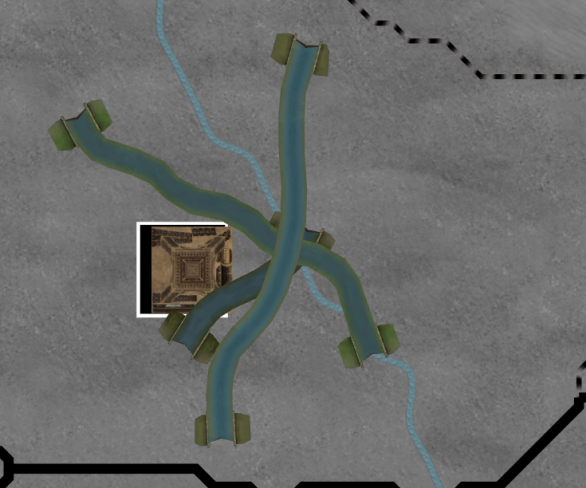

# Progreso hasta enero de 2024

Hacia cosas más grandes y mejores

## Ha llegado la versión 1.0

La versión [1.0.1](https://github.com/schombert/Project-Alice/releases/download/v1.0.1/1.0.1.zip) del Proyecto Alice ya está disponible.

## ¿Un clon de Victoria 2?

La versión 1.0.0 es lo que consideraría una copia bastante cercana de Victoria 2, pero está lejos de ser una copia perfecta. Por supuesto, continuaremos corrigiendo errores, y Leaf está trabajando en varias características (posiblemente incluso incluyendo algunos modelos 3D) que aparecerán en futuras versiones 1.0.x.

Sé que para algunos de ustedes, esto no será suficiente y lo que realmente desean es una réplica perfecta de Victoria 2, incluso con algunos de los errores. También es probable que sean conscientes de que este no es *mi* objetivo con el proyecto. La serie de versiones 1.0.x es probablemente lo más cercano que Project Alice llegará a copiar Victoria 2.

Pero solo porque ese no sea *mi* objetivo no significa que tengan que renunciar a ello, si es lo que desean. Animo a las personas que son "puristas" de Victoria 2 a organizarse en nuestro servidor (incluso pueden tener su propio canal allí, si lo desean) y comenzar a trabajar en una versión del proyecto basada en las versiones 1.0.x, pero que se construirá hacia la copia perfecta de Victoria 2 que sueñan.

Comenzar desde las versiones 1.0.x acercará mucho más a este proyecto hermano a sus objetivos generales de lo que lo haría comenzar desde cero. Las lecciones que aprendí de Open V2, uno de mis proyectos anteriores, hicieron que trabajar en Project Alice fuera mucho más fácil, y comenzar desde algo que es una especie de Victoria 2 ahorrará incontables horas. Ver otro proyecto comenzar desde cero me dolería. Además, aunque no planeo contribuir directamente a una recreación purista de Victoria 2, aún estaría encantado de responder preguntas y brindar asesoramiento al equipo que lo retome; no tendrían que navegar por un código base ajeno sin ayuda.

## El Futuro Inmediato

Como con cualquier software, siempre hay más errores por descubrir y corregir. Somos conscientes de que los rebeldes aún deben ajustarse y que TUR en GFM muestra un comportamiento extraño. (Si quieren ayudar a solucionar estos problemas, es muy útil que más personas jueguen el juego e intenten identificar sus causas). Como se mencionó anteriormente, Leaf está trabajando en varios proyectos que seguirán siendo agregados. Ma44 ha estado trabajando en la inteligencia artificial, así que probablemente veremos algunas mejoras allí también. Y también podríamos dirigirnos hacia la implementación de algunos de los elementos más pequeños e interesantes en el foro de sugerencias. También hay varias características pequeñas (por ejemplo, habilitar el desplazamiento moviéndose hacia el borde de la ventana) que serían excelentes proyectos para nuevos colaboradores.

El trabajo inicial de Leaf para cargar y renderizar algunos de los modelos.

Durante los próximos meses, personalmente planeo limitar mis contribuciones inmediatas a la corrección de errores de naturaleza más técnica. En parte, esto se debe a que estoy esperando ver hacia dónde se inclina la comunidad con respecto a Project Alice antes de realizar grandes cambios en el juego. Como mencioné en la actualización del mes pasado, si empezamos a ver mods específicos para Project Alice, entonces probablemente me enfocaré en atender las necesidades de esos modders y en realizar cambios en el juego que cuenten con un amplio respaldo de la comunidad. Por supuesto, si no obtenemos muchos modders, entonces no hay nadie a quien realmente molestar con cambios disruptivos en el juego, y en cambio, perseguiré experimentos más radicales.

Si estás trabajando en un mod, aunque sea pequeño, estaremos encantados de alojar tu trabajo en nuestro discord. También damos la bienvenida a más parches de compatibilidad para mods existentes de Victoria 2. Y algunos mods, como GFM, son tan complejos que realmente podríamos usar más personas con experiencia en GFM para ayudar a mejorar el parche de compatibilidad (GFM en particular parece un poco buggy, pero no tenemos suficiente experiencia con GFM para entender qué debería estar sucediendo y comenzar a diagnosticar qué está pasando con él). Hacer un parche de compatibilidad generalmente es bastante sencillo. Primero, solucionas los errores que informa el lanzador cuando intentas crear un escenario con el mod. Luego, cuando todos esos errores estén solucionados, juegas el mod y ves si hay algo "extraño" en comparación con el comportamiento normal del mod. Si puedes identificar eventos, decisiones u otros factores que no se comportan como lo hacen en Victoria 2, puedes informárnoslo, lo que llevará a correcciones de errores en Project Alice o quizás a algunos nuevos remedios para el parche de compatibilidad.

Pero, independientemente de cómo se vea el futuro lejano del proyecto, hay trabajo que debe hacerse primero: una revisión de la interfaz de usuario (UI), en lo que me *centraré*.

## Cambios en la interfaz de usuario (UI)

Adaptar los archivos de interfaz gráfica de usuario (gui) existentes de Victoria 2 es una barrera sustancial para el desarrollo futuro. Cuando implementé una versión simple de deuda internacional, la dificultad principal no fue escribir la lógica interna para hacerla funcionar; la dificultad principal fue, de hecho, descubrir cómo integrarla en la interfaz gráfica de usuario existente, y al final solo proporcioné una interfaz muy mínima. Esto está lejos de ser ideal, porque la interfaz de usuario *es* el juego, y si escribir la interfaz de usuario para nuevos sistemas de juego no es fácil, eso hace que todos sean mucho más reacios a trabajar en ellos. No solo el formato de los archivos gui y gfx es bastante incómodo, sino que también nos encierra en el soporte de la página de códigos win1250 para el texto. A largo plazo, necesitamos hacer la transición a Unicode, tanto por el bien de nuestros usuarios internacionales como por mi cordura. Sin embargo, hacer eso significa desechar la compatibilidad con las antiguas fuentes de mapa de bits de Victoria 2 y los archivos de localización, y significa reescribir partes de la interfaz de usuario para renderizar Unicode.

Así que he decidido desechar el sistema de interfaz de usuario (y el sistema de localización, como un subproducto de esto) y empezar de nuevo. Para mí, esto significa mucho trabajo técnico, al final del cual saldré con algunas herramientas para facilitar mi vida. Para ti, esto significará algunas cosas. En primer lugar, debes esperar que el aspecto general del juego cambie. No voy a copiar los antiguos archivos gui en el nuevo sistema que crearé. En cambio, planeo rehacer gran parte de la interfaz de usuario para comenzar el proceso de alejarse de la utilización de los archivos de juego de Victoria 2 y avanzar hacia un juego que pueda sostenerse por sí mismo (aunque probablemente esto se limite a los elementos más simples, como botones y fondos, para empezar; no tengo suficiente talento artístico para realmente rehacer correctamente los iconos). En segundo lugar, perderás la opción de cambiar a las fuentes clásicas, ya que no hay forma de mostrar texto Unicode con ellas. En tercer lugar, esperaría que los nombres grandes de los países en el mapa desaparezcan por un tiempo, y si vuelven, probablemente no serán "curvos" (muchos guiones no funcionan muy bien, o en absoluto, si empiezas a doblar la línea de base). Finalmente, se perderán cualquier cambio en la interfaz de usuario que los mods hayan realizado. Espero que la mayoría de los mods de Victoria 2 sigan funcionando en este punto (seguiremos mostrando todos los mismos datos internos), pero cualquier toque individual que hayan agregado tendría que ser recreado en el nuevo sistema de interfaz de usuario.

Supongo que también debería advertirte que algunas de mis ideas de interfaz de usuario probablemente te parecerán extrañas, al menos inicialmente. No habrá barras de desplazamiento, por ejemplo. La interfaz de usuario se construirá en parte sobre algunas ideas de un proyecto anterior mío llamado PrintUI, del cual puedes encontrar un video de demostración [aquí](https://www.youtube.com/watch?v=SbE6sTv4e-c). Ese proyecto fue principalmente un experimento en la creación de una interfaz de usuario minimalista que pudiera ser utilizada con igual facilidad con el ratón, el teclado, el controlador o alguna combinación de los tres. No pretendo que nuestra nueva interfaz de usuario sea tan espartana, pero aún estoy interesado en hacerla menos dependiente del ratón como única opción.

## El Fin

¡Nos vemos de nuevo el próximo mes! (o, si no puedes esperar tanto, únete a nosotros en [Discord](https://discord.gg/QUJExr4mRn))