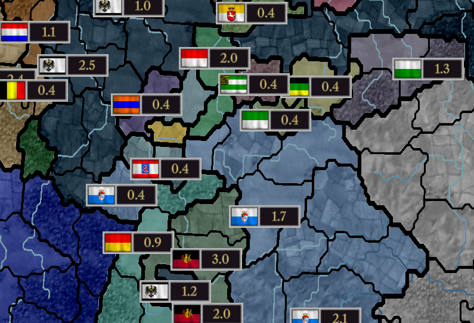
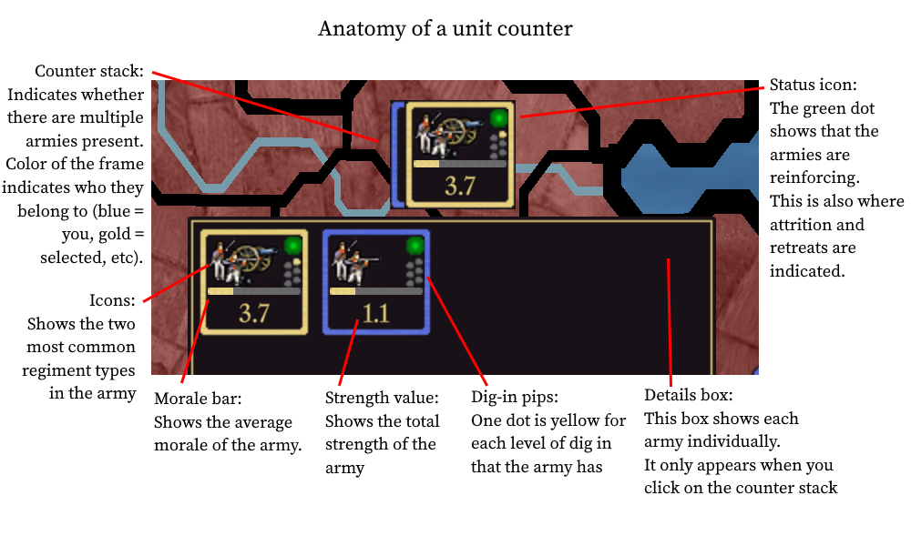
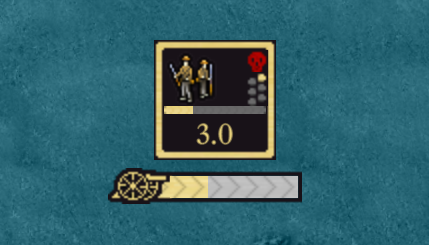
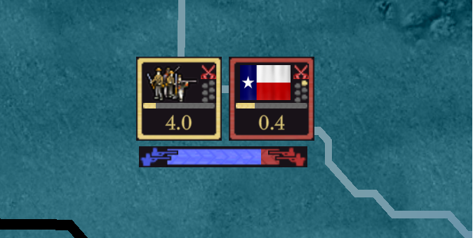
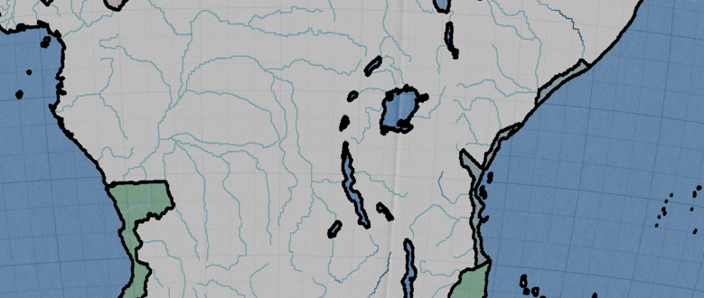

# 截至2023年7月的进展

本文姗姗来迟，为了准备公开[演示版本](https://github.com/schombert/Project-Alice/releases/download/v0.0.1-demo/2023-7-8-DEMO.zip)，所以优先做这事了，但迟到好过没有。

## 大新闻

本项目准备发布了，即使还处于初步状态。此版本不包括AI，所以它会同意任何要求，无论其是否合理。

## UI进展

由于我们没有3D模型，不得不设计新的兵牌来显示地图上的军事活动。首先为你当总览全球地图时提供了紧凑视图。

港口解决方案：

了解港口图标 
竖条：海军基地的等级；没有则不是海军基地。 
外框：蓝色为你的港口 
数字：有几艘舰艇停靠在此

当你放大视图时，会看到每个单位的更多信息：

了解单位算子 
算子栈：有几个在此；此框颜色为所属关系（蓝色为我军，金色为选中等等）。 
状态图标：绿色为该部队增援中，也有减员和撤退。 
部队图标：有两种常见的部队类型 
士气条：该部队的平均士气 
兵力值：该部队总兵力 
战壕深度：则有几个黄点，最高等级由科技解锁。 
信息框：每个部队都有各自特点，当你选中算子时才出现。

几个简单UI来展示围攻或战斗

界面有很多要做，但大部分基本完成，目前重点转在游戏机制。下个月会看不到界面变化，有的是小修小补。 
球形模式工作仍在继续。这月，Erik添加了河流及交叉判断内部逻辑，完成了地图的基本功能，即游玩时所有信息。美观有待提高，但没有美工，不用期待。

## AI

本游玩家端完成基本功能，是时候该着手开发AI。目前计划有两个阶段，首先，尽使AI满足基本状态，换是说，它将具有执行玩家所有操作的能力，不关心其表现。最后，优化AI，让它达到可接受水平。AI不会模拟“角色扮演”，它会追求普适战略，即专注最大科研点的同时，努力推动工业化。AI行动可能自私，只会加入你的侵略战争，如果它认为从中获益；它不会因为联盟关系而帮助你。

理想状态，AI在规矩内尽可能达到竞技水平。尤其微操利于AI，比如车轮战，我认为玩家也会利用，AI也该利用它。这不仅是我希望AI有挑战性，但也希望玩家受到同样的行为滥用影响，从而优化游戏规则，提高整体游戏体验。

## 结束语

下月再见！（或者等不及就加入[discord](https://discord.gg/QUJExr4mRn)）
