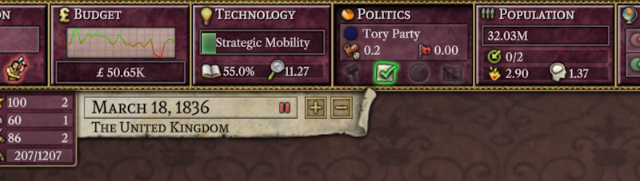
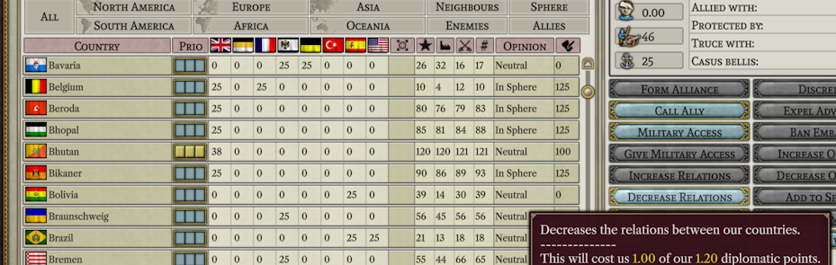

# Progress as of June 2023

This month has been unusually productive, possibly because a number of our team members have started summer vacation. But, before we get to that:

## New team members

- BrickPi: BrickPi is another developer who has also contributed to the OpenVic2 project. For us, BrickPi has contributed an upgrade that allows new windows developers to rely on the installation path of their copy of Victoria 2 for development rather than having to manually spell it out to get started.
- Breizh: While new to the team, Breizh has been part of our discord since the very first days. And, despite being new, has contributed a ton of work this month towards completing the UI.
- Ivysaur: Ivysaur is also someone who has been with us on discord since the beginning. Ivysaur joined at the very end of the month, and currently hasn't had time to contribute more than a few tool tips.

## Team Q&A

## UI progress

We have been focusing on implementing user actions and the ui required to support them this month. One immediately 
noticeable addition are events.

In this event you can see a number of interesting things. The blue text will eventually be turned into hyperlinks that, when clicked, will take you to the named province, state, or nation. You can also see the, still a bit of a work in progress, arrows that will help organize things for you when multiple events are occurring at once. The tool tip also shows that the effects specified in the files are being read out correctly, and in fact the effect will happen as expected when you choose an option (barring any bugs).

Constructions of all sorts, including provincial buildings like forts, factories, and military units have also made their way in. Above you can see a cloth factory mid construction.

Above is the, only partially completed, window for building factories. I included this simply because it shows how the somewhat unnecessary description of what paper is used for, originally featured in Victoria 1, still survives. It always makes me laugh.

This small snippet shows a new tech in the middle of being researched, as well as the newly-implemented linegraphs (courtesy of forn).

Releasing nations (and optionally switching to play as them) has also been added. Above you can see both the release nation dialog box (with obviously some work still needing to be done with the text color) and the result of releasing Ireland.

Here we can see that it is possible to gain influence and increase your relations with someone. Most of the influence actions and simple diplomatic actions have been implemented. However, without a real AI, our placeholder functionality defaults to accepting all military access requests and rejecting all alliance requests.

There is not enough space to screen shot all of the other actions that have been added, but here is the list: change national focus, start research, build province buildings, increase relations, decrease relations, build factories, build ships, build regiments, cancel unit construction, change factory priority, delete factories, release nation, play as nation, give/cancel war subsidies, change budget settings, start an election, change influence priority, discredit advisors, expel advisors, ban embassy, increase opinion, decrease opinion, add to sphere, remove from sphere, turn a colony into a state, invest in a colonial race, intervene in war, suppress movement, westernize, appoint ruling party, adopt/repeal a reform, join a crisis, change stockpile settings, take a decision, make an event choice, fabricate a casus belli, ask for military access, ask for an alliance. Yeah, it is a lot of stuff.

## Internals

A first draft of almost everything required for the game's daily update, outside of the military, has been added. That includes things ranging from pop migration, to elections, to rebel movements, to events, to constructing units and buildings. Of course, this early in development, there are probably still plenty of bugs hiding inside, but it is still neat to see most of the world behaving roughly like it should.

## International relations

Project Alice has attracted some interest among the Chinese-speaking Victora 2 community. Due to the language barrier and other logistical issues, most of this community is not present on our discord. To help bridge the gap we will be working with some members of that community to try to provide translations into Chinese of our monthly updates and other key pieces of the documentation. If you are in contact with other non-English-speaking communities that are interested in the project and are willing to do the translation work required, we would be happy to support other languages as well.

## Next month

The upcoming month will be focused primarily on implementing things associated with the military and warfare, both in the ui and in the game internals. This means things such as moving units, resolving battles, declaring wars, and sending peace offers. My hope is to get to a kind of punching-bag version by the end of the next month, which is a game where everything basically works but where the AI is totally passive.

## Thinking about AI

While there is a fair amount of work that needs to go into the military side of things, none of it is particularly technically challenging. I currently plan on treating the AI decision making process as essentially independent processes tied together by a shallow understanding of its overall situation at most. A world-class AI would take everything into consideration when making decisions, but I think that we can still get something acceptable by splitting up its decision making this way. And, importantly for getting things done on time, splitting up the AI in this way makes it easy to divide the work between different team members, since the person working on how the AI chooses to build factories doesn't then have to worry about how the AI chooses to make alliances.

If you are interested in working on the AI and know some C++, this would be a good time to join the team, as you could use the time we are working on the military and warfare to become familiar with the project before we move on to the AI.

## The End

See you again next month! (or, if you can't wait that long, join us on [discord](https://discord.gg/QUJExr4mRn))