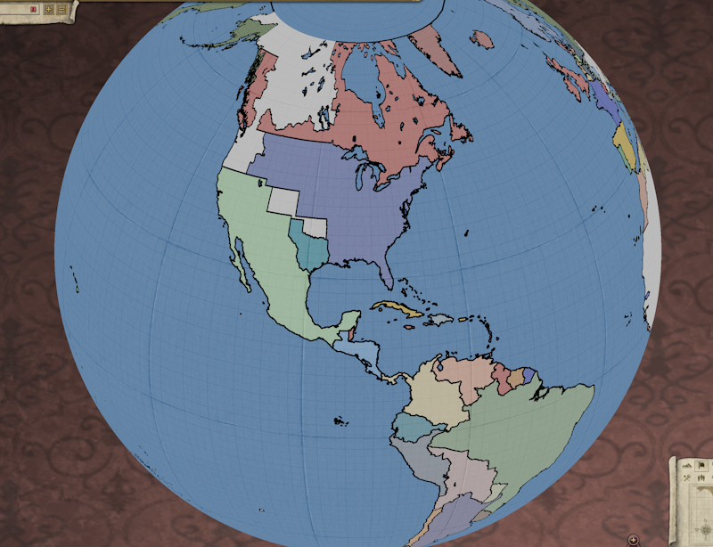
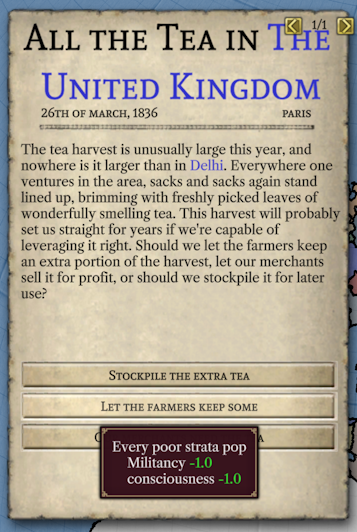
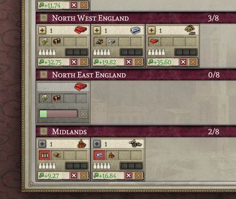
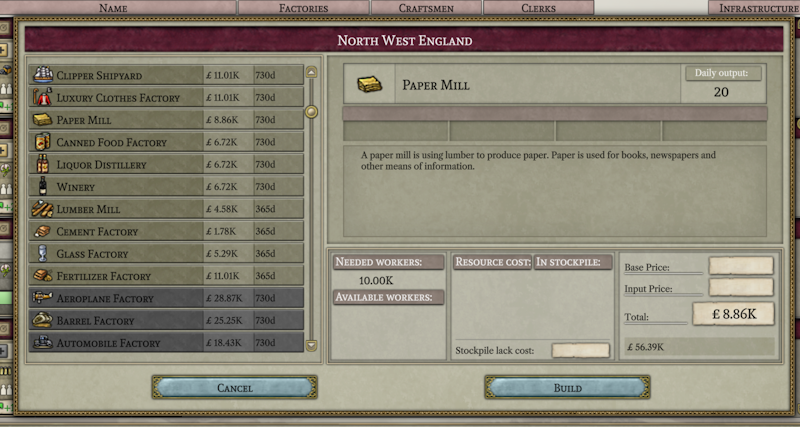
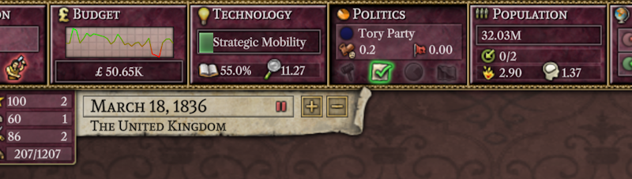
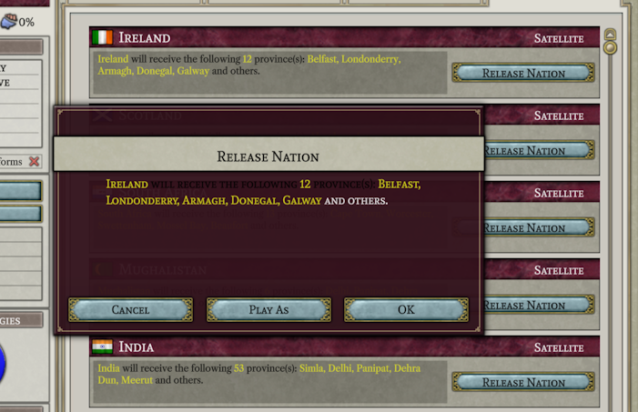
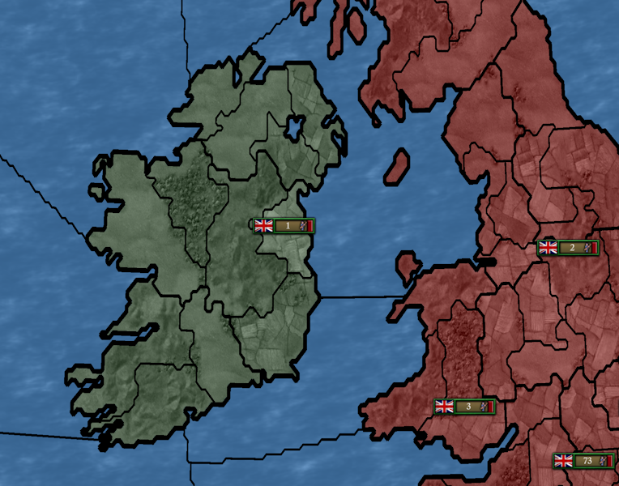
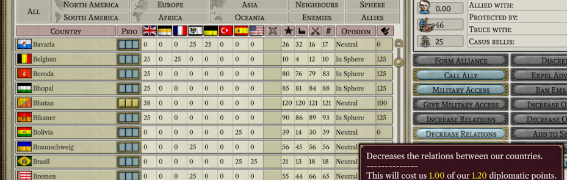

# 六月开发进展

本月的工作异常高效，可能是因为我们团队中的一些成员开始了暑假。但在此之前：

## 新成员

- BrickPi ： BrickPi 是 OpenVic2 项目的另一名开发者。在我们的项目中， BrickPi 提供了一个升级版本，让新的 Windows 开发人员可以依赖他们的 Victoria 2 副本的安装路径来进行开发，而不必手动拼写路径来开始工作。
- Breizh ： 尽管 Breizh 是团队的新成员，但他自从我们的 Discord 成立以来就一直是其中的一员。本月，尽管他是新手，但他在完成 UI 方面做出了大量的贡献。
- Ivysaur：Ivysaur 也是自 Discord 成立以来的老成员。他在月底加入了我们，目前还没有时间做出更多的贡献，只有些许工具提示。

## 团队 Q&A

本月，我们向 Erik 提出了一个问题。 Erik 是 Project Alice 四位创始成员之一，也是 [SOE](https://github.com/symphony-of-empires/symphony-of-empires) 的重要贡献者。我们问他：“在 Project Alice 上的工作与在 SOE 上的工作有何不同？”

> 在 Project Alice 上的工作要顺利得多，这既要归功于目标更加清晰，也要归功于我们从 SOE 中获得的经验。在之前的地图游戏上工作非常有帮助。 Project Alice 的进展也更快，这很大程度上要感谢所有贡献者所做出的出色工作。另一个因素是，功能的扩展在这里几乎不存在。
>
> 人们对这个项目的兴趣更大，这是可以预料的，因为开源 Victoria 2 （只需看一下 Open V2 的分支数量）的需求非常大。一旦 1.0 版本完成，我期待着这个项目巨大的模组潜力。在 Vic2 中进行修改的空间相当有限，我希望看到它得到改善。”

## UI 进展

正如上个月所说的那样，我们对地球仪的工作已经有了进展。为了让标准的 Victoria 2 地图可以在地球仪上使用，我们在两极添加了一些空白区域。虽然这不是一个完美的解决方案，但它相当不错。我们还正在制作一张基于 Open V2 地图的适当投影的全球地图，并希望能够将其作为未修改游戏的另一个选项在 1.0 版本中发布。（传统的平面地图也可通过菜单选项更改，但我没有回到它的欲望。）

本月我们主要集中精力于实现用户操作和支持其的 UI 。其中一个明显的新增功能是事件系统。

这个事件展示了很多有趣的东西。蓝色文字最终将被转换为超链接，当单击时，将带您到指定省份、州或国家。您还可以看到箭头（仍在进一步开发中），它们将帮助您在多个事件同时发生时进行选择。 工具提示还显示，文件中指定的效果正在正确地处理，并且当您进行选择时，您的事件选择确实按预期工作（除非存在任何错误）。

各种类型的建筑都已经添加了，包括工厂、军事单位和省级建筑物，例如要塞等。您可以在上面看到正在进行中的布料厂建设。

上面是建造工厂的窗口，但它仅完成了一部分。我把它包含在内只是因为它展示了最初在维多利亚 1 中出现的无关纸张用途描述的存在。这总是让我发笑。

这个小片段展示了一项新技术正在研究中的画面，以及新实现的曲线图（由forn提供）。

添加了释放国家（并可选择切换为该国以进行游戏）的功能。上面您可以看到释放国家对话框（显然还需要在文本颜色方面进行一些工作）以及释放爱尔兰的结果。

在这里，我们可以看到可以获得影响力并增加与某国的关系。大多数影响行动和简单的外交行动都已经实现了。然而，由于没有真正的 AI ，我们现在默认设置为接受所有军事通行并拒绝所有结盟请求。

屏幕截图不足以展示所有已添加的行动，以下是列表：更改国家焦点，开始研究，建造省级建筑物，提高关系，降低关系，建造工厂，建造船只，建造军队，取消单位建设，更改工厂优先级，删除工厂，释放国家，作为国家以进行游戏，提供或取消战争补贴，更改财政比例，开始选举，更改影响优先级，败坏名誉，驱逐顾问，封锁使馆，提高评价，降低评价，纳入势力范围，移出势力范围，在殖民地建立一个州，投资于殖民竞赛，干涉战争，镇压运动，开化，任命执政党，采用/废除改革，加入危机，更改库存设置，进行决议，进行事件选择，捏造战争借口，要求军事通行权，提议结盟。是的，这有很多东西。

## 程序内部

游戏运作所需的几乎所有内容（不包括军事部分）的第一个版本已经完成。这包括从人口迁移、选举、叛乱运动、事件到单位和建筑物建设等各种事情。当然，在开发的早期，可能仍有很多隐藏的错误，但看到大多数世界行为大致符合预期还是令人满意的。

## 国际关系

Project Alice 在中文 Victora 2 社区引起了一些关注。由于语言障碍和其他交流问题，这个社区的大部分人不在我们的 Discord 中。为了弥合这一差距，我们将与该社区的一些成员合作，试图提供月度更新和其他关键文件的中文翻译。如果您与其他对该项目感兴趣且愿意做所需的翻译工作的非英语社区有联系，我们也很乐意支持其他语言。

## 下个月

下个月的主要工作将集中在实现与军事和战争有关的事物，包括 UI 和游戏内部。这包括诸如移动单位、完成战斗、宣布战争和发送和平提议等内容。我希望在下个月底能够推出可以基本正常运转但 AI 完全被动的，像沙盒一样的游戏版本。

## 关于 AI 的思考

虽然军事方面还有很多工作需要做，但其中没有任何特别具有技术挑战性的内容。而实现 AI 则不同，这是一个相对复杂的任务。目前我的计划是将 AI 决策制定视为基本上独立的过程，最多只与整体情况有浅显的联系。最好的 AI 会在做决策时考虑到所有因素，但我认为我们可以通过分离其决策制定来获得可接受的结果。此外，以这种方式分割 AI 使得易于在团队成员之间分配工作，因为负责如何选择建造工厂的人就不必担心 AI 如何选择结盟等问题了。

如果您对 AI 的工作感兴趣并了解一些 C++ ，那么现在加入团队（请加入吧）将是一个很好的时机，因为在我们开始实现 AI 之前，您可以利用我们致力于军事和战争的这段时间熟悉该项目。

## 结束语

下个月再见！（或者，如果您不想等待，请加入我们的 [Discord](https://discord.gg/QUJExr4mRn) ）

[English](./june.md)（此版本由 Stevezxc 翻译于 2023/*06/04* 15:45 UTC+8）
