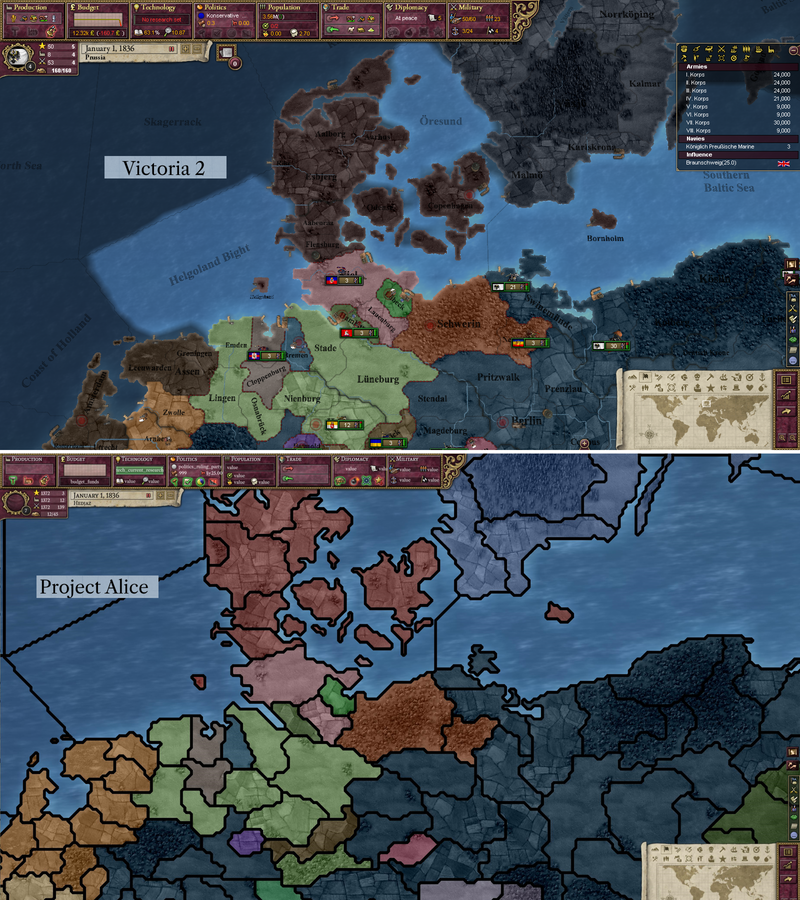

# Progress as of March 2023

Hello! How are ya'll?

For the first dev-blog about Project Alice, let's introduce the project and take a quick look at what the team has been working on for the last two months:

## Why does Project Alice exist?

Schombert commented:

> I originally started Open V2 because I found some things in Victoria 2 really irritating, even though I generally was having fun with the game. Specifically, endless rebel spam was wearing on my nerves, and I was also getting tired of selecting the same responses to events over and over again. Since Victoria 2 isn't that complicated, I figured that I could recreate it with some fixes. As things progressed, I started finding more and more things that I could do differently, and perhaps better. That was fun, but at the same time it significantly slowed down development. Eventually, I got tired of working on it, and the community didn't seem too interested in it, so I let it drop.
>
> However, about a year and a half ago I ended up in the SOE (Symphony of Empires) discord, where I have been discussing their project and giving the occasional bit of advice based on my experience with Open V2. Being there helped revive my interest a little bit, and led to me eventually writing a tool (data container) that is the backbone of Project Alice. Eventually some of the people there, as well as some new friends I made along the way, offered to help me finish what I started, and here we are.

## Map

As you may know from Schombert's [laconic videos](https://www.youtube.com/channel/UCVRXDHpfemCzPSHDfqOPr-Q), we eventually intend to add the 3D globe map from Open V2 as an additional option to the 2D map we have now.

The borders you can see in the screenshots are still a work in progress. Currently, the borders are all quite thick, but in the future province-to-province borders are going to be thin, state-to-state borders will be thicker, and national borders will have a fancy dotted line. Which borders you see will also be intelligently adjusted based on how zoomed out you are, much like how they worked in Open V2.

One advantage of having a 2D map at the moment is that it is easy to compare it to the map in Victoria 2. Some of the developers have even been adding little quality-of-life improvements as they go. For example, you can see below how selecting a province in the cultural map mode will let you see how a culture is spread out all over the map.

  

Currently, the terrain map mode looks almost identical to how it did in Victoria 2. And, as an added bonus, we incorporated some bug-fixes that improve the original map, making the islands of Fehmarn and Tsushima appear for the first time. These islands are part of the original map (I encourage you to look for yourself), but have never shown up because of a bug.

 

## Combat

We are going to replicate warfare in the original game as closely as possible, including micromanaging your units, but there are probably hidden variables affecting combat behind the scenes that we may not be able to replicate exactly. As a concession to ease of development, we are not planning on having 3D unit models in our first release. Instead we will stick with 2D unit counters, which I am sure will make certain kinds of people very happy. Of course, if you have experience rendering 3D models in C++/OpenGL, I am sure that the team would love to hear from you.

## User interface

Generally, the UI remains very close to what was present in Victoria 2. The fonts, however, are all new (you will thank us for this later if you ever have to scale the UI up). Currently we are using a version of Caslon for the body text, which was a popular typeface for publishing books during the period covered by the game. Still, the real purists have been hard at work figuring out how to render text exactly as it was in the original game, and we plan to have an option to switch the text back to its original appearance.

## Mod compatibility

We plan to deliver near-prefect mod compatibility eventually, but it isn't our focus right now. As we get closer to release, we will work on making sure that some of the most popular mods, such as HPM/GFM/HFM, function out of the box, and then we will address any gaps in compatibility as the bug reports roll in.

## The future

Our plan is still to release a 1.0 that differs minimally from the original game. After 1.0, we plan on experimenting with more radical changes. These range from reworking the rebel system to expanding the economy to make it more interesting, but for now we don't want to repeat the same mistakes that derailed Open V2.

We hope you stick with us on the road to 1.0! 

