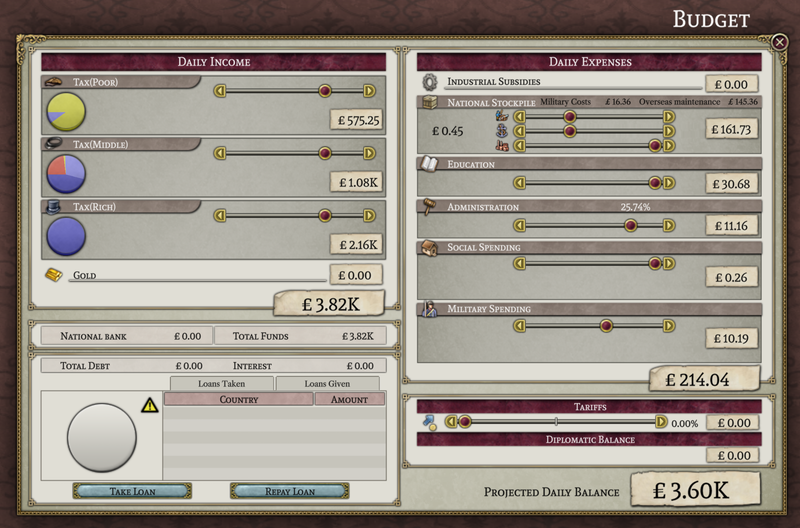
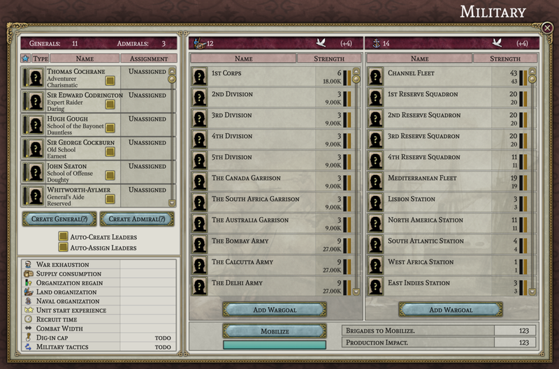
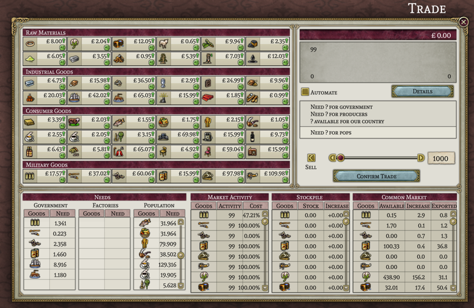
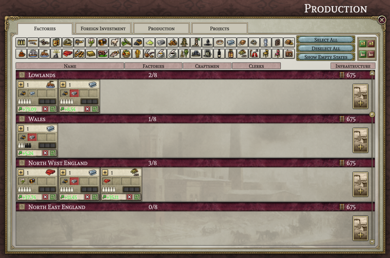
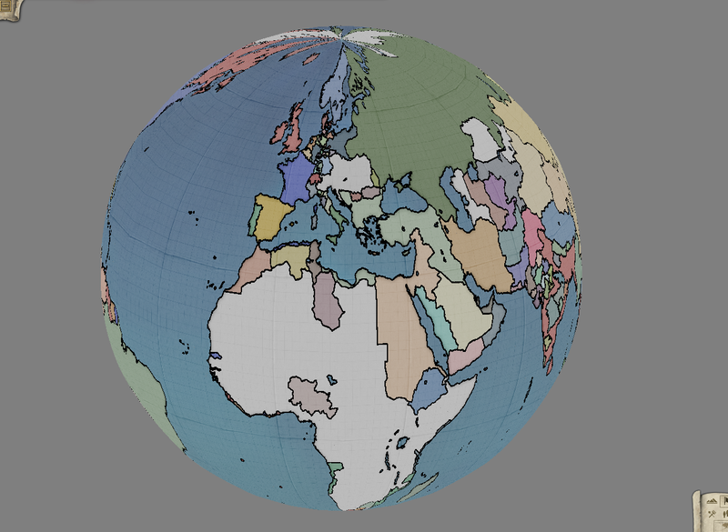

# Progress as of May 2023

Once again, it is time to review what the slackers over at Project Alice have been up to.

## New team members

--- THIS SPACE INTENTIONALLY LEFT BLANK IN CASE DBD MAKES A PR BEFORE FRIDAY ---

## Team Q&A

This month we asked leaf, one of the founding members of Project Alice and the project lead for [SOE](https://github.com/symphony-of-empires/symphony-of-empires): "How has working on Project Alice been different from working on SOE?"

> Well, Project Alice is pretty much the same "management style" as SoE (but way more organized and documented). I think the fact that it was properly documented from the start made it possible to work for a bunch of folk who would otherwise not be able to understand the inner workings of it. Working on Alice is pretty much straightforward, since you just code - submit - wait for review - correct mistakes and then it gets merged most of the time. I think that's a pretty nice quality from it; in SoE it was just submit and then correct the mistakes, which tended to break stuff, and then someone had to fix that stuff, so yes, indeed, working on Alice is a more organized and still straightforward experience. The fact that Alice also uses Data-container made it an interesting choice to work with, as with SoE everything was centered on getting the data onto some structured place. Data-container uses methods to access data, which in of itself is pretty nice because you automatically get your properties of your objects, and it's relationships, properly documented and interacted with - all at the same time. So overall I'd say it has been more pleasant to work with.

## UI progress

This month the work on the UI has been more spread out than last month. Thus there is no single window we can showcase as being nearly complete. However, you can see the pieces gradually being put into place in the budget (by forn), military (by MasterChef), and trade windows (by leaf and forn), below.

## Internals

There was more progress this month in implementing parts of the game's daily update, which unfortunately doesn't really lend itself to interesting screen shots. A large chunk of the work went into making pops "live," which is to say grow, shrink, change jobs, assimilate, move around, buy things, become angry, learn to read, join movements, and change their political opinions, among other things. We have implemented at least a first draft of most of the things a pop does in Victoria 2, with the exception of religious conversion. For the moment, we have simply made pops change their religion when they assimilate instead of having a separate process for that. We have also made no attempt to emulate any of the weird bugs (or maybe just weird design choices) from Victoria 2 that could make a pop changing jobs automatically change its culture as well under the right conditions.

The other major development, in terms of the daily update, was getting a draft of the economy working. And given that the economy is, for many people, a key part of what made Victoria 2 an interesting game, it probably deserves its own section.

## The economy

In general terms the Project Alice economy works in the same way as the Victoria 2 economy. The core economic activity is the consumption of commodities, either to satisfy pop needs, pay for the upkeep of military units, pay for construction, or to produce output commodities. When a commodity is produced it first goes into a kind of national stockpile (by this I am *not* talking about what are referred to as "stockpiles" in game) or, if the nation is in the sphere of another, a fraction goes to this stockpile with the remainder going to the stockpile of the sphere leader. When a commodity is needed, it is first drawn from the domestic stockpile, and, if that is empty, the stockpile of the sphere leader, and, if that is empty, finally a world stockpile (the world stockpile is filled with the "leftovers" from what has not been consumed the previous day). And of course this is all done in rank order, so nations of higher rank have the first shot at consuming any available commodities in a sphere leader's stockpile or in the world stockpile.

That general framework remains unaltered in Project Alice. However, within a nation we do some things differently. A nation is not a single consumer of goods; it is composed of many factories and pops, all of which have their own demand for commodities. In Victoria 2[^1] each of these consumers takes a turn at purchasing from the stockpiles of goods. The exact order is not shown in the UI, but it appears to remain basically constant from day to day. This means that, if there isn't enough of the commodity to satisfy all of the demand for it, the consumers who go earlier in the order will be able to get what they want, while those who go later will not. This has the effect of making commodity shortages extremely bimodal: the consumers early in the order get everything they want while those later in the order get nothing. Sometimes you can see this in the factory window, where you may notice some factories reporting no shortages while others report that some of the same commodities are unavailable.

In Project Alice, however, all of the consumers within a nation have equal access to the available commodities. This means that, if there are not enough commodities available, every consumer will receive some fraction of what they wanted. This in turn means that all of your factories will be impacted equally by a shortage. For example, in the image below you can see that the factories are all equally suffering from an iron shortage.

Another change is the way national stockpiles are handled (and now I *am* talking about what are called "stockpiles" in the game). There are two ways in which national stockpiles are simplified relative to how they work in Victoria 2. First, in Victoria 2, some forms of consumption by the government (for example, to construct new units) goes through the stockpiles, meaning that the government first moves commodities into its national stockpiles and then takes them out again to consume them. And this can cause some weird things to happen if you disable stockpile automation (since with automation off you can end up interfering with the process of putting the commodities into the stockpiles in the first place). In Project Alice, that does not happen; any commodities that are required by government expenses are purchased and then consumed directly, without going through the stockpiles as an intermediate step. And that in turn means that stockpile automation no longer serves a useful purpose and will not be included (because your stockpile settings can no longer interfere with other spending).

Additionally, in Victoria 2, your national stockpiles can function in basically three modes (when they aren't being automated, that is). They can be set to fill up with commodities until they hit a target amount, they can be set to sell commodities for money until they shrink to a target amount, or they can be emptied to satisfy the domestic demand for commodities that are currently in short supply. In Project Alice, we have reduced these three modes to two simpler modes: you can set your stockpiles to either fill up to a certain level or to empty out to cover for any shortages. Essentially, we have removed the option to turn stored commodities into money. This feature has been removed for two reasons. First, while you could theoretically play the markets with it, the fact that prices can move only by a limited amount per day makes doing anything useful a tedious process. Secondly, the user interface for manipulating your stockpiles has always been confusing at best, to the point where I think most players simply never take them off automatic. I hope that by simplifying stockpiles we can make at least the basic activity of stockpiling military goods during peacetime and then using those stockpiles in wartime something that the average player can use productively.

## Sneak peek

Erik, who is largely responsible for the technical machinery underpinning the map has been quite busy outside Project Alice lately. However I can share a sneak peek of some of his latest work:

See you again next month! (or, if you can't wait that long, join us on [discord](https://discord.gg/QUJExr4mRn))

[^1]: You should take this information with an implicit "as far as I can tell." We don't have access to the Victoria 2 source code, so some of this is speculation based on what we have observed.