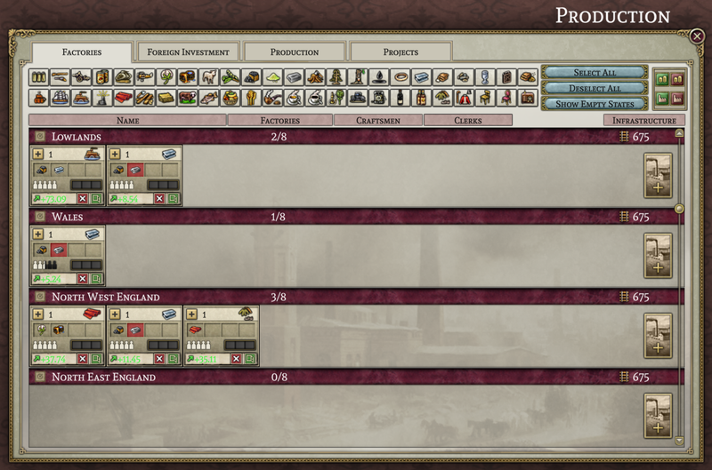

# 2023年5月 进展报告

是时候，再回顾懒散的本团队最近做了什么？

## 团队新成员

三月，程序员DeathByDarwin加入并与Leaf致力于科技界面。

## 团队常见问题

本月，我们向本项目创始人之一Leaf，也是[SOE](https://github.com/symphony-of-empires/symphony-of-empires)项目负责人提问：“在PA工作与SOE有所不同？”。

> 总之，与SOE相比，Project Alice的工作方式基本相同，但更有组织和文档记录。从一开始就有适当的文档记录使得其他人也能理解其内部运作。在Alice上工作很直接，只需编码、提交、等待审核、纠正错误，然后大部分时间都会合并。这使得工作更有组织性且直接。此外，Alice使用Data-container，这是一个有趣的选择，因为它将数据放入结构化位置并使用方法访问数据，从而使得属性和关系可以自动文档记录和交互操作。总的来说，与之一起工作更加愉快。机翻

## 界面进展

本月UI的工作比上个月更加分散。因此，我们没有可以展示为几乎完成的单个窗口。然而，您可以在以下的预算窗口（由forn完成）、军事窗口（由MasterChef完成）和贸易窗口（由leaf和forn完成）中逐渐看到各个部分的组合。机翻

## 内部程序

本月在实施游戏每日更新的部分方面取得了更多进展，但遗憾的是这些进展不太适合进行有趣的截屏。大部分工作都用于使人口“活跃”，也就是说，它们会增长、缩小、改变工作、同化、迁移、购买物品、愤怒、学习阅读、加入运动组织以及改变政治观点等等。我们至少已经初步实现了维多利亚2中人口的大部分行为，只是宗教转变暂时没有实现。目前，当人口同化时，我们简单地让其改变宗教，而没有单独进行转变过程。我们还没有尝试模拟维多利亚2中一些奇怪的错误（或者说奇怪的设计选择），有时候会导致人口改变职业时自动改变文化。机翻

另一个重大的发展是在每日更新中实现了经济的初步框架。考虑到经济对于许多人来说是使维多利亚2成为一款有趣游戏的关键部分，它可能值得单独提及。机翻

## 经济方面

总之，Project Alice的经济模型与维多利亚2的经济模型类似。核心经济活动是消费商品，既可以满足人口需求，支付军事单位的维护费用，支付建设费用，也可以生产输出商品。当商品被生产出来时，首先进入一种国家储备（我指的不是游戏中所称的“储备”），或者如果该国位于其他国家的势力范围内，则部分商品进入该国势力范围的储备，剩余部分进入势力范围领导者的储备。当需要商品时，首先从国内储备中提取，如果国内储备为空，再从势力范围领导者的储备中提取，如果仍为空，最后才从世界储备中提取（世界储备由前一天未消耗的“剩余商品”填充）。当然，所有这些都按照等级顺序进行，因此更高等级的国家首先有机会消耗势力范围领导者的储备或世界储备中的任何可用商品。机翻

在Project Alice中，这个整体框架保持不变。然而，在一个国家内部，我们做了一些不同的处理。一个国家不是单一的商品消费者；它由许多工厂和人口组成，它们都有自己对商品的需求。在维多利亚2中[^1]，每个消费者依次从商品的储备中购买。确切的顺序在用户界面中没有显示，但似乎从一天到另一天基本保持不变。这意味着，如果某种商品的供应量不足以满足所有需求，那么顺序中较早的消费者将得到他们想要的，而较晚的消费者则无法得到。这导致商品短缺的分布呈极端的双峰状：顺序中较早的消费者获得他们想要的一切，而较晚的消费者一无所得。有时候你可以在工厂窗口中看到这一点，你可能会注意到一些工厂报告没有短缺，而其他工厂报告相同的商品不可用。机翻

然而，在Project Alice中，一个国家内的所有消费者都能够平等地获得可用商品。这意味着，如果可用商品不足，每个消费者都只能得到他们所需的一部分。这也意味着所有工厂都会同样受到物资短缺的影响。例如，在下面的图片中，您可以看到所有工厂都因铁短缺而受到相等的困扰。机翻

另一个变化是国家储备的处理方式（现在我正在谈论游戏中所称的"储备"）。相对于维多利亚2中的处理方式，国家储备在"Alice计划"中有两个简化。首先，在维多利亚2中，政府的某些消费形式（例如，支付单位维护费用）需要通过储备进行，这意味着政府首先将商品转移至国家储备，然后再取出来进行消费。如果禁用储备自动化，这可能导致一些奇怪的情况发生（因为在关闭自动化时，你可能会干扰将商品放入储备的过程）。而在"Alice计划"中，不会发生这种情况；政府支出所需的任何商品都会直接购买和消费，而不需要经过储备作为中间步骤。这也意味着储备自动化不再具有实用价值，并且将不被包含在内（因为你的储备设置不会再干扰其他开支）。机翻

此外，在维多利亚2中，国家储备有三种基本模式（当它们没有自动化时）。它们可以被设置为填充商品，直到达到目标数量；它们可以被设置为出售商品以换取货币，直到缩小到达目标数量；或者它们可以被清空以满足当前短缺商品的国内需求。在"Alice计划"中，我们将这三种模式简化为两种更简单的模式：你可以将储备设置为填充到一定水平，或者清空以弥补任何短缺。基本上，我们移除了将储存的商品转换为货币的选项。这个特性有两个原因被移除。首先，虽然从理论上讲你可以利用它来进行市场交易，但是价格每天只能有限度地变动，这使得进行任何有用的操作都变得繁琐。其次，操纵储备的用户界面一直以来都令人困惑，以至于我认为大多数玩家根本就不会取消自动化设置。我希望通过简化储备系统，至少可以让普通人在和平时期进行军事物资储备，并在战时有效地使用这些储备。机翻

## 抢先体验

Erik主要负责地图机制，最近忙于项目外工作。但和大家分享他最新作品。

下月再见！(若等不及就加入[discord](https://discord.gg/QUJExr4mRn)！)

[^1]: 注意“据我所知”，我们无法获知V2源代码，有些信息由观察得出的。
