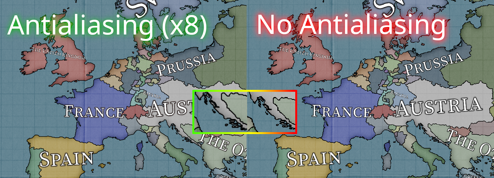

# Progress as of November 2023

It's November.

## Public alpha

The [0.8.7 alpha](https://github.com/schombert/Project-Alice/releases/download/v0.8.7%CE%B1/0.8.7-ALPHA.zip) version of Project Alice is now available. Bug reports from the community remain very much appreciated and will help us reach 1.0 faster. I am optimistic that we will move on to beta releases at some point this month.

## New Map

This month we made some tweaks to allow full-globe maps. We can't automatically add new terrain to an existing map, but this allows us to make map mods that do cover the entire globe. The [first of them](https://github.com/schombert/Project-Alice/blob/main/openv2%20map%20mod/OpenV2Map.zip), for the vanilla game, can already be tested. As with most new map mods, there are still stray pixels and other little issues to work out. A number of the provinces in Africa will also need to be renamed / given new histories / rearranged into different states. This is because part of the map was drawn from an older rework that had made those adjustments to create better pre and post colonial borders in Africa. If you are interested in helping me make those fixes, please drop by the discord.

I plan on releasing a short guide to upgrading an existing map this month.

## Other Graphical Improvements

Leaf is still working on perfecting multiplayer (we sill have one OOS bug left to track down and fix before it can be merged into a proper release). However, she has also been adding little upgrades here and there.

#### Fog of War

There is now an option in the graphics settings to turn on the classic fog of war effect, which will hide the content of provinces that you don't have vision on.

#### Anti-Aliasing

The graphics options now also allow you to set the level of anti-aliasing from 0 (what we had before) all the way up to 16 (which I do not recommend, because it may make your user interface extremely laggy -- I have settled on 4 for myself). Primarily, this option helps borders and rivers look better, especially when you are zoomed out.

(apologies to our translators)

#### Map Labels

The largest of these upgrades (which turned out to be not so little, as it ended up being a full week of work for three developers) is the new map labels. These labels appear when you are sufficiently zoomed out, and can be set to "very wiggly" (cubic curves), "curvy" (quadratic curves), and "flat" (linear).

## QOL Improvements

#### Technology Queue

One of the most life-changing QOL improvements we have added, after the ability to automate event choices, is the ability to queue up research ahead of time (shift-click to add research to the queue and right click to remove it). When your current research finishes, you will automatically start work on the earliest tech in the queue that you have the ability to research. This means that you can add future techs to your queue and they will simply remain in it until they become possible (in other words, I queue the research boosting techs as soon as I start the game and never look back).

#### Map Legends

This is still an incomplete feature, but we have started adding a map legend that will explain what the colors in various map modes mean. The existing map modes don't really need this to be understandable, for the most part, but it will eventually allow us to add more information to existing map modes without requiring returning players to read a new manual explaining them.

#### Trade Window

The trade window is now color coded to show where you have shortages and surpluses (plus a few more bits of information have been added to the tool tips).

## Modding Extensions

As we inch closer to a 1.0 release, I have begun implementing extensions to the game on request by modders. I'm not doing big system rewrites or anything like that (yet), but adding new effects, for example, easily doable. My rule of thumb here is that I only add something if a modder plans on using it when it is available. I don't want to add things that *might* be used because it would take too much focus away from getting to 1.0. The biggest thing we have added so far is a version of what are known as "scripted triggers" in some other paradox games.

A list of what has already been added can be found [here](https://github.com/schombert/Project-Alice/blob/main/docs/extensions.md) which will be updated as we go.

## The End

See you again next month! (or, if you can't wait that long, join us on [discord](https://discord.gg/QUJExr4mRn))