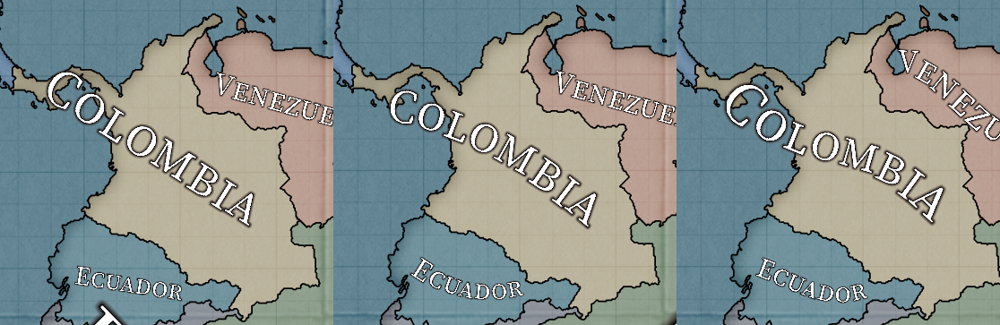
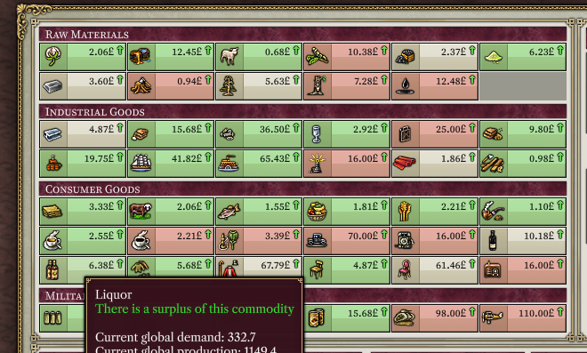

# Progreso hasta noviembre de 2023

Es noviembre.

# Alpha pública

La versión [0.8.7 alpha](https://github.com/schombert/Project-Alice/releases/download/v0.8.7%CE%B1/0.8.7-ALPHA.zip) del Proyecto Alice ya está disponible.Los informes de errores de la comunidad siguen siendo muy apreciados y nos ayudarán a llegar más rápido a la versión 1.0. Soy optimista de que avanzaremos a versiones beta en algún momento de este mes.

## Nuevo Mapa

Este mes realizamos algunos ajustes para permitir mapas de todo el mundo. No podemos agregar automáticamente terreno nuevo a un mapa existente, pero esto nos permite crear modificaciones de mapas que cubren todo el globo. El [primero de ellos](https://github.com/schombert/Project-Alice/blob/main/openv2%20map%20mod/OpenV2Map.zip), para el juego base, ya se puede probar. Como ocurre con la mayoría de las nuevas modificaciones de mapas, todavía hay píxeles sueltos y otros pequeños problemas que resolver. Algunas de las provincias en África también necesitarán ser renombradas / recibir nuevas historias / reorganizadas en diferentes estados. Esto se debe a que parte del mapa se tomó de un retrabajo anterior que había realizado esos ajustes para crear fronteras coloniales y postcoloniales más precisas en África. Si estás interesado en ayudarme a realizar esas correcciones, por favor, pasa por el discord.

Tengo planeado lanzar una breve guía para actualizar un mapa existente este mes.

## Otras Mejoras Gráficas

Leaf todavía está trabajando en perfeccionar el modo multijugador (todavía nos queda un error OOS por localizar y corregir antes de que pueda fusionarse en una versión adecuada). Sin embargo, también ha estado agregando pequeñas mejoras aquí y allá.

#### Niebla de Guerra

Ahora hay una opción en la configuración gráfica para activar el efecto clásico de niebla de guerra, que ocultará el contenido de provincias que no tengas visión.

#### Suavizado de Bordes

Las opciones gráficas ahora también te permiten ajustar el nivel de suavizado de bordes, desde 0 (como teníamos antes) hasta 16 (lo cual no recomiendo, ya que puede hacer que la interfaz de usuario sea extremadamente lenta; personalmente, he optado por usar 4). Principalmente, esta opción mejora la apariencia de bordes y ríos, especialmente cuando estás alejado en la vista.

(Mis disculpas a nuestros traductores)

#### Etiquetas de Mapa

La más grande de estas actualizaciones (que resultó no ser tan pequeña, ya que terminó siendo una semana completa de trabajo para tres desarrolladores) es la nueva función de etiquetas en el mapa. Estas etiquetas aparecen cuando estás lo suficientemente alejado, y se pueden configurar como "muy onduladas" (curvas cúbicas), "curvas" (curvas cuadráticas) y "planas" (lineales).

## Mejoras en la Calidad de Vida (QOL)

#### Cola de Tecnología

Una de las mejoras más impactantes en la calidad de vida que hemos agregado, después de la capacidad de automatizar las elecciones de eventos, es la capacidad de programar la investigación con anticipación (hacer clic mientras mantienes presionada la tecla shift para agregar investigación a la cola y clic derecho para quitarla). Cuando tu investigación actual termine, comenzarás automáticamente a trabajar en la tecnología más temprana de la cola que tengas la capacidad de investigar. Esto significa que puedes agregar tecnologías futuras a tu cola y simplemente permanecerán en ella hasta que sean posibles (en otras palabras, programo las tecnologías que mejoran la investigación tan pronto como inicio el juego y nunca vuelvo a preocuparme por ellas).

#### Leyendas del Mapa

Esta sigue siendo una característica incompleta, pero hemos comenzado a agregar una leyenda del mapa que explicará qué significan los colores en varios modos de mapa. En su mayor parte, los modos de mapa existentes no necesitan realmente esto para ser comprensibles, pero eventualmente nos permitirá agregar más información a los modos de mapa existentes sin requerir que los jugadores habituales lean un nuevo manual para entenderlos.

#### Ventana de Comercio

La ventana de comercio ahora está codificada por colores para mostrar dónde tienes escaseces y excedentes (además, se han añadido algunos detalles adicionales a los consejos de la herramienta).

## Extensiones de Modding

A medida que nos acercamos a la versión 1.0, he comenzado a implementar extensiones al juego a solicitud de los modders. No estoy realizando grandes reescrituras del sistema ni nada por el estilo (todavía), pero agregar nuevos efectos, por ejemplo, es fácil de hacer. Mi regla general aquí es que solo agrego algo si un modder planea usarlo cuando esté disponible. No quiero agregar cosas que *podrían* ser utilizadas porque eso desviaría demasiado la atención de alcanzar la versión 1.0. Lo más destacado que hemos agregado hasta ahora es una versión de lo que se conocen como "desencadenantes scriptados" en algunos otros juegos de Paradox.

Puedes encontrar una lista de lo que ya se ha agregado [aquí](https://github.com/schombert/Project-Alice/blob/main/docs/extensions_es.md), que se actualizará a medida que avanzamos.

## El Fin

¡Nos vemos de nuevo el próximo mes! (o, si no puedes esperar tanto, únete a nosotros en [Discord](https://discord.gg/QUJExr4mRn))
