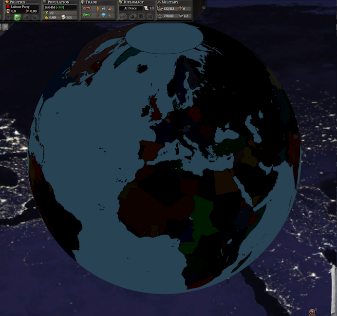
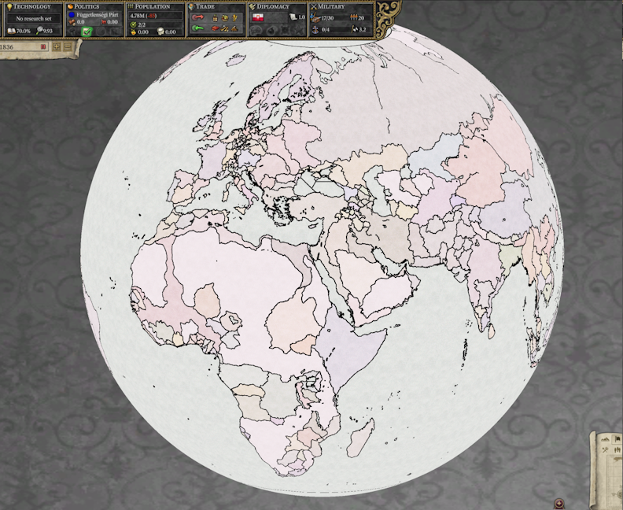

# 2023年10月进展报告

欢迎，也许几月后我不再写这些，翻译者也高兴。

## Alpha版

[Alpha版](https://github.com/schombert/Project-Alice/releases/download/v0.8.1%CE%B1/0.8.1-ALPHA.zip)能用了。目前，游戏差不多完成，你自行忽略几个零碎bug。我在HPM模组的奥地利玩了一把，没多大问题。

社区依然欢迎bug报告，也利于更快推进到1.0版。即使小问题，如工具提示缺少、其他与UI相关的故障等，也有用。

## MOD兼容情况

以下是目前支持的MOD列表：

- HPM：仍需一个兼容性补丁。（若你用不同版本的HPM，可能需要我们为你的版本做个补丁）。
- HFM：兼容性补丁、自定义着色器。
- MHM (Modern History Mod)：与其作者合作，寻找并修复错误（基本完成）。暂时仍需兼容性补丁，可能也要一些补丁访问不同年代剧本。
- ToL (Throne of Loraine)：已提交错误报告（仍需着色器）。
- AoE (Age of Enlightenment)：已提交错误报告（仍需着色器）。
- DoDR (Divergences of Darkness Rework)：已提交错误报告，但它更新很快，跟不上兼容性补丁、着色器支持。
- DoD:HPM (Divergences of Darkness: HPM)：已提交错误报告。
- HtA (Heirs to Aquitania)：其作者活动之前，已做兼容性补丁，应该没错吧。
- ToK (Trail of Khans)：已提交错误报告。
- GFM (Greater Flavor Mod)：暂停。其一位作者要求等待大版本再提交错误报告。
- TGC (The Grand Combination)：已提交错误报告，不兼容。因为其改动人口、建筑类型，而Alice目前尚未适应这些改动。可能最终移除额外内容，或者leaf支持，但目前没开始这工作。

## MOD兼容性是什么？

最近，我一直加载各种MOD，以查看哪些正常运行，但其过程令人沮丧。因为V2对MOD宽容，不代表正常运行的MOD也宽松，实际上很多时候那些MOD带来各种错误。

- Alice为了更好编写无bug的MOD设计的。当测试一个MOD时，它会报告巨量错误。对我来说，生成错误报告的MOD与Alice不兼容（目前至少这样）。
- 我们如何处理这些问题。Alice方式是剔除这些问题，以便剩下部分正常运行。若一个事件触发器引用未定义标签，条件部分则被忽略，导致事件触发更频繁。V2有其他事要做，从崩溃到停止响应。因此你可强行游玩有兼容问题的MOD，但体验不如V2。
- 对一些开发中的MOD，我提交大量错误报告。我希望其作者修复这些错误，我们可以在V2玩没问题的MOD。
- 对一些弃坑的MOD，我开始为之写兼容性补丁（可能包括修复其中错误）。
- 另外，想完美兼容，还有个障碍：一些MOD改动了地图。Alice用OpenGL渲染图形（以使其也在Linux运行），而V2用DirectX。
  - 因此我们无法加载一些MOD所依赖的修改后的着色器。通常结果是在缩小地图时要么很暗，要么很亮。
  - 当然这可以修复，我们着色器随之修改，为这些MOD加个OpenGL着色器，以使其Alice中正常渲染，或者（若其作者不想支持Alice）我们可以将修改后的着色器加到兼容性补丁。

## 多人模式

我不确定在1.0版本后会有多人游戏，但leaf这月一直在开发这功能，报告以下：

- 本月我们解决一些麻烦。例如，现在可踢出和禁止玩家，即使他们在V2无法做到（除非MOD支持）；
- 改进了聊天功能。实时显示被禁止、加入和离开的玩家消息，这些消息都在单个窗口，通过TAB键打开；
- 改进了网络队列。确保客户端间收发命令，避免随时截断问题（之前错误已被修复）。

我们正在测试多人游戏并寻找漏洞，主要确保游戏体验如同原版，甚至更好。你可加入我们Discord服务器的“Multiplayer”团队。关于多人游戏本身，目前还不能“稳定分支”合并到主线上，因此将其单独发布，通常比稳定版本更新，及时收到上游更新，因为修复了更多问题=减少了偏差（OOS）。

## 终言

下月再见(或等不及就加入[discord](https://discord.gg/QUJExr4mRn))！
