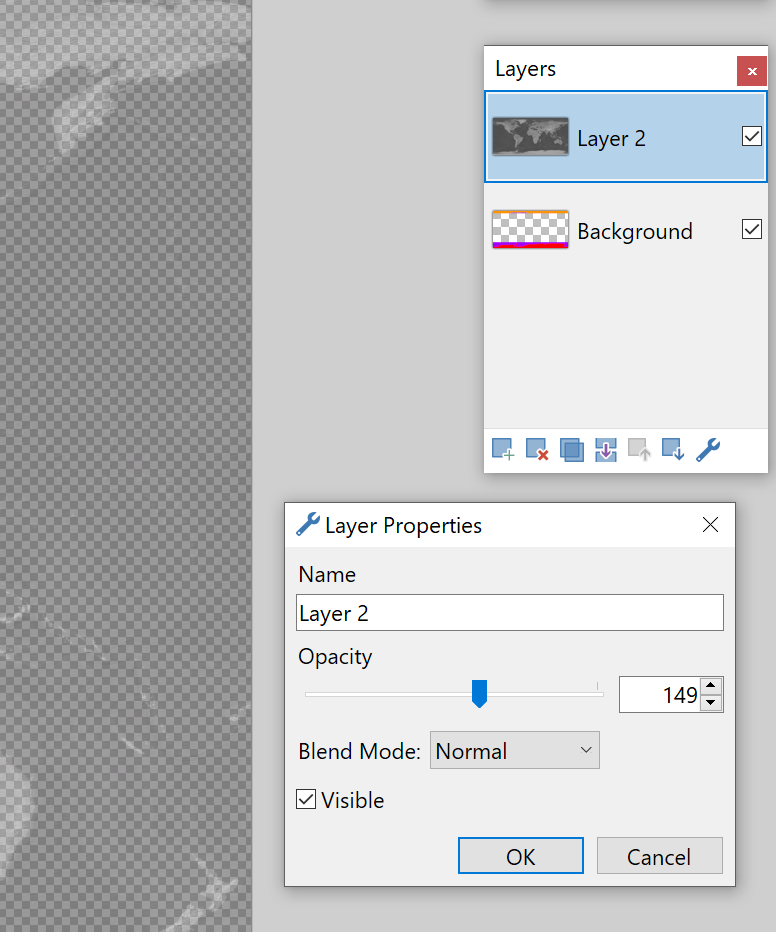
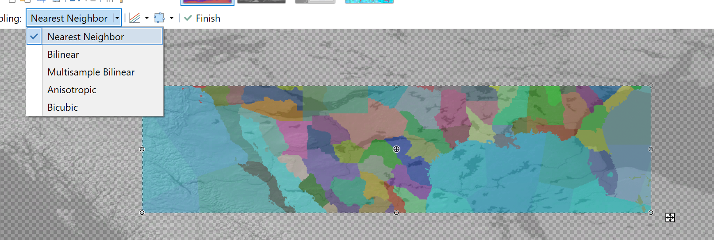
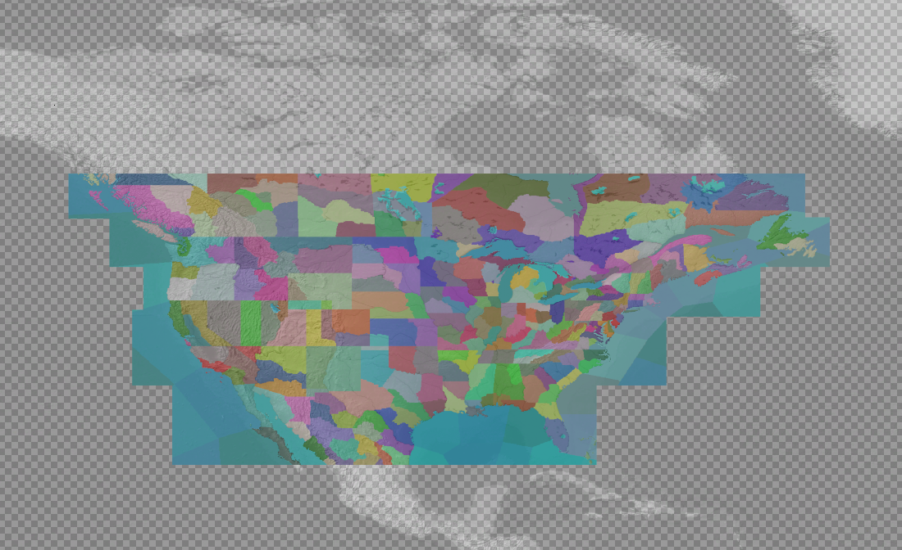
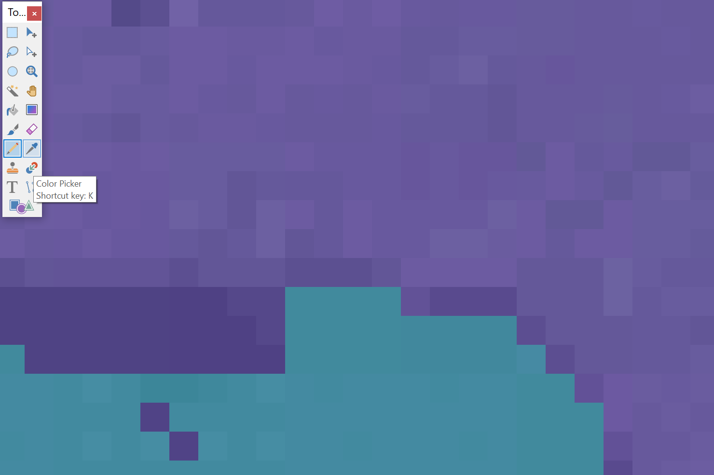
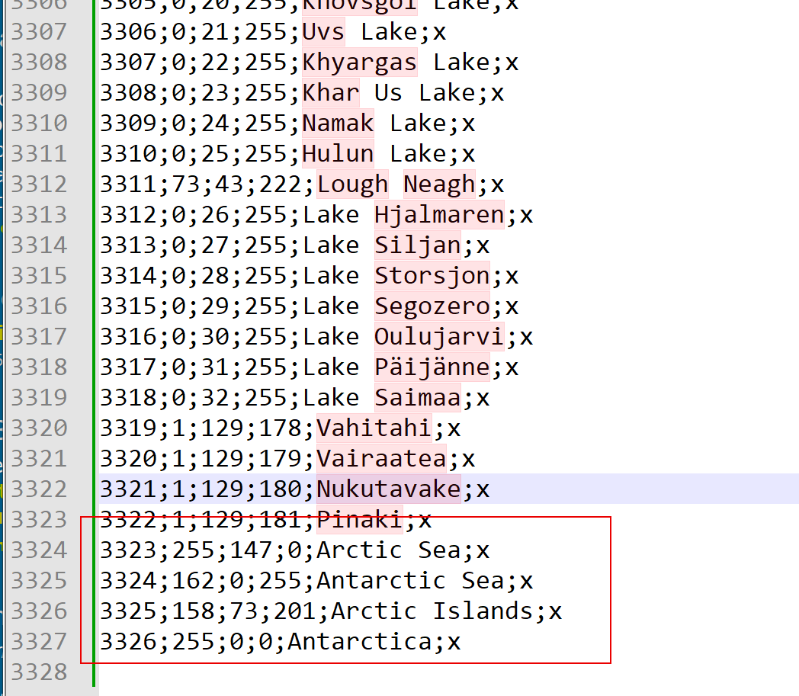
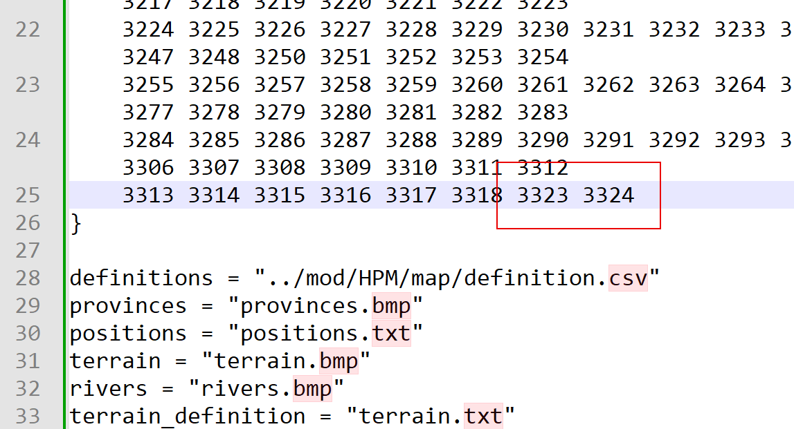
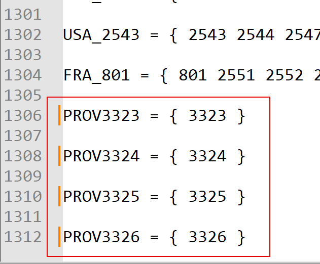
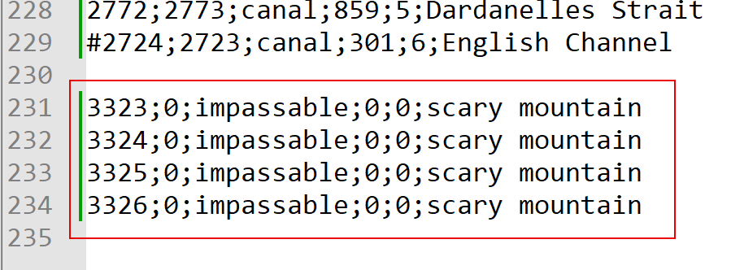
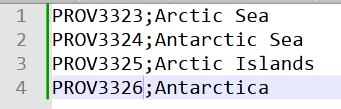
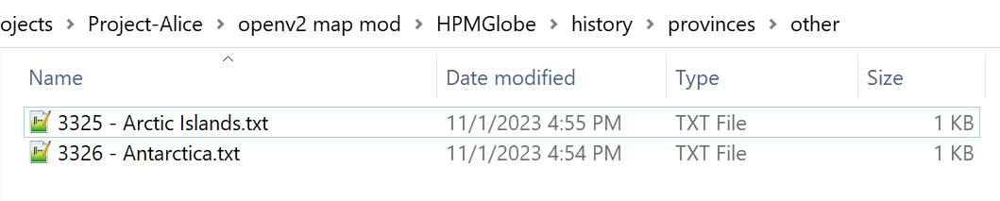

# How to upgrade a map

This short tutorial covers how to upgrade the map for an existing Victoria 2 mod to (a) be a proper projection and (b) to cover the entire globe. How much time this will take depends on how good you want the result to be; for the best results expect a significant time investment. As you follow these instructions, you may also want to consult the existing HPMGlobe mod if you find anything unclear.

## Step 1: Getting started

First, create a new folder in your `Victoria 2\mod` directory if you plan on making your new map a submod of the existing mod. If not, you can just make the changes described below in the directory of the existing mod.

## Step 2: Upgrading `provinces.bmp`

In this section the instructions will assume that you are using `paint.net` to edit the image. You can use any program that supports editing `png` files, but the details will differ. In the `map` directory of the mod you will need to create a new image file called `alice_provinces.png`. This file is the new equivalent of `provinces.bmp`. Start with the `map\terrain\colormap_political.dds` found in the OpenV2Map mod. Then, flip it vertically so that it appears to be right side up. Then, add a second layer below this one. Most of the work will be done in this second layer. You can choose to start with it empty, or if your mod's map shares a large number of provinces with a map that has already been upgraded, you may choose to start with another upgraded map in that layer. Finally, reduce the opacity of the top layer so that you can see both it and the bottom layer. At this point you should have something looking like the following:



Next, you will copy sections of the map you are upgrading into layer 2, stretching them to fit the world as illustrated by layer 1. While you do this, make sure that you have `Nearest Neighbor` set as the sampling mode (this ensures that no new pixel colors will be created in this process).



I suggest using relatively thin horizontal strips during this process with distinctly recognizable features (such as coastlines) on both sides, starting with the easy continents and then moving on to harder to place areas (as you can use the previously placed regions to guide you there).



Here are a few major things to be aware of during this process:
- The north and south American continents are too far north in most mod maps (which you will have to correct during this process).
- Most islands in the eastern Pacific are not adjusted in this way, but it is probably easier to move all the sea provinces along with the continents and then move the islands back into their appropriate places.
- Making the Atlantic work will be hell: good luck
- The very eastern edge of Siberia is highly distorted and will need significant attention
- Many island provinces are wildly oversized compared to reality, and you will need to decide whether to reduce them to a realistic one or two pixels or not

Once the map has been filled in (copying the polar regions from another upgraded map if necessary), you will have to go back to correct the coasts, lakes, and other details. Usually, this means taking the pencil tool to correct small misalignments between the province borders and actual terrain features.



(on the left you can see the province extending too far into the sea tile--the dark region--while on the right you can see it already corrected to the correct coast line). When using drawing tools, make sure that they are set to aliased rendering and pixelated selection quality--you do not want them to add new colors to the image. Also make sure that you set the tolerance to 0 if you want to use the fill tool at any point.

This step will take the majority of your time.

Note that when you are finished you will need to delete the top layer (as `png` files do not support multiple layers) and make sure that you are saving/exporting the finished result as a `png` (if you have been saving your progress as you go, the file will probably not be currently in `png` format).

## Step 3: Adding the new polar provinces

Once you are finished with the province image, you will need to add new provinces corresponding to the new polar regions (if you do not do this, they will show up as entirely water).

Start by making a copy of the base mod's `map/definitions.csv` file in your new map directory. Open that file and add the four new provinces to the end. (You could add more than 4, but 4 is the minimum that I have used to fill in the new regions).



Note that your new provinces should be numbered consecutively after the prior last province in the mod. You should also check that none of the four colors for these new provinces are already taken by some province in the mod (if it is, you will need to pick a new color and recolor the province image accordingly).

Next, make a copy of the mod's `default.map` file. First, increase the `max_provinces = ` value at the top of the file by 4. Then, add the province numbers of the two new ocean provinces (remember, your numbers will probably be different) to the `sea_starts` section as illustrated below.



Next, make a copy of the mod's `region.txt` file. We will add each of the new provinces to a new region containing just that province as follows:



Note that you will need to adjust the province numbers appropriately, both between the braces and in the names we are giving to the regions (which, cleverly, will just reuse the names we give to the provinces themselves).

Next, make a copy of the mod's `adjacencies.csv` file, adding the four lines pictured below to the end of if (again, with the province numbers adjusted accordingly). Note that these lines would not work in unmodified Victoria 2: the second value of 0 will make sure that these provinces cannot be entered at all.



To name the new provinces, you will have to add a directory named `localisation` to your mod. In that directory, create a file named `openv2names.csv`. In that file, add the following 4 lines (again, replacing the province numbers as necessary):



Finally, we need to create some history entries for the new provinces. Create directories in your mod such that you have a `history\provinces\other` path. In that folder, copy the two province history files from the `OpenV2Map` and then rename them with the proper province numbers, as shown below.



## Step 4: Creating a .mod file

Finally, you will need to create a `.mod` file for your map upgrade mod. You should model your file off of the HPM globe upgrade file, which is as follows:

```
name = "HPM Globe Map"
path = "mod/HPMGlobe"
dependencies = { "HPM Alice Patch" "Open V2 Globe Map" }
replace_path = "mod/OpenV2Map/history/provinces/other"
```

Change the name to be the name of your upgrade mod and change the path to the folder that your mod is in. In the dependencies, change `HPM Alice Patch` to the name of the mod that you are upgrading (or its compatibility patch--if it needs one--as the compatibility patch will in turn pull in the base mod). Leave the dependency on `Open V2 Globe Map` as is: this allows you to reuse some of the textures already made for that mod, which can significantly reduce the size of your mod. Also leave `replace_path` as it is (this will prevent the province history files added for the open v2 globe from conflicting with things).
